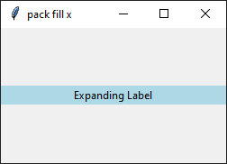

====================================================
tk geometry pack
====================================================

| The pack geometry manager allows you to arrange widgets within a root.
| See: `<https://www.pythontutorial.net/tkinter/tkinter-pack/>`_
| See: `<https://www.geeksforgeeks.org/python-pack-method-in-tkinter/?ref=lbp>`_

| Layouts: `<https://www.youtube.com/watch?v=i577cFu8eBI&list=PLpMixYKO4EXflJFPhTvZOVAbs7lBdEBSa>`_
| Pack: see `<https://www.youtube.com/watch?v=rbW1iJO1psk>`_
| Pack with frames: `<https://www.youtube.com/watch?v=SsjEAWT-SMc>`_

----

pack
--------------------

| Pack is responsive to window size changes.
| By default, the pack geometry manager places widgets vertically from top to bottom.

.. py:function:: widget.pack()

    | Use **pack()** method to pack a widgets vertically from top to bottom.
    | e.g. widget.pack()

----

Options for the `pack()` geometry manager
-----------------------------------------------

**padding**
~~~~~~~~~~~~~

.. py:function:: widget.pack(ipadx=x, ipady=y)

    | The `ipadx` value is an integer, x. The `ipady` value is an integer, y.
    | These options control the **internal** padding (in pixels) along the x and y axes, respectively.
    | Example: widget.pack(ipadx=10) has internal padding of 10 in the x direction on each side of the widget.

.. py:function:: widget.pack(padx=x, pady=y)

    | The `padx` value is an integer, x. The `pady` value is an integer, y.
    | These options control the **external** padding (in pixels) along the x and y axes, respectively.
    | Example: widget.pack(padx=10) has external padding of 10 in the x direction on each side of the widget.

.. image:: images/pack_padding.png
    :scale: 100%

.. code-block:: python

    import tkinter as tk

    root = tk.Tk()

    label1 = tk.Label(root, text="Red", bg="red", fg="white")
    label1.pack(ipadx=30, ipady=6)

    label2 = tk.Label(root, text="Purple", bg="purple", fg="white")
    label2.pack(pady=20, ipadx=8, ipady=12)

    root.mainloop()

**Anchor**
~~~~~~~~~~~~~~~~~~

.. py:function:: widget.pack(anchor=anchor_string)

    | `anchor_string` can take values "n", "s", "e", "w", "ne", "nw", "se", "sw", "center".
    | eg. `'nw'` (top-left), `'center'`, or `'se'` (bottom-right)
    | The `anchor` option specifies the position of the widget within its allocated space.
    | Example: widget.pack(anchor='nw') positions the widget at the top-left corner of its allocated space.

Example: To create labels anchored at different positions:

.. image:: images/pack_anchor.png
    :scale: 100%

.. code-block:: python

    import tkinter as tk

    root = tk.Tk()
    root.title("pack anchor")
    root.geometry('250x150')

    label1 = tk.Label(root, text="Top-Left", bg="lightblue")
    label1.pack(anchor='nw')

    label2 = tk.Label(root, text="Center", bg="lightgreen")
    label2.pack(anchor='center')

    label3 = tk.Label(root, text="Bottom-Right", bg="lightpink")
    label3.pack(anchor='se')

    root.mainloop()

**Side**
~~~~~~~~~~~

.. py:function:: widget.pack(side=side_string)

    | The `side_string` option determines the position of the widget within its parent container.
    | It can take values like `left`, `right`, `top`, or `bottom`.
    | e.g. widget.pack(side="left")

| Example: To create four buttons positioned on different sides of a frame:

.. image:: images/pack_side.png
    :scale: 100%

.. code-block:: python

    import tkinter as tk

    root = tk.Tk()
    root.title("pack side")
    root.geometry("250x150")

    button1 = tk.Button(text="Left")
    button1.pack(side="left")

    button2 = tk.Button(text="Top")
    button2.pack(side="top")

    button3 = tk.Button(text="Right")
    button3.pack(side="right")

    button4 = tk.Button(text="Bottom")
    button4.pack(side="bottom")

    root.mainloop()

**Expand**
~~~~~~~~~~~~~~~~

.. py:function:: widget.pack(expand=boolean)

    | The `boolean` value is `True` or `False`.
    | e.g. `widget.pack(expand=True)` to make a widget expand when the frame is resized
    | The `expand` option allows a widget to expand if the user resizes the frame.

**Fill**
~~~~~~~~~~~~~~~

.. py:function:: widget.pack(fill=fill_string)

    | The `fill_string` value is `None`, `x`, `y`, or `both`.
    | The `fill` option specifies how the widget should fill the available space.

Example: Use `expand=True` so fill options are shown.

.. code-block:: python

    import tkinter as tk

    root = tk.Tk()
    root.title("pack fill x")
    root.geometry("250x150")

    label = tk.Label(root, text="Expanding Label", bg="lightblue")
    label.pack(expand=True, fill='x')

    root.mainloop()

