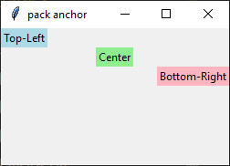
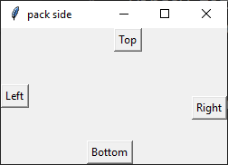

====================================================
tk geometry pack
====================================================

| The pack geometry manager allows you to arrange widgets within a parent object, usually a window or frame.
| It organizes widgets in blocks before placing them in the parent widget.
| See: `<https://www.pythontutorial.net/tkinter/tkinter-pack/>`_

| Layouts: `<https://www.youtube.com/watch?v=i577cFu8eBI&list=PLpMixYKO4EXflJFPhTvZOVAbs7lBdEBSa>`_
| Pack: see `<https://www.youtube.com/watch?v=rbW1iJO1psk>`_
| Pack with frames: `<https://www.youtube.com/watch?v=SsjEAWT-SMc>`_

----

pack
--------------------

| Pack is responsive to window size changes.
| By default, the pack geometry manager places widgets vertically from top to bottom.
| A widget can be packed inside any container widget, including the root window (`tk.Tk`), toplevel windows (`tk.Toplevel`), frames (`tk.Frame`, `ttk.Frame`, `tk.LabelFrame`, `ttk.LabelFrame`), notebook tabs (`ttk.Notebook` frames), paned-window panes (`tk.PanedWindow`, `ttk.PanedWindow`), canvases using `create_window`, and any custom scrollable or embedded frame acting as a container.
| Pack allocates space based on several factors:

    - The widget's requested size based on its content.
    - The use of side options (left, right, top, bottom) which places widgets in a “strip” along one side.
    - The use of expand to increase the allocated area.
    - The use of fill to specify how the widget should fill the allocated area.

.. py:function:: widget.pack()

    | Use **pack()** method to pack a widgets vertically from top to bottom.
    | e.g. widget.pack()

----

Options for the `pack()` geometry manager
-----------------------------------------------

**padding: internal**
~~~~~~~~~~~~~~~~~~~~~

.. py:function:: widget.pack(ipadx=x, ipady=y)

    | The `ipadx` value is an integer, x. The `ipady` value is an integer, y.
    | These options control the **internal** padding (in pixels) along the x and y axes, respectively.
    | Example: widget.pack(ipadx=10) has internal padding of 10 in the x direction on each side of the widget.

.. image:: images/pack_ipad.png
    :scale: 100
    :align: center
    :align: center

.. code-block:: python

    import tkinter as tk

    root = tk.Tk()

    label1 = tk.Label(root, text="ipadx=10, ipady=5", bg="red", fg="white")
    label1.pack(ipadx=10, ipady=5)
    label2 = tk.Label(root, text="ipadx=20, ipady=10", bg="purple", fg="white")
    label2.pack(ipadx=20, ipady=10)
    label3 = tk.Label(root, text="ipadx=30, ipady=20", bg="blue", fg="white")
    label3.pack(ipadx=30, ipady=20)

    root.mainloop()

----

**padding: external**
~~~~~~~~~~~~~~~~~~~~~

.. py:function:: widget.pack(padx=x, pady=y)

    | The `padx` value is an integer, x. The `pady` value is an integer, y.
    | These options control the **external** padding (in pixels) along the x and y axes, respectively.
    | Example: widget.pack(padx=10) has external padding of 10 in the x direction on each side of the widget.

| Examples below show labels with different external padding values inside frames to visualize the padding effect.

.. image:: images/pack_pad.png
    :scale: 100
    :align: center
    :align: center

.. code-block:: python

    import tkinter as tk

    root = tk.Tk()

    # --- Block 1 ---
    frame1 = tk.Frame(root, bd=1, relief="solid")
    frame1.pack(pady=1)

    label1 = tk.Label(frame1, text="padx=10, pady=5", bg="red", fg="white")
    label1.pack(padx=10, pady=5)

    # --- Block 2 ---
    frame2 = tk.Frame(root, bd=1, relief="solid")
    frame2.pack(pady=1)

    label2 = tk.Label(frame2, text="padx=20, pady=10", bg="purple", fg="white")
    label2.pack(padx=20, pady=10)

    # --- Block 3 ---
    frame3 = tk.Frame(root, bd=1, relief="solid")
    frame3.pack(pady=1)

    label3 = tk.Label(frame3, text="padx=30, pady=20", bg="blue", fg="white")
    label3.pack(padx=30, pady=20)

    root.mainloop()

----

**Anchor**
~~~~~~~~~~~~~~~~~~

.. py:function:: widget.pack(anchor=anchor_string)

    | `anchor_string` can take values "n", "s", "e", "w", "ne", "nw", "se", "sw", "center".
    | eg. `'nw'` (top-left), `'center'`, or `'se'` (bottom-right)
    | The `anchor` option specifies the position of the widget within its allocated space.
    | Example: widget.pack(anchor='nw') positions the widget at the top-left corner of its allocated space.

Example: To create labels anchored at different positions:

.. code-block:: python

    import tkinter as tk

    root = tk.Tk()
    root.title("pack anchor")
    root.geometry('250x150')

    label1 = tk.Label(root, text="Top-Left", bg="lightblue")
    label1.pack(anchor='nw')

    label2 = tk.Label(root, text="Center", bg="lightgreen")
    label2.pack(anchor='center')

    label3 = tk.Label(root, text="Bottom-Right", bg="lightpink")
    label3.pack(anchor='se')

    root.mainloop()

----

**Side**
~~~~~~~~~~~

.. py:function:: widget.pack(side=side_string)

    | The `side_string` option determines the position of the widget within its parent container.
    | It can take values like `left`, `right`, `top`, or `bottom`.
    | e.g. widget.pack(side="left")
    | The `side` option specifies which side of the parent widget the child widget should be packed against.
    | Packing on the left creates a vertical strip along the left edge of the window.

| Example: To create four buttons positioned on different sides of a frame:

.. code-block:: python

    import tkinter as tk

    root = tk.Tk()
    root.title("pack side")
    root.geometry("250x150")

    button1 = tk.Button(text="Left")
    button1.pack(side="left")

    button2 = tk.Button(text="Top")
    button2.pack(side="top")

    button3 = tk.Button(text="Right")
    button3.pack(side="right")

    button4 = tk.Button(text="Bottom")
    button4.pack(side="bottom")

    root.mainloop()

----

**Expand**
~~~~~~~~~~~~~~~~

.. py:function:: widget.pack(expand=boolean)

    | The `boolean` value is `True` or `False`.
    | e.g. `widget.pack(expand=True)` to make a widget expand when the frame is resized
    | The `expand` option allows a widget to expand if the user resizes the frame.

----

**Fill**
~~~~~~~~~~~~~~~

.. py:function:: widget.pack(fill=fill_string)

    | The `fill_string` value is `None`, `x`, `y`, or `both`.
    | The `fill` option specifies how the widget should fill the available space.
    | * ``fill='x'`` works, because pack always gives the widget the full width of its container.
    | * ``fill='y'`` does not appear to work with `expand=False`, because the label receives only its natural height. There is no extra vertical space to fill.
    | * ``fill='both'`` behaves the same way: horizontal fill works, vertical fill does not unless `expand=True`.

Examples below use `expand=False.

.. image:: images/pack_fill_x_not_expanding.png
    :scale: 100
    :align: center

.. image:: images/pack_fill_x_not_expanding.png
    :scale: 100
    :align: center

Example: Use `expand=True` so fill options are visible for the y direction as well as the x direction.

.. image:: images/pack_fill_x.png
    :scale: 100
    :align: center

.. image:: images/pack_fill_y.png
    :scale: 100
    :align: center

.. code-block:: python

    import tkinter as tk

    root = tk.Tk()
    root.title("pack fill x")
    root.geometry("250x150")

    label = tk.Label(root, text="Expanding fill x", bg="lightblue")
    label.pack(expand=True, fill='x')

    root.mainloop()

----

.. admonition:: Tasks

    #. Make an example where all the different pack options are used together.

    .. dropdown::
        :icon: codescan
        :color: primary
        :class-container: sd-dropdown-container

        .. tab-set::

            .. tab-item:: Q1

                Make an example where all the different pack options are used together.

                .. code-block:: python

                    import tkinter as tk

                    root = tk.Tk()
                    root.title("pack all options")
                    root.geometry("300x200")

                    label = tk.Label(root, text="All pack options", bg="lightblue")
                    label.pack(side="left", anchor="center", expand=True, fill="both", padx=10, pady=10, ipadx=5, ipady=5)

                    root.mainloop()