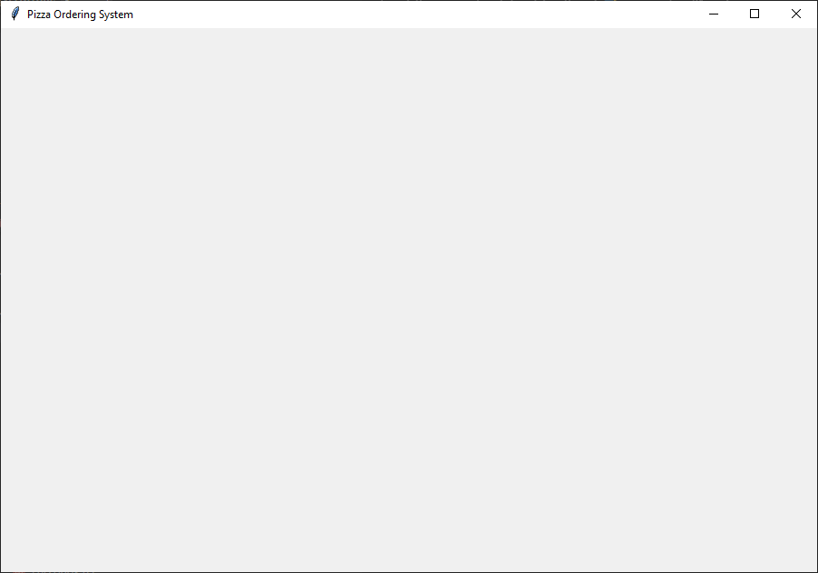

================================================
Create a window
================================================

- **Objective**: Set up the basic Tkinter window.
- **Content**:

  - Introduction to Tkinter.
  - Creating a basic window.
  - Adding a title and configuring the window size.

Introduction to Tkinter
--------------------------------

- Tkinter is a standard GUI (Graphical User Interface) library for Python.
- It provides tools to create desktop applications with windows, buttons, text fields, and more.

----

Creating a Basic Window
--------------------------------

.. code-block:: python

    import tkinter as tk

    # Create the main window
    root = tk.Tk()
    window.title("Pizza Ordering System")
    window.geometry("900x600")

    # Run the application
    window.mainloop()

- ``import tkinter as tk``: Imports the Tkinter library and assigns it the alias ``tk``.
- ``root = tk.Tk()``: Creates the main application window.
- ``window.title("Pizza Ordering System")``: Sets the title of the window.
- ``window.geometry("900x600")``: Sets the size of the window to 900 pixels wide and 600 pixels tall.
- ``window.mainloop()``: Starts the Tkinter event loop, which waits for user interactions.
