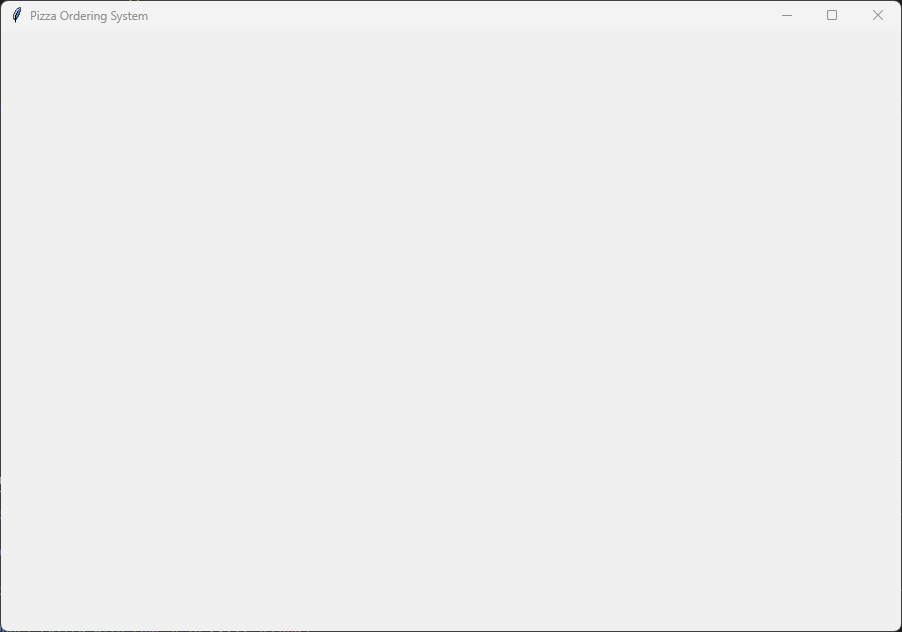

================================================
Create a window
================================================

- **Objective**: Set up the basic Tkinter root.
- **Content**:

  - Introduction to Tkinter.
  - Creating a basic root (window).
  - Adding a title and configuring the window size.
  - Placing commented sections for the different parts of the code.

Introduction to Tkinter
--------------------------------

- Tkinter is a standard GUI (Graphical User Interface) library for Python.
- It provides tools to create desktop applications with windows, buttons, text fields, and more.

----

Creating a Basic Window
--------------------------------

.. code-block:: python

    import tkinter as tk

    # 1. DATA DICTIONARIES & LISTS

    # 2. CONSTANTS & STYLES

    # 3. DEFINITIONS / FUNCTIONS

    # 4. TKINTER WIDGETS
    # Create the main window
    root = tk.Tk()
    root.title("Pizza Ordering System")
    root.geometry("900x700")

    # 5. Main code
    # Run the application
    root.mainloop()

- ``import tkinter as tk``: Imports the Tkinter library and assigns it the alias ``tk``.
- ``root = tk.Tk()``: Creates the main application root.
- ``root.title("Pizza Ordering System")``: Sets the title of the root.
- ``root.geometry("900x700")``: Sets the size of the window to 900 pixels wide and 600 pixels tall.
- ``root.mainloop()``: Starts the Tkinter event loop, which waits for user interactions.
