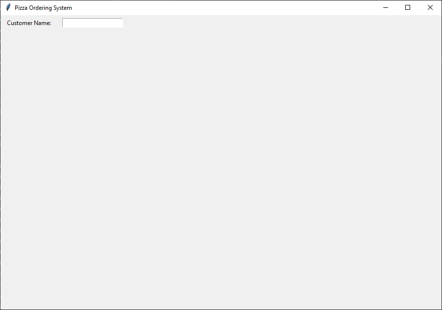

=========================================================
Pizza 2: Adding Labels and Entry Widgets
=========================================================

- **Objective**: Add labels and entry widgets for customer name input.
- **Content**:

  - Adding labels.
  - Adding entry widgets.
  - Positioning widgets using grid layout.

Adding Labels
--------------------------------

.. code-block:: python

    # Customer name
    tk.Label(root, text="Customer Name:").grid(row=0, column=0, padx=10, pady=5)

- ``tk.Label(root, text="Customer Name:")``: Creates a label widget with the text "Customer Name:".
- ``.grid(row=0, column=0, padx=10, pady=5)``: Positions the label in the grid layout at row 0, column 0, with padding of 10 pixels horizontally and 5 pixels vertically.

Adding Entry Widgets
--------------------------------

.. code-block:: python

    customer_entry = tk.Entry(root)
    customer_entry.grid(row=0, column=1, padx=10, pady=5)

- ``customer_entry = tk.Entry(root)``: Creates an entry widget for text input.
- ``.grid(row=0, column=1, padx=10, pady=5)``: Positions the entry widget in the grid layout at row 0, column 1, with padding.

Positioning Widgets Using Grid Layout
----------------------------------------------------------------

- The ``grid`` method is used to position widgets in a table-like structure.
- ``row`` and ``column`` specify the position of the widget.
- ``padx`` and ``pady`` add padding around the widget.

