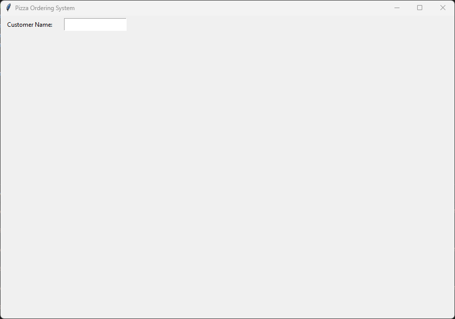

=========================================================
Add Customer Label and Entry Widget
=========================================================

- **Objective**: Add label and entry widget for customer name input.
- **Content**:

  - Adding label.
  - Adding entry widget.
  - Positioning widgets using grid layout.

----

Adding Labels
--------------------------------

| Place the following code below the other widget code in Section "4. TKINTER WIDGETS".

.. code-block:: python

    # Customer name
    customer_label = tk.Label(root, text="Customer Name:")
    customer_label.grid(row=0, column=0, padx=10, pady=5, sticky="e")

- ``customer_label = tk.Label(root, text="Customer Name:")``: Creates a label widget with the text "Customer Name:".
- ``customer_label.grid(row=0, column=0, padx=10, pady=5, sticky="e")``: Positions the label in the grid layout at row 0, column 0, with padding of 10 pixels horizontally and 5 pixels vertically.

----

Adding Entry Widgets
--------------------------------

| Place the following code below the other widget code in Section "4. TKINTER WIDGETS".

.. code-block:: python

    customer_entry = tk.Entry(root, width=20)
    customer_entry.grid(row=0, column=1, padx=10, pady=5, ipady=3, sticky="w")

- ``customer_entry = tk.Entry(root, width=20)``: Creates an entry widget for text input.
- ``.grid(row=0, column=1, padx=10, pady=5, ipady=3, sticky="w")``: Positions the entry widget in the grid layout at row 0, column 1, with padding.

----

Positioning Widgets Using Grid Layout
----------------------------------------------------------------

- The ``grid`` method is used to position widgets in a table-like structure.
- ``row`` and ``column`` specify the position of the widget.
- ``padx`` and ``pady`` add padding around the widget.

