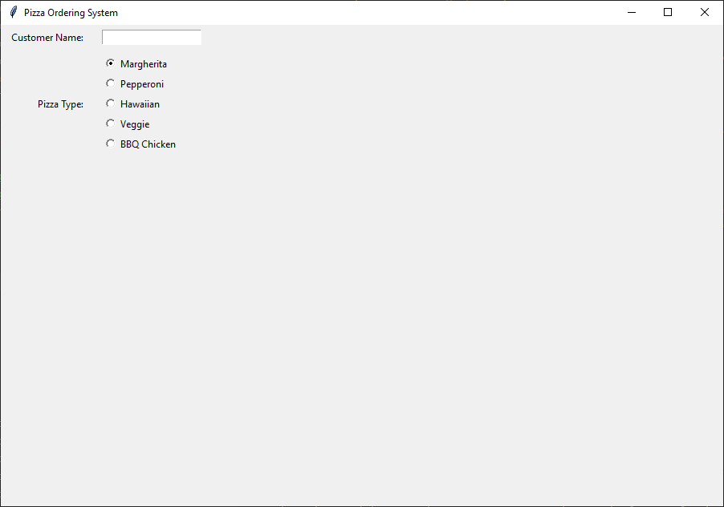

=============================================================
Pizza 3: Adding Radio Buttons for Pizza Types
=============================================================

- **Objective**: Add radio buttons for selecting pizza types.
- **Content**:

  - Introduction to radio buttons.
  - Creating and positioning radio buttons for Pizza Type.
  - Using StringVar to manage radio button values.

Introduction to Radio Buttons
--------------------------------

- Radio buttons allow users to select one option from a set of mutually exclusive options.

Creating and Positioning Radio Buttons for Pizza Type
----------------------------------------------------------------

| This code creates a label and a set of radio buttons for selecting a pizza type. The selected pizza type is stored in a `StringVar` named `pizza_var`, which is initialized to "Margherita". The radio buttons are placed vertically inside a frame and aligned to the left.

.. code-block:: python

    # Pizza type
    tk.Label(root, text="Pizza Type:").grid(row=1, column=0, padx=10, pady=5, sticky="e")
    pizza_var = tk.StringVar(root)
    pizza_var.set("Margherita")
    pizza_frame = tk.Frame(root)
    pizza_frame.grid(row=2, column=1, padx=10, pady=5, sticky="w")
    for pizza in ["Margherita", "Pepperoni", "Hawaiian", "Veggie", "BBQ Chicken"]:
        tk.Radiobutton(pizza_frame, text=pizza, variable=pizza_var, value=pizza).pack(anchor="w")

1. **Label Creation**:

    .. code-block::

      tk.Label(root, text="Pizza Type:").grid(row=1, column=0, padx=10, pady=5, sticky="e")

   - This line creates a label widget with the text "Pizza Type:".
   - The `grid` method places the label in the second row (`row=1`), first column (`column=0`) of the grid layout.
   - `padx` and `pady` add padding around the label for better spacing.
   - `sticky="e"` aligns the label to the east (right side) of its grid cell.

2. **StringVar Initialization**:

    .. code-block::

        pizza_var = tk.StringVar(root)
        pizza_var.set("Margherita")

   - `pizza_var` is a `StringVar` object that holds the value of the selected pizza type.
   - `pizza_var.set("Margherita")` sets the default value to "Margherita".

3. **Frame Creation**:

    .. code-block::

        pizza_frame = tk.Frame(root)
        pizza_frame.grid(row=2, column=1, padx=10, pady=5, sticky="w")

   - This creates a frame widget to contain the radio buttons.
   - The `grid` method places the frame in the third row (`row=2`), second column (`column=1`) of the grid layout.
   - `sticky="w"` aligns the frame to the west (left side) of its grid cell.

4. **Radio Buttons Creation**:

    .. code-block::

        for pizza in ["Margherita", "Pepperoni", "Hawaiian", "Veggie", "BBQ Chicken"]:
            tk.Radiobutton(pizza_frame, text=pizza, variable=pizza_var, value=pizza).pack(anchor="w")

   - This loop creates a radio button for each pizza type in the list.
   - Each `Radiobutton` is placed inside `pizza_frame`.
   - `text=pizza` sets the label of the radio button.
   - `variable=pizza_var` links the radio button to the `pizza_var` variable.
   - `value=pizza` sets the value of `pizza_var` when the radio button is selected.
   - `pack(anchor="w")` arranges the radio buttons vertically, aligned to the left.

Using StringVar to Manage Radio Button Values
----------------------------------------------------------------

See: https://python-course.eu/tkinter/variable-classes-in-tkinter.php

1. **StringVar Initialization**:

    .. code-block::

        pizza_var = tk.StringVar(root)

    - ``tk.StringVar`` is a class in the ``tkinter`` module that provides a way to manage the value of a widget, such as a label or entry, as a string.
    - ``pizza_var`` is an instance of ``StringVar`` associated with the ``root`` window.
    - This variable will hold the value of the selected pizza type and can be used to retrieve or update the value dynamically.

2. **Setting the Default Value**:

    .. code-block::

        pizza_var.set("Margherita")

    - The ``set`` method initializes the ``StringVar`` with a default value, in this case, "Margherita".
    - This means that when the GUI is first displayed, "Margherita" will be the pre-selected option.

3. **Why Use StringVar?**

   - **Dynamic Updates**: ``StringVar`` allows the value to be updated dynamically. When the user selects a different pizza type, ``pizza_var`` will automatically update to reflect the new selection.
   - **Data Binding**: Widgets like ``Radiobutton`` can be bound to ``StringVar``, enabling them to share and update the same value.
   - **Ease of Access**: You can easily retrieve the current value of ``pizza_var`` using the ``get`` method, which is helpful for processing user input.

    .. code-block::

        selected_pizza = pizza_var.get()

