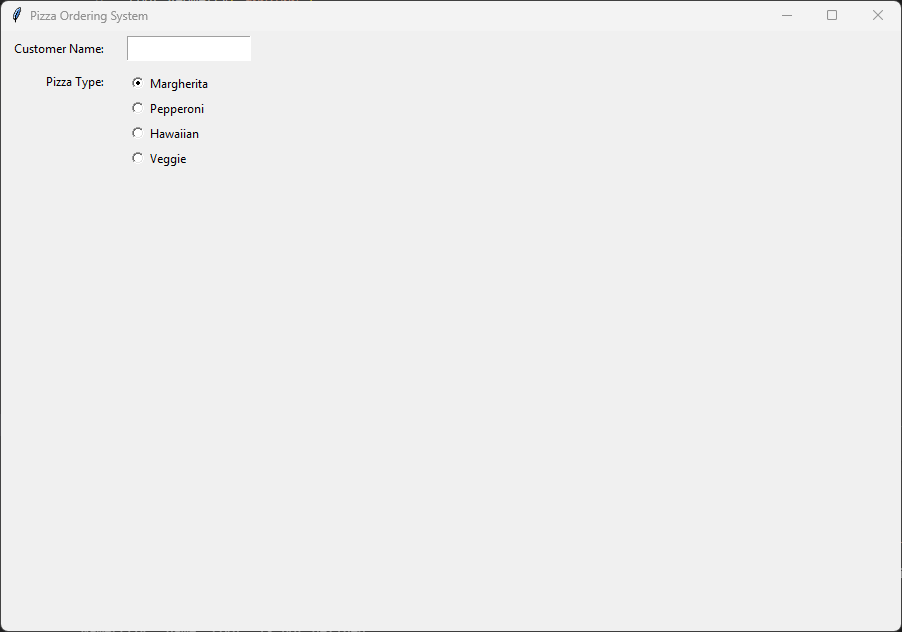

=============================================================
Add Radio Buttons for Pizza Types
=============================================================

- **Objective**: Add radio buttons for selecting pizza types.
- **Content**:

  - Introduction to radio buttons.
  - Creating and positioning radio buttons for Pizza Type.
  - Using StringVar to manage radio button values.

----

Introduction to Radio Buttons
--------------------------------

- Radio buttons allow users to select one option from a set of mutually exclusive options.

----

Creating and Positioning Radio Buttons for Pizza Type
----------------------------------------------------------------

| Place the following code below the other widget code in Section "4. TKINTER WIDGETS"
| This code creates a label and a set of radio buttons for selecting a pizza type.
| The selected pizza type is stored in a `StringVar` named `pizza_var`, which is initialized to "Margherita".
| The radio buttons are placed vertically inside a frame and aligned to the left.

.. code-block:: python

    # Pizza Type (Radio buttons)
    pizza_label = tk.Label(root, text="Pizza Type:")
    pizza_label.grid(row=1, column=0, padx=10, pady=5, sticky="ne")

    pizza_var = tk.StringVar(root)
    pizza_var.set("Margherita")

    pizza_frame = tk.Frame(root)
    pizza_frame.grid(row=1, column=1, padx=10, pady=5, sticky="w")

    for pizza in ["Margherita", "Pepperoni", "Hawaiian", "Veggie"]:
        radio_button = tk.Radiobutton(pizza_frame, text=pizza, variable=pizza_var, value=pizza)
        radio_button.pack(anchor="w")

1. **Label Creation**:

    .. code-block::

        pizza_label = tk.Label(root, text="Pizza Type:")
        pizza_label.grid(row=1, column=0, padx=10, pady=5, sticky="ne")

   - This line creates a label widget with the text "Pizza Type:".
   - The `grid` method places the label in the second row (`row=1`), first column (`column=0`) of the grid layout.
   - `padx` and `pady` add padding around the label for better spacing.
   - `sticky="ne"` aligns the label to the northeast (top-right) of its grid cell.

2. **StringVar Initialization**:

    .. code-block::

        pizza_var = tk.StringVar(root)
        pizza_var.set("Margherita")

   - `pizza_var` is a `StringVar` object that holds the value of the selected pizza type.
   - `pizza_var.set("Margherita")` sets the default value to "Margherita".
   - This means that when the GUI is first displayed, "Margherita" will be the pre-selected option.

| Tkinter variables (StringVar, IntVar, etc.) aren't normal Python strings; they are special objects linked to Tkinter's internal engine.
| By passing root, ``tk.StringVar(root)``, you are saying, "This variable belongs to this specific window."
| If that window is ever closed or destroyed, the memory used by that variable is safely cleaned up along with it.

3. **Frame Creation**:

    .. code-block::

        pizza_frame = tk.Frame(root)
        pizza_frame.grid(row=1, column=1, padx=10, pady=5, sticky="w")

   - This creates a frame widget to contain the radio buttons.
   - The `grid` method places the frame in the second row (`row=1`), second column (`column=1`) of the grid layout.
   - `sticky="w"` aligns the frame to the west (left side) of its grid cell.

4. **Radio Buttons Creation**:

    .. code-block::

        for pizza in ["Margherita", "Pepperoni", "Hawaiian", "Veggie"]:
            radio_button = tk.Radiobutton(pizza_frame, text=pizza, variable=pizza_var, value=pizza)
            radio_button.pack(anchor="w")

   - This loop creates a radio button for each pizza type in the list.
   - Each `Radiobutton` is placed inside `pizza_frame`.
   - `text=pizza` sets the label of the radio button.
   - `variable=pizza_var` links the radio button to the `pizza_var` variable.
   - `value=pizza` sets the value of `pizza_var` when the radio button is selected.
   - `pack(anchor="w")` arranges the radio buttons vertically, aligned to the left.

