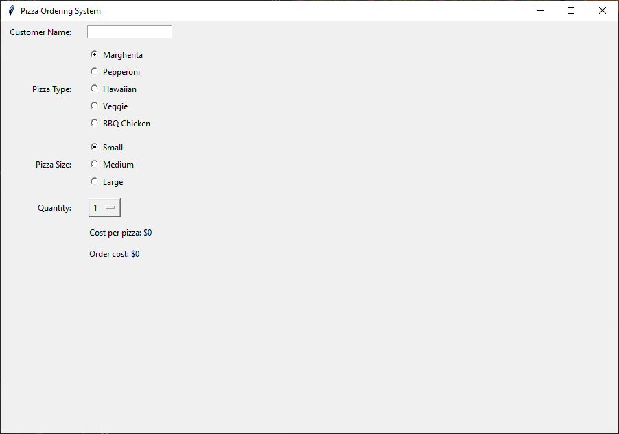

=========================================================
Pizza 5: Adding Costs
=========================================================

- **Objective**: Add costs.
- **Content**:

  - Define prices for pizzas
  - Adding Cost Display Fields
  - Calculating the cost based on selection.
  - Updating costs dynamically based on selections.

Define prices for pizzas
------------------------------

| ``prices`` is a nested dictionary that stores the prices of different pizza types based on their sizes. The outer dictionary keys are the names of the pizzas (e.g., "Margherita", "Pepperoni"), and each key maps to another dictionary. The inner dictionaries have keys representing the sizes of the pizzas ("Small", "Medium", "Large") and values representing the corresponding prices. For example, a small Margherita pizza costs 5 dollars, while a large BBQ Chicken pizza costs 12 dollars.

.. code-block:: python

    # Define the prices for each pizza size
    prices = {
        "Margherita": {"Small": 5, "Medium": 7, "Large": 10},
        "Pepperoni": {"Small": 6, "Medium": 8, "Large": 11},
        "Hawaiian": {"Small": 6, "Medium": 8, "Large": 11},
        "Veggie": {"Small": 5, "Medium": 7, "Large": 10},
        "BBQ Chicken": {"Small": 7, "Medium": 9, "Large": 12}
    }

| The cost of a particular pizza, pizza_type, of size, pizza_size, is retrieved by accessing ``prices[pizza_type][pizza_size]``.

Adding Cost Display Fields
------------------------------

Cost per pizza display
~~~~~~~~~~~~~~~~~~~~~~~

| This code sets up a label to display the cost per pizza. The displayed text is managed by a `StringVar` named `cost_display_var`, which is initialized to "Cost per pizza: $0". The label is placed in the grid layout and aligned to the left, ensuring it updates dynamically based on the value of `cost_display_var`.

.. code-block:: python

    # Cost per pizza display
    cost_display_var = tk.StringVar(root)
    cost_display_var.set("Cost per pizza: $0")
    tk.Label(root, textvariable=cost_display_var).grid(row=4, column=1, padx=10, pady=5, sticky="w")

- ``cost_display_var = tk.StringVar(root)``: Creates a StringVar to hold the cost per pizza.
- ``cost_display_var.set("Cost per pizza: $0")``: initializes the `StringVar` with the default text "Cost per pizza: $0", and so sets the initial value of the cost display.
- ``tk.Label(root, textvariable=cost_display_var)``: Creates a label that displays the cost per pizza, the value of `cost_display_var`.
- The `grid` method, ``.grid(row=4, column=1, padx=10, pady=5, sticky="w")``, places the label in the fifth row (`row=4`), second column (`column=1`) of the grid layout.
- `padx` and `pady` add padding around the label for better spacing.
- `sticky="w"` aligns the label to the west (left side) of its grid cell.

Order cost display
~~~~~~~~~~~~~~~~~~~~~~~

| This code sets up a label to display the total order cost. The displayed text is managed by a `StringVar` named `order_cost_var`, which is initialized to "Order cost: $0". The label is placed in the grid layout and aligned to the left, ensuring it updates dynamically based on the value of `order_cost_var`.

.. code-block:: python

    # order cost display
    order_cost_var = tk.StringVar(root)
    order_cost_var.set("Order cost: $0")
    tk.Label(root, textvariable=order_cost_var).grid(row=5, column=1, padx=10, pady=5, sticky="w")

- ``order_cost_var = tk.StringVar(root)``: Creates a StringVar to hold the order cost.
- ``order_cost_var.set("Order cost: $0")``:  initializes the `StringVar` with the default text "Order cost: $0", and so sets the initial value of the order cost display.
- ``tk.Label(root, textvariable=order_cost_var)``: Creates a label that displays the order cost, the value of `order_cost_var`.
- The `textvariable` parameter links the label to the `order_cost_var` variable, so any changes to `order_cost_var` will automatically update the label's text.
- The `grid` method places the label in the sixth row (`row=5`), second column (`column=1`) of the grid layout.
- `padx` and `pady` add padding around the label for better spacing.
- `sticky="w"` aligns the label to the west (left side) of its grid cell.

Calculating the cost based on selection.
-------------------------------------------------

| Use ``update_costs`` to calculate the cost of a pizza and the Order cost.
| This function updates the displayed cost per pizza and the total order cost based on the selected pizza type, size, and quantity.
| It retrieves the necessary values from the corresponding pizza type and size `StringVar` variables and quantity `IntVar` variable, calculates the costs using the `prices` dictionary, and updates the display variables accordingly.

.. code-block:: python

    # Costs
    def update_costs(*args):
        pizza = pizza_var.get()
        size = size_var.get()
        quantity = quantity_var.get()
        if pizza and size:
            cost = prices[pizza][size]
            cost_display_var.set(f"Cost per pizza: ${cost}")
            if quantity:
                order_cost = cost * quantity
                order_cost_var.set(f"Order cost: ${order_cost}")

1. **Function Definition**:

    .. code-block::

        def update_costs(*args):

    - This line defines a function named `update_costs` that takes any number of arguments (`*args`).
    - The `*args` parameter in a function definition allows the function to accept an arbitrary number of positional arguments. This means you can pass any number of arguments to the function, and they will be accessible as a tuple within the function.
    - In the context of Tkinter and event-driven programming, `*args` is particularly useful for binding functions to multiple events. When an event occurs (like a button click or a change in a widget's value), Tkinter automatically passes event-specific information to the callback function. By using `*args`, the function can handle these additional arguments without explicitly defining them.

2. **Retrieve Selected Values**:

    .. code-block::

        pizza = pizza_var.get()
        size = size_var.get()
        quantity = quantity_var.get()

    - `pizza = pizza_var.get()` retrieves the selected pizza type from the `pizza_var` variable.
    - `size = size_var.get()` retrieves the selected pizza size from the `size_var` variable.
    - `quantity = quantity_var.get()` retrieves the selected quantity from the `quantity_var` variable as an integer.

3. **Calculate Costs**:

    .. code-block::

        if pizza and size:
            cost = prices[pizza][size]
            cost_display_var.set(f"Cost per pizza: ${cost}")
            if quantity:
                order_cost = cost * quantity
                order_cost_var.set(f"Order cost: ${order_cost}")

    - The `if pizza and size:` condition checks if both a pizza type and size have been selected.
    - `cost = prices[pizza][size]` retrieves the cost of the selected pizza type and size from the `prices` dictionary.
    - `cost_display_var.set(f"Cost per pizza: ${cost}")` updates the `cost_display_var` with the cost of a single pizza.
    - The nested `if quantity:` condition checks if a quantity has been selected.
    - `order_cost = cost * quantity` calculates the total order cost by multiplying the cost of a single pizza by the quantity.
    - `order_cost_var.set(f"Order cost: ${order_cost}")` updates the `order_cost_var` with the total order cost.

Updating Costs Dynamically Based on Selections
------------------------------------------------------

| These lines of code ensure that any changes to the `pizza_var`, `size_var`, or `quantity_var` variables will automatically trigger the `update_costs` function. This allows the GUI to dynamically update the displayed costs based on the user's selections.
| ``trace_add`` is a method of ``StringVar`` that allows updating of the costs whenever the pizza type or size changes.
| ``trace_add`` is a method of ``IntVar`` that allows updating of the costs whenever the pizza quantity changes.

.. code-block:: python

    # place after pizza_var.set method
    pizza_var.trace_add("write", update_costs)

.. code-block:: python

    # place after size_var.set method
    size_var.trace_add("write", update_costs)

.. code-block:: python

    # place after quantity_var.set method
    quantity_var.trace_add("write", update_costs)

- **pizza_var.trace_add("write", update_costs)**:

  - The `trace_add` method is used to monitor changes to the `StringVar` variables. When a change is detected, it triggers the `update_costs` function.
  - The `"write"` mode indicates that the trace should trigger when the variable's value is written or updated.
  - The `update_costs` function is called whenever `pizza_var` changes.
  - Each time `pizza_var` changes, Tkinter passes event-specific arguments to `update_costs`. The `*args` parameter in `update_costs` ensures that `update_costs` can accept these arguments without any issues.

- **size_var.trace_add("write", update_costs)**:

  - This line sets up a trace on the `size_var` variable.
  - The `update_costs` function is called whenever `size_var` changes.

- **quantity_var.trace_add("write", update_costs)**:

  - This line sets up a trace on the `quantity_var` variable.
  - The `update_costs` function is called whenever `quantity_var` changes.

- Add this code below to the previous lines of code dealing with ``pizza_var``.

.. code-block:: python

    pizza_var.trace_add("write", update_costs)

- Add this code below to the previous lines of code dealing with ``size_var``.

.. code-block:: python

    size_var.trace_add("write", update_costs)

- Add this code below to the previous lines of code dealing with ``quantity_var``.

.. code-block:: python

    quantity_var.trace_add("write", update_costs)

