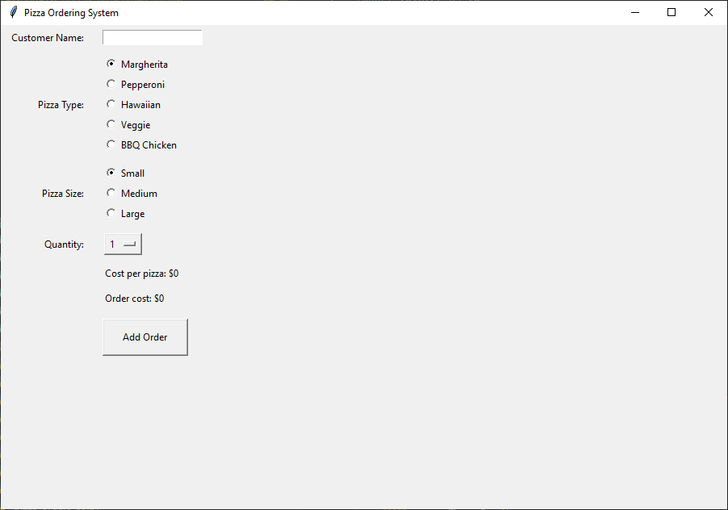

================================================
Pizza 6: Adding Orders
================================================

- **Objective**: Add functionality to add orders.
- **Content**:

  - Creating an add order button.
  - Writing the `add_order` function.
  - Validating input and updating the order list.

Creating an Add Order Button
------------------------------------

.. code-block:: python

    # Add order button
    add_button = tk.Button(root, text="Add Order", command=add_order)
    add_button.grid(row=6, column=1, padx=10, pady=10, ipadx=20, ipady=10, sticky="w")

- ``tk.Button(root, text="Add Order", command=add_order, bg=button_bg, fg=button_fg)``: Creates a button with the text "Add Order" and assigns the ``add_order`` function to be called when the button is clicked.
- ``.grid(row=6, column=1, padx=10, pady=10, ipadx=20, ipady=10, sticky="w")``: Positions the button in the grid layout.

Writing the ``add_order`` Function
---------------------------------------

| Add an import line for the messsagebox that is needed if no customer name is entered.

.. code-block:: python

    from tkinter import messagebox

| Add a list variable to keep track of orders.
| Orders will be added as tuples of (customer, pizza, size, quantity).
| Place this near the top of the code under the prices.

.. code-block:: python

    # orders
    orders = []

| Add an import line for the messsagebox that is needed if no customer name is entered.

.. code-block:: python

    def add_order():
        customer = customer_entry.get()
        pizza = pizza_var.get()
        size = size_var.get()
        quantity = quantity_var.get()

        if not customer:
            messagebox.showerror("Input Error", "Please enter the customer name.")
            customer_entry.config(bg="red")
            return
        else:
            customer_entry.config(bg="white")

        orders.append((customer, pizza, size, quantity))
        quantity_var.set("1")

- ``add_order``: Function to add an order to the list.
- ``customer = customer_entry.get()``: Retrieves the customer name from the entry widget.
- ``pizza = pizza_var.get()``: Retrieves the selected pizza type.
- ``size = size_var.get()``: Retrieves the selected pizza size.
- ``quantity = quantity_var.get()``: Retrieves the selected quantity string as an integer.
- ``messagebox.showerror("Input Error", "Please enter the customer name.")``: Displays an error message if the customer name is not entered.
- ``orders.append((customer, pizza, size, quantity))``: Adds the order to the list of orders.
- ``quantity_var.set("1")``: Resets the quantity to 1.

