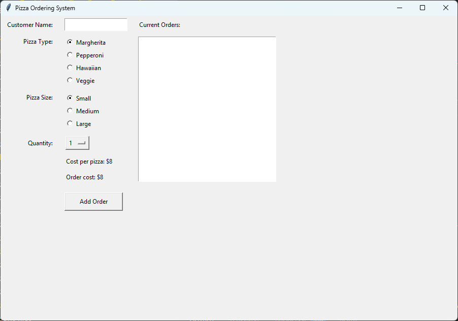

================================================
Display Orders
================================================

- **Objective**: Display the list of orders.
- **Content**:

  - Adding a Listbox widget to display orders.
  - Formatting the orders display.
  - Updating the orders list dynamically.

----

Adding a Listbox Widget to Display Orders
------------------------------------------

| Place the following code below the other widget code in Section "4. TKINTER WIDGETS" to create a Listbox widget for displaying orders.

.. code-block:: python

    # --- RIGHT SIDE: ORDER DISPLAY & MANAGEMENT ---

    # Order List Label & Listbox
    orders_label = tk.Label(root, text="Current Orders:")
    orders_label.grid(row=0, column=2, padx=10, pady=5, sticky="w")
    order_list = tk.Listbox(root, width=45, height=12)
    order_list.grid(row=1, column=2, rowspan=5, columnspan=2, padx=10, pady=5, sticky="nsew")

- ``orders_label = tk.Label(root, text="Current Orders:")``: Creates a label widget with the text "Current Orders:".
- ``orders_label.grid(row=0, column=2, padx=10, pady=5, sticky="w")``: Positions the label widget in the grid layout.
- ``order_list = tk.Listbox(root, width=45, height=12)``: Creates a Listbox widget to display the list of orders.
- ``order_list.grid(row=1, column=2, rowspan=5, columnspan=2, padx=10, pady=5, sticky="nsew")``: Positions the Listbox widget in the grid layout.

----

Display the orders as a list
----------------------------------

.. code-block:: python

    # Display orders
    def update_order_list():
        order_list.delete(0, tk.END)
        total_cost = 0

        for order in orders:
            customer, pizza, size, quantity = order
            cost = prices[pizza][size] * quantity
            total_cost += cost
            order_list.insert(tk.END, f"{customer} - {quantity} {size} {pizza} - ${cost}")
        if orders:
            order_list.insert(tk.END, f"Total cost: ${total_cost}")

- ``order_list.delete(0, tk.END)``: Clears the Listbox widget.
- ``order_list.insert(tk.END, f"{customer} - {quantity} {size} {pizza} - ${cost}")``: Inserts the formatted order details into the Listbox widget.
- ``order_list.insert(tk.END, f"Total cost: ${total_cost}")``: Inserts the total cost at the end of the Listbox.

----

Updating the Orders List Dynamically
--------------------------------------------

- Call ``update_order_list()`` whenever an order is added.
- Add the code line below to the bottomo of the ``else`` block inadd_order()

.. code-block:: python

    # add to add_order()
    update_order_list()
