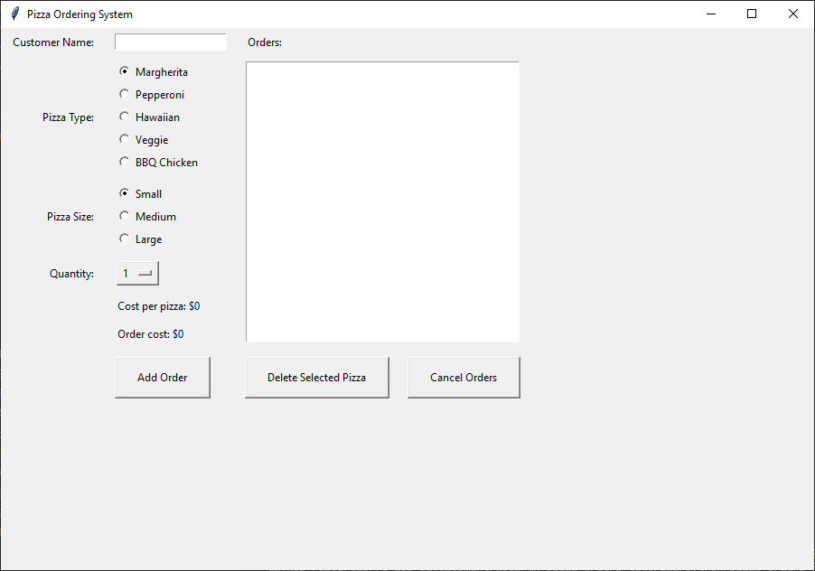

================================================
Pizza 8: Deleting Orders
================================================

- **Objective**: Add functionality to delete orders.
- **Content**:

  - Creating a delete order section.
  - Writing the `delete_selected_pizza` function.
  - Writing the `select_order` Function
  - Binding the `select_order` Function to the listbox
  - Writing the `cancel_order` Function

Creating a Delete Order Section
------------------------------------

.. code-block:: python

    # Delete selected pizza button
    delete_pizza_button = tk.Button(root, text="Delete Selected Pizza", command=delete_selected_pizza)
    delete_pizza_button.grid(row=6, column=2, padx=10, ipadx=20, ipady=10, pady=5, sticky="w")

- ``delete_pizza_button = tk.Button(root, text="Delete Selected Pizza", command=delete_selected_pizza)``: Creates a button labeled "Delete Selected Pizza" and sets the command to `delete_selected_pizza`, which will be executed when the button is clicked.
- ``delete_pizza_button.grid(row=6, column=2, padx=10, ipadx=20, ipady=10, pady=5, sticky="w")``: Places the button in the grid layout at row 6, column 2 and adds padding around the button: 10 pixels on the x-axis (`padx`), 20 pixels inside the button on the x-axis (`ipadx`), 10 pixels inside the button on the y-axis (`ipady`), and 5 pixels on the y-axis (`pady`) and aligns the button to the west (left) side of the cell (`sticky="w"`).

.. code-block:: python

    # Cancel whole order button
    cancel_order_button = tk.Button(root, text="Cancel Orders", command=cancel_order)
    cancel_order_button.grid(row=6, column=3, padx=10, ipadx=20, ipady=10, pady=5, sticky="w")

- ``cancel_order_button = tk.Button(root, text="Cancel Orders", command=cancel_order)``: creates a button labeled "Cancel Orders", and sets the command to `cancel_order`, which will be executed when the button is clicked.
- ``cancel_order_button.grid(row=6, column=3, padx=10, ipadx=20, ipady=10, pady=5, sticky="w")``: Places the button in the grid layout at row 6, column 2 and adds padding around the button: 10 pixels on the x-axis (`padx`), 20 pixels inside the button on the x-axis (`ipadx`), 10 pixels inside the button on the y-axis (`ipady`), and 5 pixels on the y-axis (`pady`)and aligns the button to the west (left) side of the cell (`sticky="w"`).

Writing the **delete_selected_pizza** Function
------------------------------------------------

.. code-block:: python

    # Delete selected pizza
    def delete_selected_pizza():
        order_selection = order_list.curselection()
        if not order_selection:
            messagebox.showerror("Input Error", "Please select a pizza to delete.")
            return
        order_index = order_selection[0]
        if order_index == order_list.size() - 1:
            messagebox.showerror("Input Error",
                                "Cannot delete the total cost line.")
            return
        del orders[order_index]
        update_order_list()

- ``order_selection = order_list.curselection()``: Gets the index of the selected item in the Listbox as a tuple like (0,).
- ``if not order_selection: messagebox.showerror("Input Error", "Please select a pizza to delete.")``: Shows an error message if no pizza is selected.
- ``order_index = order_selection[0]`` get the line number from the tuple.
- ``if order_index == order_list.size() - 1: messagebox.showerror("Input Error", "Cannot delete the total cost line.")``: Shows an error message if the selected item is the total cost line.
- ``del orders[order_index]``: Deletes the selected order from the orders list.

Writing the **select_order** Function
------------------------------------------------

| ``select_order`` puts in the customer name form the order, and reselects the pizza, size and quantity so it can easily be adjusted.

.. code-block:: python

    # Select order
    def select_order(event):
        order_selection = order_list.curselection()
        if order_selection:
            order_index = order_selection[0]
            if order_index < len(orders):
                customer, pizza, size, quantity = orders[order_index]
                customer_entry.delete(0, tk.END)
                customer_entry.insert(0, customer)
                pizza_var.set(pizza)
                size_var.set(size)
                quantity_var.set(str(quantity))

- ``order_selection = order_list.curselection()``: Retrieves a tuple of indices of all selected items in the Listbox.
- ``if order_selection:``: Checks if there is at least one selected item.
- ``order_index = order_selection[0]``: Gets the index of the first selected item.
- ``if order_index < len(orders):``: Ensures the selected index is within the range of the orders list.
- ``customer, pizza, size, quantity = orders[order_index]``: Unpacks the selected order's details into respective variables.
- ``customer_entry.delete(0, tk.END)``: Clears the current text in the customer entry field.
- ``customer_entry.insert(0, customer)``: Inserts the selected customer's name into the customer entry field.
- ``pizza_var.set(pizza)``: Sets the pizza variable to the selected pizza type.
- ``size_var.set(size)``: Sets the size variable to the selected pizza size.
- ``quantity_var.set(str(quantity))``: Sets the quantity variable to the selected quantity, converting it to a string.

Binding the **select_order** Function to the listbox
------------------------------------------------------

| Add this code to the rest of the lines dealing with `order_list`.
| It binds the `select_order` function to the `<<ListboxSelect>>` event of the `order_list` Listbox.
| The `<<ListboxSelect>>` event is triggered whenever the selection in the Listbox changes.
| When a user selects an item in the Listbox, the `select_order` function is called automatically.

.. code-block:: python

    # add for reselectings chosen options:
    order_list.bind('<<ListboxSelect>>', select_order)

Writing the **cancel_order** Function
------------------------------------------------

.. code-block:: python

    # Cancel whole order
    def cancel_order():
        orders.clear()
        update_order_list()

- ``orders.clear``: empties the list of orders.
- ``update_order_list()``: updates the displayed order, which in effect clears it.
