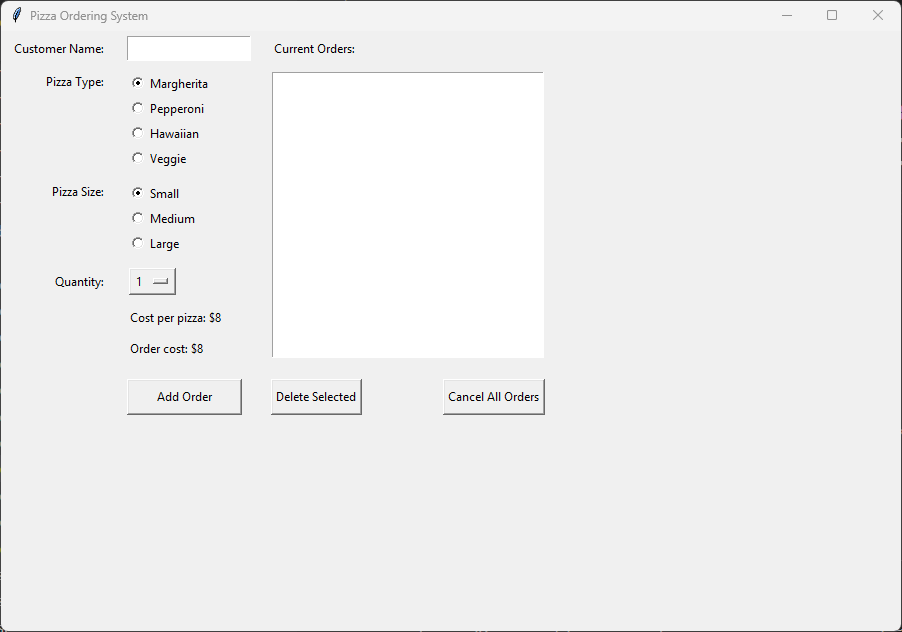

================================================
Deleting Orders
================================================

- **Objective**: Add functionality to delete orders.
- **Content**:

  - Creating a delete order section.
  - Writing the `delete_selected_pizza` function.
  - Writing the `select_order` Function
  - Binding the `select_order` Function to the listbox
  - Writing the `cancel_order` Function

----

Creating a Delete Order Section
------------------------------------

| Add the following code to below the other widegt code to create buttons for deleting the selected pizza and canceling the whole order.

.. code-block:: python

   # Action Button: Delete Selected
    delete_pizza_button = tk.Button(root, text="Delete Selected", command=delete_selected_pizza)
    delete_pizza_button.grid(row=6, column=2, padx=10, pady=15, ipady=5, sticky="w")

- ``delete_pizza_button = tk.Button(root, text="Delete Selected Pizza", command=delete_selected_pizza)``: Creates a button labeled "Delete Selected Pizza" and sets the command to `delete_selected_pizza`, which will be executed when the button is clicked.
- ``delete_pizza_button.grid(row=6, column=2, padx=10,  pady=5, ipadx=20, ipady=10,sticky="w")``: Places the button in the grid layout at row 6, column 2 and adds external padding around the button: 10 pixels on the x-axis (`padx`),and 5 pixels on the y-axis (`ipady`), and 20 pixels inside the button on the x-axis (`ipadx`), 10 pixels inside the button on the y-axis (`ipady`), and aligns the button to the west (left) side of the cell (`sticky="w"`).

.. code-block:: python

    # Action Button: Cancel All Orders
    cancel_order_button = tk.Button(root, text="Cancel All Orders", command=cancel_order)
    cancel_order_button.grid(row=6, column=3, padx=10, pady=15, ipady=5, sticky="e")

- ``cancel_order_button = tk.Button(root, text="Cancel Orders", command=cancel_order)``: creates a button labeled "Cancel Orders", and sets the command to `cancel_order`, which will be executed when the button is clicked.
- ``cancel_order_button.grid(row=6, column=3, padx=10, pady=5, ipadx=20, ipady=10, sticky="e")``: Places the button in the grid layout at row 6, column 3 and adds padding around the button: 10 pixels on the x-axis (`padx`), 20 pixels inside the button on the x-axis (`ipadx`), 10 pixels inside the button on the y-axis (`ipady`), and 5 pixels on the y-axis (`pady`)and aligns the button to the east (right) side of the cell (`sticky="e"`).

----

Writing the **delete_selected_pizza** Function
------------------------------------------------

.. code-block:: python

    # Delete selected pizza
    def delete_selected_pizza():
        order_selection = order_list.curselection()
        if not order_selection:
            messagebox.showerror("Input Error", "Please select a pizza to delete.")
            return
        order_index = order_selection[0]
        if order_index == order_list.size() - 1:
            messagebox.showerror("Input Error",
                                "Cannot delete the total cost line.")
            return
        del orders[order_index]
        update_order_list()

- ``order_selection = order_list.curselection()``: Gets the index of the selected item in the Listbox as a tuple like (0,) for line 0, or (1, ) for line 1 or (0, 1, 2) for lines 0 to 2.
- ``if not order_selection: messagebox.showerror("Input Error", "Please select a pizza to delete.")``: Shows an error message if no pizza is selected.
- ``order_index = order_selection[0]`` gets the selected line number from the tuple at index 0.
- ``if order_index == order_list.size() - 1: messagebox.showerror("Input Error", "Cannot delete the total cost line.")``: Shows an error message if the selected item is the total cost line.
- ``del orders[order_index]``: Deletes the selected order from the orders list.

----

Writing the **cancel_order** Function
------------------------------------------------

.. code-block:: python

    # Cancel whole order
    def cancel_order():
        orders.clear()
        update_order_list()

- ``orders.clear``: empties the list of orders.
- ``update_order_list()``: updates the displayed order, which in effect clears it.
