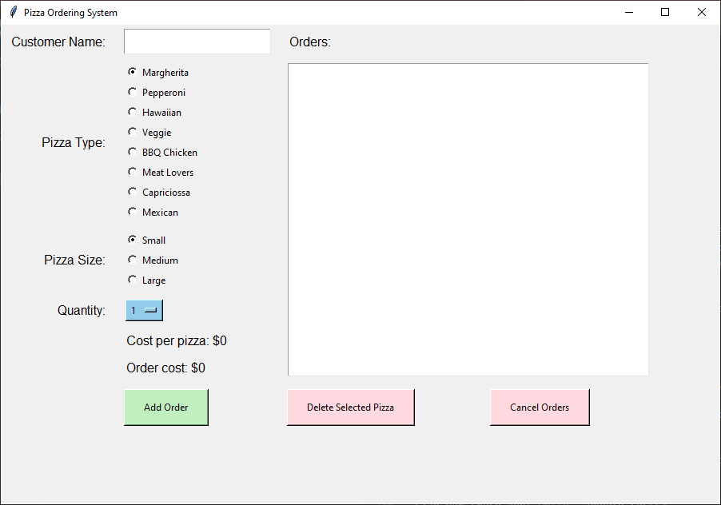

==================================================
Pizza 9: Final Touches and Styling
==================================================

- **Objective**: Add final touches and improve the GUI styling.
- **Content**:

  - Adding Font and colour variables
  - Adding font and colour settings to tkinter widgets
  - Updating Pizza type to use prices dictionary
  - Final review and testing.

Adding Font and colour variables
--------------------------------

| Add this code at the top of the file under the prices dictionary.
| This allows the variables to be used to adjust colouring in the various functions, not just the tkinter objects code lines.

.. code-block:: python

    # Style configurations
    LABEL_FONT = ("Helvetica", 12)
    ENTRY_FONT = ("Helvetica", 14)
    ORDER_FONT = ("Helvetica", 12)
    ENTRY_BG = "#ffffff"  # white
    TEXT_BG = "#f0f0f0"  # Very light gray
    TEXT_FG = "#000000"  # black

    QUANTITY_BG = "#93ccea"  # Very soft blue
    QUANTITY_HOVER_BG = "#53aede"  # soft blue

    ORDER_LIST_TOTAL_BG = "#c0f0c0"  # Very soft lime green
    ORDER_LIST_TOTAL_SELECTED_BG = "#5bd85b"  # moderate lime green

    ADD_BUTTON_BG = "#c0f0c0"  # Very soft lime green
    ADD_BUTTON_FG = "#000000"  # black
    ADD_BUTTON_HOVER_BG = "#5bd85b"  # moderate lime green

    DELETE_BUTTON_BG = "#ffdae0"  # very pale red
    DELETE_BUTTON_FG= "#000000"  # black
    DELETE_BUTTON_HOVER_BG = "#ffc1cb"  # very pale red

Adding font and colour settings to tkinter widgets
----------------------------------------------------

| Add or adjust the code below for font and colour settings in each section for each widget.

.. code-block:: python

    # Create the main window
    root.configure(bg=TEXT_BG)

    # Customer name
    tk.Label(root, text="Customer Name:", font=LABEL_FONT, bg=TEXT_BG).grid(row=0, column=0, padx=10, pady=5, sticky="e")
    customer_entry = tk.Entry(root, font=ENTRY_FONT, bg=ENTRY_BG)

    # Pizza type
    tk.Label(root, text="Pizza Type:", font=LABEL_FONT, bg=TEXT_BG).grid(row=1, column=0, padx=10, pady=5, sticky="e")

    pizza_frame = tk.Frame(root, bg=TEXT_BG)

    for pizza in prices.keys():
        tk.Radiobutton(pizza_frame, text=pizza, variable=pizza_var, value=pizza, bg=TEXT_BG).pack(anchor="w")

    # Pizza size
    tk.Label(root, text="Pizza Size:", font=LABEL_FONT, bg=TEXT_BG).grid(row=2, column=0, padx=10, pady=5, sticky="e")

    size_frame = tk.Frame(root, bg=TEXT_BG)

    for pizza in prices.keys():
        tk.Radiobutton(pizza_frame, text=pizza, variable=pizza_var, value=pizza, bg=TEXT_BG).pack(anchor="w")

    # Quantity
    tk.Label(root, text="Quantity:", font=LABEL_FONT, bg=TEXT_BG).grid(row=3, column=0, padx=10, pady=5, sticky="e")

    quantity_menu.config(bg=QUANTITY_BG, fg=TEXT_FG, activebackground=QUANTITY_HOVER_BG, activeforeground=TEXT_FG)  # for menu button

    quantity_menu["menu"].config(bg=QUANTITY_BG, fg=TEXT_FG)  # for menu items

    # Cost per pizza display
    tk.Label(root, textvariable=cost_display_var, font=LABEL_FONT, bg=TEXT_BG).grid(row=4, column=1, padx=10, pady=5, sticky="w")

    # Order cost display
    tk.Label(root, textvariable=order_cost_var, font=ORDER_FONT, bg=TEXT_BG).grid(row=5, column=1, padx=10, pady=5, sticky="w")

    # Add order button
    add_button = tk.Button(root, text="Add Order", command=add_order, bg=ADD_BUTTON_BG, fg=ADD_BUTTON_FG, activebackground=ADD_BUTTON_HOVER_BG)

    # Orders list
    tk.Label(root, text="Orders:", font=LABEL_FONT, bg=TEXT_BG).grid(row=0, column=2, padx=10, pady=5, sticky="w")
    order_list = tk.Listbox(root, width=50, bg=ENTRY_BG)

    # Delete selected pizza button
    delete_pizza_button = tk.Button(root, text="Delete Selected Pizza", command=delete_selected_pizza, bg=DELETE_BUTTON_BG, fg=DELETE_BUTTON_FG, activebackground=DELETE_BUTTON_HOVER_BG)

    # Cancel whole order button
    cancel_order_button = tk.Button(root, text="Cancel Orders", command=cancel_order, bg=DELETE_BUTTON_BG, fg=DELETE_BUTTON_FG, activebackground=DELETE_BUTTON_HOVER_BG)

Adding color to the Orders list total
---------------------------------------

| Adjust the padding, alignment, and size of widgets to create a more polished look.

.. code-block:: python

    # Display orders
    def update_order_list():
        order_list.delete(0, tk.END)
        total_cost = 0
        for order in orders:
            customer, pizza, size, quantity = order
            cost = prices[pizza][size] * quantity
            total_cost += cost
            order_list.insert(tk.END, f"{customer} - {quantity} {size} {pizza}(s) - ${cost}")
        if orders:
            order_list.insert(tk.END, f"Total cost: ${total_cost}")
            # add color to last line of order list for total
            order_list.itemconfig(order_list.size() - 1, {"bg": ORDER_LIST_TOTAL_BG, "selectbackground": ORDER_LIST_TOTAL_SELECTED_BG})

Adding hover color to buttons
---------------------------------------

| The **Add Order**, **Delete Selected Pizza** and **Cancel Orders** buttons require special code to change colour on hovering.

| **Add Order** button changes
~~~~~~~~~~~~~~~~~~~~~~~~~~~~~~~~~

.. code-block:: python

    # Function to change color on hover
    def on_enter_add(e):
        add_button.config(bg=ADD_BUTTON_HOVER_BG)

    def on_leave_add(e):
        add_button.config(bg=ADD_BUTTON_BG)

    # Add order button
    # for hover color change:
    # Bind the hover events
    add_button.bind("<Enter>", on_enter_add)
    add_button.bind("<Leave>", on_leave_add)

| **Delete Selected Pizza** button changes
~~~~~~~~~~~~~~~~~~~~~~~~~~~~~~~~~~~~~~~~~~~~~

.. code-block:: python

    # Function to change color on hover
    def on_enter_delete(e):
        delete_pizza_button.config(bg=DELETE_BUTTON_HOVER_BG)

    def on_leave_delete(e):
        delete_pizza_button.config(bg=DELETE_BUTTON_BG)

    # Delete selected pizza button
    # for hover color change:
    # Bind the hover events
    delete_pizza_button.bind("<Enter>", on_enter_delete)
    delete_pizza_button.bind("<Leave>", on_leave_delete)

| **Cancel Orders** button changes
~~~~~~~~~~~~~~~~~~~~~~~~~~~~~~~~~~~~~~~~~~~~~

.. code-block:: python

    # Function to change color on hover
    def on_enter_cancel(e):
        cancel_order_button.config(bg=DELETE_BUTTON_HOVER_BG)

    def on_leave_cancel(e):
        cancel_order_button.config(bg=DELETE_BUTTON_BG)

    # Cancel whole order button
    # for hover color change:
    # Bind the hover events
    cancel_order_button.bind("<Enter>", on_enter_cancel)
    cancel_order_button.bind("<Leave>", on_leave_cancel)

Improving the customer_entry width
-----------------------------------------------------

- Adjust the width to set a wider customer entry field.
- Add internal vertical padding using `ipady`.

.. code-block:: python

    customer_entry = tk.Entry(root, font=ENTRY_FONT, bg=ENTRY_BG, width=20)
    customer_entry.grid(row=0, column=1, padx=10, pady=5, ipady=5)

Updating Pizza type to use prices dictionary
------------------------------------------------------

| Adjust "# Pizza type" code section to use keys from the prices dictionary instead of manual entries.
| This allows updating the pizza dictionary to flow through to the pizza options.

| Replace ``["Margherita", "Pepperoni", "Hawaiian", "Veggie", "BBQ Chicken"]`` with ``prices.keys()``.

.. code-block:: python

    for pizza in prices.keys():
        tk.Radiobutton(pizza_frame, text=pizza, variable=pizza_var, value=pizza, bg=TEXT_BG).pack(anchor="w")

| Test these code changes by adding ot the prices dictionary.

.. code-block:: python

    # Define the prices for each pizza size
    prices = {
        "Margherita": {"Small": 5, "Medium": 7, "Large": 10},
        "Pepperoni": {"Small": 6, "Medium": 8, "Large": 11},
        "Hawaiian": {"Small": 6, "Medium": 8, "Large": 11},
        "Veggie": {"Small": 5, "Medium": 7, "Large": 10},
        "BBQ Chicken": {"Small": 7, "Medium": 9, "Large": 12},
        "Meat Lovers": {"Small": 7, "Medium": 9, "Large": 12},
        "Capriciossa": {"Small": 6, "Medium": 8, "Large": 11},
        "Mexican": {"Small": 6, "Medium": 8, "Large": 11},
    }

Final Review and Testing
-----------------------------------------

- Test the application to ensure all features work as expected.
- Make any necessary adjustments to improve functionality and user experience.
