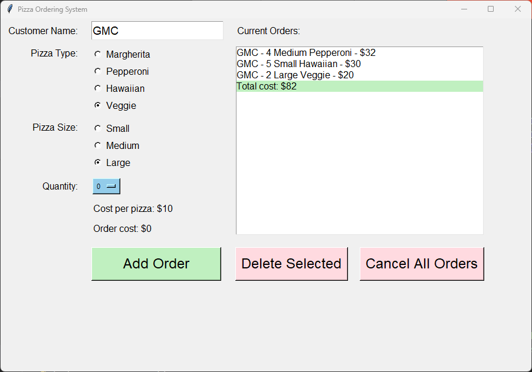

==================================================
Final Touches and Styling
==================================================

- **Objective**: Add final touches and improve the GUI styling.
- **Content**:

  - Expand Pizza prices dictionary
  - Updating Pizza type to use prices dictionary
  - Adding Font and colour variables
  - Adding font and colour settings to tkinter widgets
  - Final testing.

----

Expanding Pizza prices dictionary
------------------------------------------------------

| Place the following code in Section "1. DATA DICTIONARIES & LISTS".

.. code-block:: python

    # Define the prices for each pizza size
    prices = {
        "Margherita": {"Small": 8, "Medium": 12, "Large": 15},
        "Veggie": {"Small": 9, "Medium": 12, "Large": 16},
        "Pepperoni": {"Small": 9, "Medium": 13, "Large": 17},
        "Hawaiian": {"Small": 10, "Medium": 14, "Large": 18},
        "Capriciossa": {"Small": 10, "Medium": 14, "Large": 18},
        "Mexican": {"Small": 10, "Medium": 14, "Large": 18},
        "BBQ Chicken": {"Small": 11, "Medium": 15, "Large": 19},
        "Meat Lovers": {"Small": 11, "Medium": 15, "Large": 19}
    }

----

Updating Pizza type to use prices dictionary
------------------------------------------------------

| Adjust the "# Pizza type" code section in "# 4. TKINTER WIDGETS" to use keys from the prices dictionary instead of manual entries.
| This allows updating the pizza dictionary to flow through to the pizza options.

| Replace ``["Margherita", "Pepperoni", "Hawaiian", "Veggie"]`` with ``prices.keys()``.

.. code-block:: python

    for pizza in prices.keys():

| Test these code changes.

----

Adding Font and colour variables
--------------------------------

| Place the following code in Section "2. CONSTANTS & STYLES".
| Using variables for fonts and colors allows for easy adjustments to the overall look of the application in one place.

.. code-block:: python

    # Fonts
    LABEL_FONT = ("Helvetica", 12)
    ENTRY_FONT = ("Helvetica", 14)
    ORDER_FONT = ("Helvetica", 12)
    RADIO_FONT = ("Helvetica", 12)
    BUTTON_FONT = ("Helvetica", 18)

    # Colors
    BG_COLOR = "#f0f0f0"       # Light gray background
    ENTRY_BG = "#ffffff"       # Entry box background
    LIST_BG = "#ffffff"        # Listbox background
    TOTAL_BG = "#c0f0c0"       # Total highlights
    ADD_BG = "#c0f0c0"         # Add button
    DELETE_BG = "#ffdae0"      # Delete / Cancel buttons
    QUANTITY_BG = "#93ccea"    # Quantity background

----

Adding font and colour settings to tkinter widgets
----------------------------------------------------

| Add the following code lines to the relevant widget code sections in "4. TKINTER WIDGETS" to apply the font and color settings defined in the constants section.
| The code snippets go after the widget creation code for each widget type (e.g., after creating labels, entries, buttons, etc.) to configure their appearance using the defined constants.

.. code-block:: python

    # Create the main window
    root.configure(bg=BG_COLOR)

.. code-block:: python

    # Customer name
    customer_label.config(font=LABEL_FONT, bg=BG_COLOR)

    customer_entry.config(font=ENTRY_FONT, bg=ENTRY_BG)

.. code-block:: python

    # Pizza type
    pizza_label.config(font=LABEL_FONT, bg=BG_COLOR)

    pizza_frame.config(bg=BG_COLOR)

    radio_button.config(font=RADIO_FONT, bg=BG_COLOR)

.. code-block:: python

    # Pizza size
    size_label.config(font=LABEL_FONT, bg=BG_COLOR)

    size_frame.config(bg=BG_COLOR)

    radio_button.config(font=RADIO_FONT, bg=BG_COLOR)

.. code-block:: python

    # Quantity
    quantity_label.config(font=LABEL_FONT, bg=BG_COLOR)

    quantity_menu.config(bg=QUANTITY_BG, activebackground=QUANTITY_BG)
    quantity_menu["menu"].config(bg=QUANTITY_BG)  # for menu items

.. code-block:: python

    # Cost per pizza display
    cost_label.config(font=LABEL_FONT, bg=BG_COLOR)

.. code-block:: python

    # Order cost display
    order_cost_label.config(font=LABEL_FONT, bg=BG_COLOR)

.. code-block:: python

    # Add order button
    add_button.config(font=BUTTON_FONT, bg=ADD_BG)

.. code-block:: python

    # Orders list
    orders_label.config(font=LABEL_FONT, bg=BG_COLOR)

    order_list.config(font=ORDER_FONT, bg=LIST_BG, activestyle="none", highlightthickness=0, selectbackground="#d3d3d3", selectforeground="#000000")

.. code-block:: python

    # Delete selected pizza button
    delete_pizza_button.config(font=BUTTON_FONT, bg=DELETE_BG)

.. code-block:: python

    # Cancel whole order button
    cancel_order_button.config(font=BUTTON_FONT, bg=DELETE_BG)

----

Adding color to the Orders list total
---------------------------------------

| Adjust the padding, alignment, and size of widgets to create a more polished look.

.. code-block:: python

    # Display orders
    def update_order_list():
        order_list.delete(0, tk.END)
        total_cost = 0
        for order in orders:
            customer, pizza, size, quantity = order
            cost = prices[pizza][size] * quantity
            total_cost += cost
            order_list.insert(tk.END, f"{customer} - {quantity} {size} {pizza} - ${cost}")
        if orders:
            order_list.insert(tk.END, f"Total cost: ${total_cost}")
            # Color code the very last row (Total Cost line)
            # Get the index number of the very last item we just added
            last_row_index = tk.END
            order_list.itemconfig(last_row_index, bg=TOTAL_BG)

----

Final Testing
-----------------------------------------

Test the application to ensure all features work as expected.

