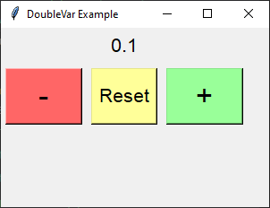

====================================================
Increment float
====================================================

| See: https://www.geeksforgeeks.org/python-setting-and-retrieving-values-of-tkinter-variable/

----

Required Syntax
-----------------------------------

.. py:class:: DoubleVar

    | Syntax: ``double_var = tk.DoubleVar()``
    | Description: Creates a Tkinter variable for holding an float.
    | Default: None
    | Example: ``double_var = tk.DoubleVar()``

.. py:method:: get

    | Syntax: ``current_value = double_var.get()``
    | Description: Retrieves the current value of the `DoubleVar`.
    | Default: None
    | Example: ``current_value = double_var.get()``

.. py:method:: set

    | Syntax: ``double_var.set(new_value)``
    | Description: Sets the value of the `DoubleVar` to the specified float.
    | Default: None
    | Example: ``double_var.set(0.0)``

.. py:attribute:: textvariable

    | Syntax: ``label_widget = tk.Label(parent, textvariable=variable)``
    | Description: Associates a Tkinter variable with the label text.
    | Default: None
    | Example: ``label_widget = tk.Label(window, textvariable=my_var)``

.. py:attribute:: command

    | Syntax: ``button_widget = tk.Button(parent, command=callback_function)``
    | Description: Specifies the function to be called when the button is clicked.
    | Default: ``None``
    | Example: ``button_widget = tk.Button(window, command=on_click)``

Code example
~~~~~~~~~~~~~~~~~~

This code creates a basic GUI with buttons to increment, decrement, and reset a float value displayed in a label.

1. **Using DoubleVar**:

   - `double_var = tk.DoubleVar()`: Creates an `DoubleVar` instance, `double_var`, which is a special Tkinter variable for holding float data.
   - `double_var.set(0.0)`: Sets the initial value of `double_var` to 0.0.

2. **Creating the Label Widget**:

   - `label = tk.Label(root, textvariable=double_var, font=("Helvetica", 16))`: Creates a label in the `root` window. The `textvariable` parameter is linked to `double_var`, so the label text displays `double_var`'s value.
   - `label.grid(row=0, column=0, columnspan=3, pady=5)`: Positions the label in the grid layout.

3. **Defining the Update Functions**:

   - `def increment_value()`: Defines a function to increment `double_var`'s value by 0.1.
   - `def decrement_value()`: Defines a function to decrement `double_var`'s value by 0.1.
   - `def reset_value()`: Defines a function to reset `double_var`'s value to 0.0.

4. **Creating the Button Widgets**:

   - `button_decrement = tk.Button(root, text="-", width=4, command=decrement_value, font=("Helvetica", 24), bg="#FF6666")`: Creates a button to decrement the value, with a light red background.
   - `button_reset = tk.Button(root, text="Reset", command=reset_value, font=("Helvetica", 16), bg="#FFFF99")`: Creates a button to reset the value, with a light yellow background.
   - `button_increment = tk.Button(root, text="+", width=4, command=increment_value, font=("Helvetica", 24), bg="#99FF99")`: Creates a button to increment the value, with a light green background.

.. code-block:: python

    import tkinter as tk

    # Create the main window
    root = tk.Tk()
    root.geometry("300x200")
    root.title("DoubleVar Example")

    # Create a DoubleVar to hold the float value
    double_var = tk.DoubleVar()
    double_var.set(0.0)  # Initial value

    # Create a Label widget with textvariable
    label = tk.Label(root, textvariable=double_var, font=("Helvetica", 16))
    label.grid(row=0, column=0, columnspan=3, pady=5)

    # Function to increment the float value
    def increment_value():
        current_value = double_var.get()
        double_var.set(round(current_value + 0.1, 1))  # Increment the value by 0.1

    # Function to decrement the float value
    def decrement_value():
        current_value = double_var.get()
        double_var.set(round(current_value - 0.1, 1))  # Decrement the value by 0.1

    # Function to reset the float value to zero
    def reset_value():
        double_var.set(0.0)  # Reset the value to 0.0

    # Create Buttons to trigger the value update
    button_decrement = tk.Button(root, text="-", width=4, command=decrement_value, font=("Helvetica", 24), bg="#FF6666")  # Light red
    button_reset = tk.Button(root, text="Reset", command=reset_value, font=("Helvetica", 16), bg="#FFFF99")  # Light yellow
    button_increment = tk.Button(root, text="+", width=4, command=increment_value, font=("Helvetica", 24), bg="#99FF99")  # Light green

    # Position the buttons below the label
    button_decrement.grid(row=1, column=0, padx=5, pady=5, sticky="nsew")
    button_reset.grid(row=1, column=1, padx=5, pady=5, sticky="nsew")
    button_increment.grid(row=1, column=2, padx=5, pady=5, sticky="nsew")

    # Run the application
    root.mainloop()
