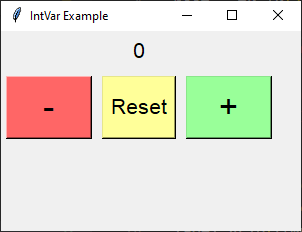

====================================================
Increment integers with modifiers
====================================================

| See: https://www.geeksforgeeks.org/python-setting-and-retrieving-values-of-tkinter-variable/

----

----

Required Syntax
-----------------------------------

.. py:class:: IntVar

    | Syntax: ``int_var = tk.IntVar()``
    | Description: Creates a Tkinter variable for holding an integer.
    | Default: None
    | Example: ``int_var = tk.IntVar()``

.. py:method:: get

    | Syntax: ``current_value = int_var.get()``
    | Description: Retrieves the current value of the `IntVar`.
    | Default: None
    | Example: ``current_value = int_var.get()``

.. py:method:: set

    | Syntax: ``int_var.set(new_value)``
    | Description: Sets the value of the `IntVar` to the specified integer.
    | Default: None
    | Example: ``int_var.set(42)``

.. py:attribute:: textvariable

    | Syntax: ``label_widget = tk.Label(parent, textvariable=variable)``
    | Description: Associates a Tkinter variable with the label text.
    | Default: None
    | Example: ``label_widget = tk.Label(window, textvariable=my_var)``

.. py:attribute:: command

    | Syntax: ``button_widget = tk.Button(parent, command=callback_function)``
    | Description: Specifies the function to be called when the button is clicked.
    | Default: ``None``
    | Example: ``button_widget = tk.Button(window, command=on_click)``

.. py:attribute:: bind

    | Syntax: ``widget.bind("<Event>", handler_function)``
    | Description: Binds an event, such as a mouse click or key press, to a specific function.
    | Default: ``None``
    | Example: ``button_increment.bind("<ButtonPress-1>", start_increment)``

Code example
~~~~~~~~~~~~~~~~~~

| This code creates a basic GUI with buttons to increment, decrement, and reset an integer value displayed in a label.
| It allows the use of Alt-clicking and Shift-clicking and Alt-Shift-clicking to increment in steps of 10, 100 and 1000 respectively.

.. code-block:: python

    import tkinter as tk

    # Function to increment the integer value by a specified amount
    def increment_value(increment):
        current_value = int_var.get()
        int_var.set(current_value + increment)

    # Function to decrement the integer value by a specified amount
    def decrement_value(decrement):
        current_value = int_var.get()
        int_var.set(current_value - decrement)

    # Function to reset the integer value to zero
    def reset_value():
        int_var.set(0)  # Reset the value to 0

    # Increment functions for different amounts
    def increment_by_1(event):
        increment_value(1)

    def increment_by_10(event):
        increment_value(10)

    def increment_by_100(event):
        increment_value(100)

    def increment_by_1000(event):
        increment_value(1000)

    # Decrement functions for different amounts
    def decrement_by_1(event):
        decrement_value(1)

    def decrement_by_10(event):
        decrement_value(10)

    def decrement_by_100(event):
        decrement_value(100)

    def decrement_by_1000(event):
        decrement_value(1000)

    # Create the main window
    root = tk.Tk()
    root.geometry("300x200")
    root.title("IntVar Example")

    # Create an IntVar to hold the integer value
    int_var = tk.IntVar()
    int_var.set(0)  # Initial value

    # Create a Label widget with textvariable
    label = tk.Label(root, textvariable=int_var, font=("Helvetica", 16))
    label.grid(row=0, column=0, columnspan=3, pady=5)

    # Create Buttons
    button_decrement = tk.Button(root, text="-", width=4, font=("Helvetica", 24), bg="#FF6666")  # Light red
    button_reset = tk.Button(root, text="Reset", command=reset_value, font=("Helvetica", 16), bg="#FFFF99")  # Light yellow
    button_increment = tk.Button(root, text="+", width=4, font=("Helvetica", 24), bg="#99FF99")  # Light green

    # Bind different increments based on modifier keys
    button_increment.bind("<Button-1>", increment_by_1)  # No modifier
    button_increment.bind("<Alt-Button-1>", increment_by_10)  # Alt + Click
    button_increment.bind("<Shift-Button-1>", increment_by_100)  # Shift + Click
    button_increment.bind("<Alt-Shift-Button-1>", increment_by_1000)  # Alt + Shift + Click

    # Bind different decrements based on modifier keys
    button_decrement.bind("<Button-1>", decrement_by_1)  # No modifier
    button_decrement.bind("<Alt-Button-1>", decrement_by_10)  # Alt + Click
    button_decrement.bind("<Shift-Button-1>", decrement_by_100)  # Shift + Click
    button_decrement.bind("<Alt-Shift-Button-1>", decrement_by_1000)  # Alt + Shift + Click

    # Position the buttons below the label
    button_decrement.grid(row=1, column=0, padx=5, pady=5, sticky="nsew")
    button_reset.grid(row=1, column=1, padx=5, pady=5, sticky="nsew")
    button_increment.grid(row=1, column=2, padx=5, pady=5, sticky="nsew")

    # Run the application
    root.mainloop()
