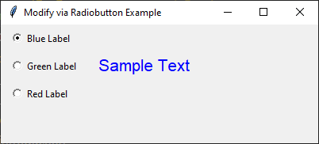

====================================================
Modify via radiobutton
====================================================

| See: https://www.geeksforgeeks.org/python-setting-and-retrieving-values-of-tkinter-variable/

----

----

Required Syntax
-----------------------------------

.. py:class:: StringVar

    | Syntax: ``text_var = tk.StringVar()``
    | Description: Creates a Tkinter variable for holding string data.
    | Default: None
    | Example: ``text_var = tk.StringVar()``

.. py:method:: get

    | Syntax: ``current_value = text_var.get()``
    | Description: Retrieves the current value of the `StringVar`.
    | Default: None
    | Example: ``current_value = text_var.get()``

.. py:method:: set

    | Syntax: ``text_var.set("New Value")``
    | Description: Sets the value of the `StringVar` to the specified string.
    | Default: None
    | Example: ``text_var.set("black")``

.. py:attribute:: variable

    | Syntax: ``widget = tk.Radiobutton(parent, text="label", variable=variable, command=callback_function)``
    | Description: Associates a Tkinter variable with the Radiobutton state.
    | Default: None
    | Example: ``blue_radiobutton = tk.Radiobutton(root, text="Blue Label", variable=color_var, value="blue", command=set_label_color)``

.. py:attribute:: command

    | Syntax: ``button_widget = tk.BuRadiobuttontton(parent, command=callback_function)``
    | Description: Specifies the function to be called when the Radiobutton is clicked.
    | Default: ``None``
    | Example: ``button_widget = tk.Radiobutton(root, command=on_click)``

Code example
~~~~~~~~~~~~~~~~~~

.. code-block:: python

    import tkinter as tk

    # Function to set the label color
    def set_label_color():
        label.config(fg=color_var.get())

    # Create the main window
    root = tk.Tk()
    root.geometry("400x150")
    root.title("Modify via Radiobutton Example")

    # Create a StringVar to hold the color value
    color_var = tk.StringVar()
    color_var.set("black")  # Initial value

    # Create Radiobuttons to toggle the label color using the color as value
    blue_radiobutton = tk.Radiobutton(root, text="Blue Label", variable=color_var, value="blue", command=set_label_color)
    blue_radiobutton.grid(row=0, column=0, padx=10, pady=5, sticky="w")

    green_radiobutton = tk.Radiobutton(root, text="Green Label", variable=color_var, value="green", command=set_label_color)
    green_radiobutton.grid(row=1, column=0, padx=10, pady=5, sticky="w")

    red_radiobutton = tk.Radiobutton(root, text="Red Label", variable=color_var, value="red", command=set_label_color)
    red_radiobutton.grid(row=2, column=0, padx=10, pady=5, sticky="w")

    # Create a Label widget
    label = tk.Label(root, text="Sample Text", font=("Helvetica", 16), fg="black")
    label.grid(row=0, column=1, rowspan=3, padx=10, pady=20)

    # Run the application
    root.mainloop()
