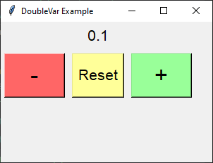

====================================================
Label textvariable: Increment floats
====================================================

| See: `<https://www.geeksforgeeks.org/python-setting-and-retrieving-values-of-tkinter-variable/>`_

----

Increment label float via buttons
---------------------------------------

The code creates a Tkinter GUI application to manage a float value with increment, decrement, and reset functionality:

1. A `DoubleVar` is created to hold the float value: ``double_var = tk.DoubleVar()``.
2. The `set` method initializes the value: ``double_var.set(0.0)``.
3. The `get` method retrieves the current value: ``current_value = double_var.get()``.
4. A label is associated with the `DoubleVar`: ``label = tk.Label(root, textvariable=double_var)``.
5. Buttons are created with `command` callbacks for increment, decrement, and reset operations.
6. The `increment_value` function increases the `DoubleVar` value by 0.1, rounded to one decimal place.
7. The `decrement_value` function decreases the value by 0.1, rounded to one decimal place.
8. The `reset_value` function sets the value to 0.0.

Required Syntax
~~~~~~~~~~~~~~~~~~~~~~~~

| DoubleVar in Tkinter can handle both strings and floats for calculations.
| When you use DoubleVar.get(), it returns a float, and when you use DoubleVar.set(), it can accept either a float or a string that represents a float.
| In the code below, f-strings format the values before setting them, which converts the floats to strings.
| However, DoubleVar can still handle these strings correctly because it internally converts them back to floats for calculations.
| 0.00 is displayed as 0.0 — the internal representation is a float. The default string representation of a float in Python does not include trailing zeros.
| To keep 0 represented as 0.00, formatting to 2 decimal places is needed.
| In anticipation of varying the number of decimal places, the code below uses f-string formatting to 1 dp even though it is not needed for 1 dp.

.. py:class:: DoubleVar

    | Syntax: ``double_var = tk.DoubleVar()``
    | Description: Creates a Tkinter variable for holding an float.
    | Default: None
    | Example: ``double_var = tk.DoubleVar()``

.. py:method:: set

    | Syntax: ``double_var.set(new_value)``
    | Description: Sets the value of the ``DoubleVar`` to the specified float.
    | Default: None
    | Example: ``double_var.set(0.0)``

.. py:method:: get

    | Syntax: ``current_value = double_var.get()``
    | Description: Retrieves the current value of the ``DoubleVar``.
    | Default: None
    | Example: ``current_value = double_var.get()``

.. py:attribute:: textvariable

    | Syntax: ``label_widget = tk.Label(parent, textvariable=variable)``
    | Description: Associates a Tkinter variable with the label text. If the variable is changed, the label text is updated.
    | Default: None
    | Example: ``label_widget = tk.Label(root, textvariable=my_var)``

.. py:attribute:: command

    | Syntax: ``button_widget = tk.Button(parent, command=callback_function)``
    | Description: Specifies the function to be called when the button is clicked.
    | Default: ``None``
    | Example: ``button_widget = tk.Button(root, command=on_click)``

Code features
~~~~~~~~~~~~~~~~~~

| Here's a breakdown of the main parts of the code:

1. **Create a variable: DoubleVar**:

   - ``double_var = tk.DoubleVar()``: Creates an ``DoubleVar`` instance, ``double_var``, which is a special Tkinter variable for holding float data.
   - ``double_var.set(0.0)``: Sets the initial value of ``double_var`` to 0.0.

2. **Link variable to Label with textvariable**:

   - ``label = tk.Label(root, textvariable=double_var, font=("Helvetica", 16))``: Creates a label in the ``root`` root.
   - The ``textvariable`` parameter is linked to ``double_var``, so the label text displays ``double_var``'s value.

3. **Definethe Functions**:

   - These functions use ``.get()`` and ``.set()`` methods on the variable  ``int_var``.
   - ``def increment_value()``: Defines a function to increment ``double_var``'s value by 0.1.
   - ``def decrement_value()``: Defines a function to decrement ``double_var``'s value by 0.1.
   - ``def reset_value()``: Defines a function to reset ``double_var``'s value to 0.0.

4. **Set Button commands**:

   - ``button_decrement = tk.Button(root, text="-", width=4, command=decrement_value, font=("Helvetica", 24), bg="#FF6666")``: Creates a button that calls ``decrement_value`` when clicked.
   - ``button_reset = tk.Button(root, text="Reset", command=reset_value, font=("Helvetica", 16), bg="#FFFF99")``: Creates a button that calls ``reset_value`` when clicked.
   - ``button_increment = tk.Button(root, text="+", width=4, command=increment_value, font=("Helvetica", 24), bg="#99FF99")``: Creates a button that calls ``increment_value`` when clicked.

Code
~~~~~~~~~~~~~~~~~~

This code creates a basic GUI with buttons to increment, decrement, and reset a float value displayed in a label.

.. code-block:: python

    import tkinter as tk

    # Function to increment the float value
    def increment_value():
        current_value = double_var.get()
        double_var.set(f"{current_value + 0.1:.1f}")  # Increment the value by 0.1

    # Function to decrement the float value
    def decrement_value():
        current_value = double_var.get()
        double_var.set(f"{current_value - 0.1:.1f}")  # Decrement the value by 0.1

    # Function to reset the float value to zero
    def reset_value():
        double_var.set(f"{0.0:.1f}")  # Reset the value to 0.0

    # Create the main window
    root = tk.Tk()
    root.geometry("300x200")
    root.title("DoubleVar Example")

    # Create a DoubleVar to hold the float value
    double_var = tk.DoubleVar()
    double_var.set(f"{0.0:.1f}")  # Initial value

    # Create a Label widget with textvariable
    label = tk.Label(root, textvariable=double_var, font=("Helvetica", 16))
    label.grid(row=0, column=0, columnspan=3, pady=5)

    # Create Buttons to trigger the value update
    button_decrement = tk.Button(root, text="-", width=4, command=decrement_value, font=("Helvetica", 24), bg="#FF6666")  # Light red
    button_reset = tk.Button(root, text="Reset", command=reset_value, font=("Helvetica", 16), bg="#FFFF99")  # Light yellow
    button_increment = tk.Button(root, text="+", width=4, command=increment_value, font=("Helvetica", 24), bg="#99FF99")  # Light green

    # Position the buttons below the label
    button_decrement.grid(row=1, column=0, padx=5, pady=5, sticky="nsew")
    button_reset.grid(row=1, column=1, padx=5, pady=5, sticky="nsew")
    button_increment.grid(row=1, column=2, padx=5, pady=5, sticky="nsew")

    # Run the application
    root.mainloop()

----

.. admonition:: Tasks

    #. Modify the code to increment in steps of 0.01 using constants for the increment and the number of decimal places.
    #. Modify the code to increment in steps of 0.001 using constants for the increment and the number of decimal places.

    .. dropdown::
        :icon: codescan
        :color: primary
        :class-container: sd-dropdown-container

        .. tab-set::

            .. tab-item:: Q1

                Modify the code to increment in steps of 0.01 using constants for the increment and the number of decimal places.

                .. code-block:: python

                    import tkinter as tk

                    INC = 0.01
                    DECPLACES = 2

                    # Function to increment the float value
                    def increment_value():
                        current_value = double_var.get()
                        double_var.set(f"{current_value + INC:.{DECPLACES}f}")  # Increment the value by INC

                    # Function to decrement the float value
                    def decrement_value():
                        current_value = double_var.get()
                        double_var.set(f"{current_value - INC:.{DECPLACES}f}")  # Decrement the value by INC

                    # Function to reset the float value to zero
                    def reset_value():
                        double_var.set(f"{0.0:.{DECPLACES}f}")  # Reset the value

                    # Create the main window
                    root = tk.Tk()
                    root.geometry("300x200")
                    root.title("DoubleVar Example")

                    # Create a DoubleVar to hold the float value
                    double_var = tk.DoubleVar()
                    double_var.set(f"{0.0:.{DECPLACES}f}")  # Initial value

                    # Create a Label widget with textvariable
                    label = tk.Label(root, textvariable=double_var, font=("Helvetica", 16))
                    label.grid(row=0, column=0, columnspan=3, pady=5)

                    # Create Buttons to trigger the value update
                    button_decrement = tk.Button(root, text="-", width=4, command=decrement_value, font=("Helvetica", 24), bg="#FF6666")  # Light red
                    button_reset = tk.Button(root, text="Reset", command=reset_value, font=("Helvetica", 16), bg="#FFFF99")  # Light yellow
                    button_increment = tk.Button(root, text="+", width=4, command=increment_value, font=("Helvetica", 24), bg="#99FF99")  # Light green

                    # Position the buttons below the label
                    button_decrement.grid(row=1, column=0, padx=5, pady=5, sticky="nsew")
                    button_reset.grid(row=1, column=1, padx=5, pady=5, sticky="nsew")
                    button_increment.grid(row=1, column=2, padx=5, pady=5, sticky="nsew")

                    # Run the application
                    root.mainloop()

            .. tab-item:: Q2

                MModify the code to increment in steps of 0.01 using constants for the increment and the number of decimal places.

                .. code-block:: python

                    import tkinter as tk

                    INC = 0.001
                    DECPLACES = 3

                    # Function to increment the float value
                    def increment_value():
                        current_value = double_var.get()
                        double_var.set(f"{current_value + INC:.{DECPLACES}f}")  # Increment the value by INC

                    # Function to decrement the float value
                    def decrement_value():
                        current_value = double_var.get()
                        double_var.set(f"{current_value - INC:.{DECPLACES}f}")  # Decrement the value by INC

                    # Function to reset the float value to zero
                    def reset_value():
                        double_var.set(f"{0.0:.{DECPLACES}f}")  # Reset the value

                    # Create the main window
                    root = tk.Tk()
                    root.geometry("300x200")
                    root.title("DoubleVar Example")

                    # Create a DoubleVar to hold the float value
                    double_var = tk.DoubleVar()
                    double_var.set(f"{0.0:.{DECPLACES}f}")  # Initial value

                    # Create a Label widget with textvariable
                    label = tk.Label(root, textvariable=double_var, font=("Helvetica", 16))
                    label.grid(row=0, column=0, columnspan=3, pady=5)

                    # Create Buttons to trigger the value update
                    button_decrement = tk.Button(root, text="-", width=4, command=decrement_value, font=("Helvetica", 24), bg="#FF6666")  # Light red
                    button_reset = tk.Button(root, text="Reset", command=reset_value, font=("Helvetica", 16), bg="#FFFF99")  # Light yellow
                    button_increment = tk.Button(root, text="+", width=4, command=increment_value, font=("Helvetica", 24), bg="#99FF99")  # Light green

                    # Position the buttons below the label
                    button_decrement.grid(row=1, column=0, padx=5, pady=5, sticky="nsew")
                    button_reset.grid(row=1, column=1, padx=5, pady=5, sticky="nsew")
                    button_increment.grid(row=1, column=2, padx=5, pady=5, sticky="nsew")

                    # Run the application
                    root.mainloop()

