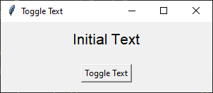
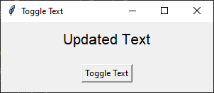

====================================================
Label textvariable: toggle text
====================================================

| See: https://www.geeksforgeeks.org/python-setting-and-retrieving-values-of-tkinter-variable/

----

Toggle text via button
----------------------------

| The code below creates a Tkinter GUI application that toggles text on a label when a button is clicked:

1. A `StringVar` is created to hold the label's text: ``text_var = tk.StringVar()``.
2. The `set` method initializes the text: ``text_var.set("Initial Text")``.
3. The `get` method retrieves the current text: ``current_value = text_var.get()``.
4. A label is associated with the `StringVar`: ``label = tk.Label(root, textvariable=text_var)``.
5. A button is created with a command to toggle the text: ``button = tk.Button(root, command=update_text)``.
6. The `update_text` function checks the current value of `text_var` and toggles it using ``set``.
7. Clicking the button triggers the `command` to update the label's text.

Required Syntax
~~~~~~~~~~~~~~~~~~~~~

.. py:class:: StringVar

    | Syntax: ``text_var = tk.StringVar()``
    | Description: Creates a Tkinter variable for holding string data.
    | Default: None
    | Example: ``text_var = tk.StringVar()``

.. py:method:: set

    | Syntax: ``text_var.set("New Value")``
    | Description: Sets the value of the ``StringVar`` to the specified string.
    | Default: None
    | Example: ``text_var.set("Hello, World!")``

.. py:method:: get

    | Syntax: ``current_value = text_var.get()``
    | Description: Retrieves the current value of the ``StringVar``.
    | Default: None
    | Example: ``current_value = text_var.get()``

.. py:attribute:: textvariable

    | Syntax: ``label_widget = tk.Label(parent, textvariable=variable)``
    | Description: Associates a Tkinter variable with the label text.  If the variable is changed, the label text is updated.
    | Default: None
    | Example: ``label_widget = tk.Label(root, textvariable=my_var)``

.. py:attribute:: command

    | Syntax: ``button_widget = tk.Button(parent, command=callback_function)``
    | Description: Specifies the function to be called when the button is clicked.
    | Default: ``None``
    | Example: ``button_widget = tk.Button(root, command=on_click)``

Code features
~~~~~~~~~~~~~~~~~~

| Here's a breakdown of the main parts of the code:

1. **Create a variable: StringVar**:

   - ``text_var = tk.StringVar()``: Creates a ``StringVar`` instance, ``text_var``, which is a special tkinter variable for holding string data.
   - ``text_var.set("Initial Text")``: Sets the initial value of ``text_var``.

2. **Link variable to Label with textvariable**:

   - ``label = tk.Label(root, textvariable=text_var, font=("Helvetica", 16))``: Creates a label in the ``window`` root.
   - The ``textvariable`` parameter is linked to ``text_var``, so the label text displays ``text_var``'s value.

3. **Define the Function**:

   - ``def update_text()``: Defines a function, ``update_text``, that gets ``text_var``'s current value using ``text_var.get()``.
   - It toggles ``text_var`` between "Initial Text" and "Updated Text" by using ``text_var.set()``.

4. **Set Button command**:

   - ``button = tk.Button(root, text="Toggle Text", command=update_text)``: Creates a button with the label "Toggle Text" and sets ``update_text`` as the function that runs when clicked.

Code
~~~~~~~~~~~~~~~~~~

| This code creates a basic GUI with a button that toggles the text of a label.

.. code-block:: python

    import tkinter as tk

    # Function to update the text
    def update_text():
        if text_var.get() == "Initial Text":
            text_var.set("Updated Text")
        else:
            text_var.set("Initial Text")

    # Create the main window
    root = tk.Tk()
    root.geometry("300x100")
    root.title("Toggle Text")

    # Create a StringVar to hold the text
    text_var = tk.StringVar()
    text_var.set("Initial Text")

    # Create a Label widget with textvariable
    label = tk.Label(root, textvariable=text_var, font=("Helvetica", 16))
    label.pack(pady=10)

    # Create a Button to trigger the text update
    button = tk.Button(root, text="Toggle Text", command=update_text)
    button.pack(pady=10)

    # Run the application
    root.mainloop()

----

.. admonition:: Tasks

    #. Write code to reverse a string entered by a user into an entry field, using an input_var and an output_var.
        .. image:: images/reverse_string.png
            :scale: 67%
    #. Modify the previous answer to insert a random palindrome if the entry string is blank.
        .. image:: images/reverse_string_palindromes.png
            :scale: 67%

    .. dropdown::
        :icon: codescan
        :color: primary
        :class-container: sd-dropdown-container

        .. tab-set::

            .. tab-item:: Q1

                Write code to reverse a string entered by a user into an entry field, using an input_var and an output_var.

                .. code-block:: python

                    import tkinter as tk

                    # Function to transform the text
                    def transform_text():
                        user_input = input_var.get()
                        if user_input:
                            # reverse
                            reversed_text = user_input[::-1]
                            output_var.set(reversed_text)
                        else:
                            output_var.set("Please enter a string.")

                    # Create the main window
                    root = tk.Tk()
                    root.geometry("300x200")
                    root.title("String Reverser")

                    # Create a StringVar to hold the user input
                    input_var = tk.StringVar()

                    # Create a Label and Entry for user input
                    input_label = tk.Label(root, text="Enter a string:", font=("Helvetica", 12))
                    input_label.pack(pady=5)
                    input_entry = tk.Entry(root, textvariable=input_var, font=("Helvetica", 12))
                    input_entry.pack(pady=5)

                    # Create a Button to trigger the text Reversal
                    button = tk.Button(root, text="Reversed Text", command=transform_text)
                    button.pack(pady=5)

                    # Create a StringVar to hold the transformed text
                    output_var = tk.StringVar()
                    output_var.set("")

                    # Create a Label widget with textvariable for the output
                    output_result = tk.Label(root, textvariable=output_var, font=("Helvetica", 12))
                    output_result.pack(pady=5)

                    # Run the application
                    root.mainloop()

            .. tab-item:: Q2

                Modify the previous answer to insert a random palindrome if the entry string is blank.

                .. code-block:: python

                    import tkinter as tk
                    import random

                    # List of palindromes
                    palindromes = [
                        "aibohphobia", "civic", "deified", "kayak", "level", "madam", "minim", "noon",
                        "racecar", "radar", "refer", "repaper", "reviver", "rotator", "rotor", "sagas",
                        "solos", "stats", "tenet", "wow"
                    ]

                    # Function to transform the text
                    def transform_text():
                        user_input = input_var.get()
                        if user_input:
                            # Reverse the user input
                            reversed_text = user_input[::-1]
                            output_var.set(reversed_text)
                        else:
                            # Use a random palindrome if no input is provided
                            random_palindrome = random.choice(palindromes)
                            input_var.set(random_palindrome)
                            output_var.set(random_palindrome)

                    # Create the main window
                    root = tk.Tk()
                    root.geometry("300x200")
                    root.title("String Reverser")

                    # Create a StringVar to hold the user input
                    input_var = tk.StringVar()

                    # Create a Label and Entry for user input
                    input_label = tk.Label(root, text="Enter a string:", font=("Helvetica", 12))
                    input_label.pack(pady=5)
                    input_entry = tk.Entry(root, textvariable=input_var, font=("Helvetica", 12))
                    input_entry.pack(pady=5)

                    # Create a Button to trigger the text reversal
                    button = tk.Button(root, text="Reverse Text", command=transform_text)
                    button.pack(pady=20)

                    # Create a StringVar to hold the transformed text
                    output_var = tk.StringVar()
                    output_var.set("")

                    # Create a Label widget with textvariable for the output
                    output_result = tk.Label(root, textvariable=output_var, font=("Helvetica", 12))
                    output_result.pack(pady=5)

                    # Run the application
                    root.mainloop()
