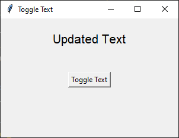

====================================================
Toggle text
====================================================

| See: https://www.geeksforgeeks.org/python-setting-and-retrieving-values-of-tkinter-variable/

----

Syntax
-----------------------------------

.. py:class:: StringVar

    | Syntax: ``text_var = tk.StringVar()``
    | Description: Creates a Tkinter variable for holding string data.
    | Default: None
    | Example: ``text_var = tk.StringVar()``

.. py:attribute:: textvariable

    | Syntax: ``label_widget = tk.Label(parent, textvariable=variable)``
    | Description: Associates a Tkinter variable with the label text.
    | Default: None
    | Example: ``label_widget = tk.Label(window, textvariable=my_var)``

.. py:attribute:: command

    | Syntax: ``button_widget = tk.Button(parent, command=callback_function)``
    | Description: Specifies the function to be called when the button is clicked.
    | Default: ``None``
    | Example: ``button_widget = tk.Button(window, command=on_click)``

Code example
~~~~~~~~~~~~~~~~~~

This code creates a basic GUI with a button that toggles the text of a label.

1. **Using StringVar**:

   - `text_var = tk.StringVar()`: Creates a `StringVar` instance, `text_var`, which is a special tkinter variable for holding string data.
   - `text_var.set("Initial Text")`: Sets the initial value of `text_var`.

2. **Creating the Label Widget**:

   - `label = tk.Label(root, textvariable=text_var, font=("Helvetica", 16))`: Creates a label in the `root` window. The `textvariable` parameter is linked to `text_var`, so the label text displays `text_var`'s value.
   - `label.pack(pady=20)`: Adds the label to the window with 20 pixels of vertical padding.

3. **Defining the Update Function**:

   - `def update_text()`: Defines a function, `update_text`, that checks `text_var`'s current value and toggles it between "Initial Text" and "Updated Text" by using `text_var.set()`.

4. **Creating the Button Widget**:

   - `button = tk.Button(root, text="Toggle Text", command=update_text)`: Creates a button with the label "Toggle Text" and sets `update_text` as the function that runs when clicked.

.. code-block:: python

    import tkinter as tk

    # Create the main window
    root = tk.Tk()
    root.geometry("300x200")
    root.title("TextVariable Example")

    # Create a StringVar to hold the text
    text_var = tk.StringVar()
    text_var.set("Initial Text")

    # Create a Label widget with textvariable
    label = tk.Label(root, textvariable=text_var, font=("Helvetica", 16))
    label.pack(pady=20)

    # Function to update the text
    def update_text():
        if text_var.get() == "Initial Text":
            text_var.set("Updated Text")
        else:
            text_var.set("Initial Text")

    # Create a Button to trigger the text update
    button = tk.Button(root, text="Toggle Text", command=update_text)
    button.pack(pady=20)

    # Run the application
    root.mainloop()

