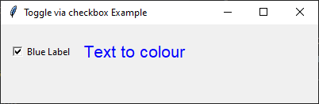

====================================================
Toggle via checkbox
====================================================

| See: https://www.geeksforgeeks.org/python-setting-and-retrieving-values-of-tkinter-variable/

----

Required Syntax
-----------------------------------

.. py:class:: BooleanVar

    | Syntax: ``bool_var = tk.BooleanVar()``
    | Description: Creates a Tkinter variable for holding boolean data.
    | Default: None
    | Example: ``bool_var = tk.BooleanVar()``

.. py:method:: get

    | Syntax: ``current_value = text_var.get()``
    | Description: Retrieves the current value of the `StringVar`.
    | Default: None
    | Example: ``current_value = text_var.get()``

.. py:method:: set

    | Syntax: ``text_var.set("New Value")``
    | Description: Sets the value of the `StringVar` to the specified string.
    | Default: None
    | Example: ``text_var.set("Hello, World!")``

.. py:attribute:: variable

    | Syntax: ``widget = tk.Checkbutton(parent, text="label", variable=variable, command=callback_function)``
    | Description: Associates a Tkinter variable with the checkbutton state.
    | Default: None
    | Example: ``toggle_checkbutton = tk.Checkbutton(root, text="Blue Label", variable=bool_var, command=toggle_label_color)``

.. py:attribute:: command

    | Syntax: ``button_widget = tk.Button(parent, command=callback_function)``
    | Description: Specifies the function to be called when the button is clicked.
    | Default: ``None``
    | Example: ``button_widget = tk.Button(window, command=on_click)``

Code example
~~~~~~~~~~~~~~~~~~

The checkbox toggles the label color between blue and black.

1. **Using BooleanVar**:

   - `bool_var = tk.BooleanVar()`: Creates a `BooleanVar` instance.
   - `bool_var.set(False)`: Sets the initial value of `bool_var` to `False`.

2. **Defining the Toggle Function**:

   - `def toggle_label_color()`: Defines a function to toggle the color of the label.
   - `if bool_var.get()`: Checks the current value of `bool_var`. For BooleanVar variables, the returned value is 0 for False, and 1 for Ttrue. Since it is True or False there is no need for a test with `==`.
   - `label.config(fg="blue")`: Sets the label color to blue if `bool_var` is `True`.
   - `label.config(fg="black")`: Sets the label color to black if `bool_var` is `False`.

3. **Creating the Checkbutton**:

   - `toggle_checkbutton = tk.Checkbutton(root, text="Blue Label", variable=bool_var, command=toggle_label_color)`: Creates a checkbox to toggle the label color between blue and black.
   - The `BooleanVar` instance (`bool_var`) holds the state of the checkbox (checked or unchecked). This is called State Management.
   - When the checkbox is checked or unchecked, the value of `bool_var` is automatically updated to `True` or `False`, respectively.
   - In this example, `variable=bool_var` ensures that the checkbox and the `BooleanVar` are synchronized, allowing the `toggle_label_color` function to correctly change the label's color based on the checkbox state. Without this parameter, the checkbox would not be able to communicate its state to the `BooleanVar`, and the label color would not update as expected.

.. code-block:: python

    import tkinter as tk

    # Create the main window
    root = tk.Tk()
    root.geometry("300x200")
    root.title("Toggle via checkbox Example")

    # Create a BooleanVar to hold the boolean value
    bool_var = tk.BooleanVar()
    bool_var.set(False)  # Initial value

    # Function to toggle the label color
    def toggle_label_color():
        if bool_var.get():
            label.config(fg="blue")  # Set label color to blue
        else:
            label.config(fg="black")  # Set label color to black

    # Create a Checkbutton to toggle the label color
    toggle_checkbutton = tk.Checkbutton(root, text="Blue Label", variable=bool_var, command=toggle_label_color)
    toggle_checkbutton.grid(row=0, column=0, padx=10, pady=20)

    # Create a Label widget
    label = tk.Label(root, text="Text to colour", font=("Helvetica", 16), fg="black")
    label.grid(row=0, column=1, pady=20)

    # Run the application
    root.mainloop()

