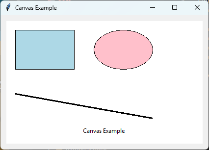

====================================================
tk Canvas
====================================================

| See: `<https://docs.python.org/3/library/tkinter.html#tkinter.Canvas>`_
| See: `<https://www.geeksforgeeks.org/python-tkinter-canvas-widget/>`_

----

Usage
---------------

| The ``tkinter.Canvas`` widget provides a rectangular drawing area for displaying graphics, images and other widgets.
| A canvas can contain lines, rectangles, ovals, polygons, arcs, text, images and embedded widgets.
| To create a canvas widget, the general syntax is (assuming import via ``import tkinter as tk``):

.. py:function:: canvas_widget = tk.Canvas(parent, option=value)

    | ``parent`` is the window or frame object.
    | Options can be passed as parameters separated by commas.
    | Items drawn on a canvas are assigned an integer ID that can be used to modify or delete them later.

----

Using a Canvas
---------------------------



.. code-block:: python

    import tkinter as tk

    root = tk.Tk()
    root.title("Canvas Example")

    canvas = tk.Canvas(root, width=400, height=250, bg="white")
    canvas.pack(padx=10, pady=10)

    canvas.create_rectangle(20, 20, 140, 100, fill="lightblue")
    canvas.create_oval(180, 20, 300, 100, fill="pink")
    canvas.create_line(20, 150, 300, 200, width=3)
    canvas.create_text(200, 225, text="Canvas Example")

    root.mainloop()

----

.. admonition:: Tasks

    #. Modify the program so that it draws:

        * a yellow rectangle,
        * a green circle,
        * a red line of width **5**.

        .. image:: images/canvas_question.png
            :scale: 70

    .. dropdown::
        :icon: codescan
        :color: primary
        :class-container: sd-dropdown-container

        .. tab-set::

            .. tab-item:: Q1

                Modify the code to produce the drawing shown above.

                .. code-block:: python

                    import tkinter as tk

                    root = tk.Tk()
                    root.title("Canvas Question")

                    canvas = tk.Canvas(root, width=400, height=250, bg="white")
                    canvas.pack()

                    canvas.create_rectangle(20, 20, 140, 100, fill="yellow")
                    canvas.create_oval(200, 20, 300, 120, fill="green")
                    canvas.create_line(20, 150, 300, 200, fill="red",width=5)

                    root.mainloop()

----

Common Drawing Methods
----------------------

.. py:function:: canvas_widget.create_line(x1, y1, x2, y2, option=value)

    | Draws a straight line from ``(x1, y1)`` to ``(x2, y2)``.
    | Returns the integer ID of the line.
    | Common options include:

    | * ``fill="color"`` - Sets the line colour.
    | * ``width=value`` - Sets the thickness of the line in pixels.
    | * ``dash=(length1, length2)`` - Draws a dashed line.
    | * ``arrow="first"``, ``"last"`` or ``"both"`` - Adds arrowheads to the line.

.. py:function:: canvas_widget.create_rectangle(x1, y1, x2, y2, option=value)

    | Draws a rectangle whose opposite corners are ``(x1, y1)`` and ``(x2, y2)``.
    | Returns the integer ID of the rectangle.
    | Common options include:

    | * ``fill="color"`` - Sets the interior colour of the rectangle.
    | * ``outline="color"`` - Sets the border colour.
    | * ``width=value`` - Sets the border thickness in pixels.
    | * ``dash=(length1, length2)`` - Draws a dashed border.

.. py:function:: canvas_widget.create_oval(x1, y1, x2, y2, option=value)

    | Draws an oval that fits inside the bounding rectangle defined by
    | ``(x1, y1)`` and ``(x2, y2)``.
    | If the bounding rectangle is square, the result is a circle.
    | Returns the integer ID of the oval.
    | Common options include:

    | * ``fill="color"`` - Sets the interior colour.
    | * ``outline="color"`` - Sets the border colour.
    | * ``width=value`` - Sets the border thickness.
    | * ``dash=(length1, length2)`` - Draws a dashed border.

.. py:function:: canvas_widget.create_arc(x1, y1, x2, y2, option=value)

    | Draws an arc inside the bounding rectangle defined by
    | ``(x1, y1)`` and ``(x2, y2)``.
    | Returns the integer ID of the arc.
    | Common options include:

    | * ``start=angle`` - Specifies the starting angle in degrees.
    | * ``extent=angle`` - Specifies the size of the arc in degrees.
    | * ``style=tk.PIESLICE`` - Draws a filled pie slice (default).
    | * ``style=tk.CHORD`` - Draws a chord between the arc's endpoints.
    | * ``style=tk.ARC`` - Draws only the curved outline.
    | * ``fill="color"`` - Sets the fill colour of a ``PIESLICE`` or ``CHORD``.
    | * ``outline="color"`` - Sets the outline colour.
    | * ``width=value`` - Sets the outline thickness.


```rst id="v1bkcm"
.. py:function:: canvas_widget.create_polygon(x1, y1, x2, y2, ..., option=value)

    | Draws a polygon by joining each pair of coordinates with straight lines.
    | The last point is automatically joined to the first point to close the shape.
    | Returns the integer ID of the polygon.
    | Common options include:
    |
    | * ``fill="color"`` - Sets the interior colour.
    | * ``outline="color"`` - Sets the border colour.
    | * ``width=value`` - Sets the border thickness in pixels.
    | * ``dash=(length1, length2)`` - Draws a dashed border.
    | * ``smooth=True`` - Draws curved edges instead of straight lines.

.. py:function:: canvas_widget.create_text(x, y, option=value)

    | Draws a text item with its reference point at ``(x, y)``.
    | Returns the integer ID of the text item.
    | Common options include:
    |
    | * ``text="message"`` - Specifies the text to display.
    | * ``font=("font", size, style)`` - Sets the font.
    | * ``fill="color"`` - Sets the text colour.
    | * ``anchor="position"`` - Specifies which part of the text is positioned at ``(x, y)``.
    | * ``justify="left"``, ``"center"`` or ``"right"`` - Aligns multiple lines of text.
    | * ``width=value`` - Wraps the text when it exceeds the specified width.

.. py:function:: canvas_widget.create_image(x, y, option=value)

    | Displays an image with its reference point at ``(x, y)``.
    | Returns the integer ID of the image.
    | Common options include:
    |
    | * ``image=photo`` - Specifies the ``PhotoImage`` object to display.
    | * ``anchor="position"`` - Specifies which part of the image is placed at ``(x, y)``.
    | * ``state="normal"``, ``"hidden"`` or ``"disabled"`` - Sets the display state.

.. py:function:: canvas_widget.create_window(x, y, option=value)

    | Embeds another widget inside the canvas.
    | Returns the integer ID of the embedded window.
    | Common options include:
    |
    | * ``window=widget`` - Specifies the widget to embed.
    | * ``anchor="position"`` - Specifies which part of the widget is positioned at ``(x, y)``.
    | * ``width=value`` - Sets the width of the embedded widget.
    | * ``height=value`` - Sets the height of the embedded widget.


----

Canvas Methods
----------------------

.. py:function:: canvas_widget.coords(item_id)

    | Returns the coordinates of the specified item.

.. py:function:: canvas_widget.move(item_id, dx, dy)

    | Moves an item by the specified horizontal and vertical distances.

.. py:function:: canvas_widget.delete(item_id)

    | Deletes the specified item.

.. py:function:: canvas_widget.itemconfig(item_id, option=value)

    | Changes the configuration of an existing item.

.. py:function:: canvas_widget.find_all()

    | Returns a tuple containing the IDs of every item on the canvas.

----

Parameter syntax
----------------------

.. py:function:: canvas_widget = tk.Canvas(parent, option=value)

    | ``parent`` is the window or frame object.
    | Options can be passed as parameters separated by commas.

    **Parameters:**

    .. py:attribute:: background
    .. py:attribute:: bg

        | Syntax: ``canvas_widget = tk.Canvas(parent, bg="color")``
        | Description: Sets the background colour.
        | Default: SystemWindow

    .. py:attribute:: borderwidth
    .. py:attribute:: bd

        | Syntax: ``canvas_widget = tk.Canvas(parent, borderwidth=value)``
        | Description: Sets the border width.
        | Default: 2

    .. py:attribute:: closeenough

        | Syntax: ``canvas_widget = tk.Canvas(parent, closeenough=value)``
        | Description: Sets the distance used when determining whether the mouse is close to an item.
        | Default: 1.0

    .. py:attribute:: confine

        | Syntax: ``canvas_widget = tk.Canvas(parent, confine=True)``
        | Description: Keeps the view inside the scroll region.
        | Default: True

    .. py:attribute:: cursor

        | Syntax: ``canvas_widget = tk.Canvas(parent, cursor="cursor_type")``
        | Description: Sets the mouse cursor.

    .. py:attribute:: height

        | Syntax: ``canvas_widget = tk.Canvas(parent, height=value)``
        | Description: Sets the canvas height in pixels.
        | Default: 0

    .. py:attribute:: highlightbackground

        | Syntax: ``canvas_widget = tk.Canvas(parent, highlightbackground="color")``
        | Description: Sets the highlight border colour when the canvas does not have focus.

    .. py:attribute:: highlightcolor

        | Syntax: ``canvas_widget = tk.Canvas(parent, highlightcolor="color")``
        | Description: Sets the highlight border colour when the canvas has focus.

    .. py:attribute:: highlightthickness

        | Syntax: ``canvas_widget = tk.Canvas(parent, highlightthickness=value)``
        | Description: Sets the thickness of the highlight border.
        | Default: 1

    .. py:attribute:: relief

        | Syntax: ``canvas_widget = tk.Canvas(parent, relief="style")``
        | Description: Sets the border style.
        | Default: ``flat``

    .. py:attribute:: scrollregion

        | Syntax: ``canvas_widget = tk.Canvas(parent, scrollregion=(x1, y1, x2, y2))``
        | Description: Defines the scrollable region of the canvas.

    .. py:attribute:: takefocus

        | Syntax: ``canvas_widget = tk.Canvas(parent, takefocus=1)``
        | Description: Determines whether the canvas can receive keyboard focus.

    .. py:attribute:: width

        | Syntax: ``canvas_widget = tk.Canvas(parent, width=value)``
        | Description: Sets the canvas width in pixels.
        | Default: 0

    .. py:attribute:: xscrollcommand

        | Syntax: ``canvas_widget = tk.Canvas(parent, xscrollcommand=scrollbar.set)``
        | Description: Connects a horizontal scrollbar to the canvas.

    .. py:attribute:: yscrollcommand

        | Syntax: ``canvas_widget = tk.Canvas(parent, yscrollcommand=scrollbar.set)``
        | Description: Connects a vertical scrollbar to the canvas.

----

Default options
------------------------

| Code to display the default value for each ``Canvas`` option is shown below.

.. code-block:: python

    import tkinter as tk

    root = tk.Tk()

    widget = tk.Canvas(root)
    widget_options = widget.keys()

    for option in widget_options:
        print(f"{option}: {widget.cget(option)}")  # cget retrieves the current value of the option

