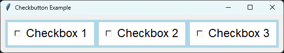

====================================================
tk Checkbutton
====================================================

| See: `<https://docs.python.org/3/library/tkinter.html#tkinter.Checkbutton>`_
| See: `<https://www.geeksforgeeks.org/python-tkinter-checkbutton-widget/>`_

----

Usage
---------------

| The `tkinter.Checkbutton` widget provides a checkbutton (checkbox).
| To create a checkbutton widget, the general syntax is (assuming import via "import tkinter as tk"):

.. py:function:: checkbutton_widget = tk.Checkbutton(parent, option=value)

    | parent is the window or frame object.
    | Options can be passed as parameters separated by commas.
    | Each checkbutton has its own ``IntVar`` because every checkbox stores its own checked state independently.
    | Unlike radio buttons, checkbuttons should not share the same control variable.

----

Using check buttons
---------------------------

.. code-block:: python

    import tkinter as tk

    # Create the main window
    root = tk.Tk()
    root.title("Checkbutton Example")

    # Create a frame with a background color
    frame1 = tk.Frame(root, bg="light blue")
    frame1.pack(anchor="nw", padx=10, pady=10)

    # Define a font style
    font_style = ("Lucida Grande", 18)

    # Define the options for group 1
    options_grp1 = ["Checkbox 1", "Checkbox 2", "Checkbox 3"]
    # Store each checkbox's IntVar using its label as the key.
    variables = {}

    for option in options_grp1:
        # Each checkbutton has its own IntVar.
        # IntVar() defaults to 0 (unchecked).
        variables[option] = tk.IntVar()

        # Make the first checkbutton checked initially.
        if option == "Checkbox 1":
            variables[option].set(1)

        button = tk.Checkbutton(
            frame1, text=option, variable=variables[option], indicatoron=1,
            bg="white", fg="black", font=font_style, padx=10, pady=5
        )
        button.pack(anchor="nw", padx=5, pady=5)

    # Run the main event loop
    root.mainloop()

----

.. admonition:: Tasks

    #. Modify the code so that it displays four checkbuttons arranged vertically.

        .. image:: images/checkboxes_vertically.png
            :scale: 67

    .. dropdown::
        :icon: codescan
        :color: primary
        :class-container: sd-dropdown-container

        .. tab-set::

            .. tab-item:: Q1

                Modify the code so that it displays four checkbuttons arranged vertically.

                .. code-block:: python

                    import tkinter as tk

                    # Create the main window
                    root = tk.Tk()
                    root.title("Checkbutton Question")
                    # Set the size of the window
                    root.geometry("350x300")

                    # Create a frame with a background color
                    frame1 = tk.Frame(root, bg="light blue")
                    frame1.pack(anchor="nw", padx=10, pady=10)

                    # Define a font style
                    font_style = ("Lucida Grande", 18)

                    # Define the options for group 1
                    options_grp1 = ["Checkbox 1", "Checkbox 2", "Checkbox 3", "Checkbox 4"]
                    # Store each checkbox's IntVar using its label as the key.
                    variables = {}

                    for option in options_grp1:
                        # Each checkbutton has its own IntVar.
                        # IntVar() defaults to 0 (unchecked).
                        variables[option] = tk.IntVar()

                        # Make the first checkbutton checked initially.
                        if option == "Checkbox 1":
                            variables[option].set(1)

                        button = tk.Checkbutton(
                            frame1, text=option, variable=variables[option], indicatoron=1,
                            bg="white", fg="black", font=font_style, padx=10, pady=5
                        )
                        button.pack(anchor="w", padx=5, pady=5)    # defaults to side="top"

                    # Run the main event loop
                    root.mainloop()

----

Methods
----------------------

.. py:function:: checkbutton_widget.select()

    | Selects the checkbutton.
    | Sets the associated control variable to the ``onvalue``.

.. py:function:: checkbutton_widget.deselect()

    | Deselects the checkbutton.
    | Sets the associated control variable to the ``offvalue``.

.. py:function:: checkbutton_widget.toggle()

    | Toggles the state of the checkbutton.
    | If the checkbutton is selected it becomes deselected, and vice versa.

.. py:function:: checkbutton_widget.flash()

    | Briefly flashes the checkbutton several times.
    | Useful for drawing the user's attention to the widget.

.. py:function:: checkbutton_widget.invoke()

    | Simulates the user clicking the checkbutton.
    | Toggles the state and calls the function specified by the ``command`` option, if one exists.
    | Returns the value returned by the callback function.

----

Control variable methods
----------------------------

.. py:function:: variable.get()

    | Returns the current value of the associated control variable.

.. py:function:: variable.set(value)

    | Sets the value of the associated control variable.
    | If ``value`` equals the ``onvalue``, the checkbutton becomes selected.
    | If ``value`` equals the ``offvalue``, the checkbutton becomes deselected.

----

Parameter syntax
----------------------

.. py:function:: checkbutton_widget = tk.Checkbutton(parent, option=value)

    | parent is the window or frame object.
    | Options can be passed as parameters separated by commas.

    **Parameters:**

    .. py:attribute:: activebackground

        | Syntax: ``checkbutton_widget = tk.Checkbutton(parent, activebackground="color")``
        | Description: Sets the background color of the checkbutton when it is active.
        | Default: SystemButtonFace
        | Example: ``checkbutton_widget = tk.Checkbutton(root, activebackground="lightblue")``

    .. py:attribute:: activeforeground

        | Syntax: ``checkbutton_widget = tk.Checkbutton(parent, activeforeground="color")``
        | Description: Sets the foreground color of the checkbutton when it is active.
        | Default: SystemWindowText
        | Example: ``checkbutton_widget = tk.Checkbutton(root, activeforeground="blue")``

    .. py:attribute:: anchor

        | Syntax: ``checkbutton_widget = tk.Checkbutton(parent, anchor="position")``
        | Description: Sets the anchor position for the text and indicator.
        | Default: center
        | Example: ``checkbutton_widget = tk.Checkbutton(root, anchor="w")``

    .. py:attribute:: background
    .. py:attribute:: bg

        | Syntax: ``checkbutton_widget = tk.Checkbutton(parent, background="color")``
        | Description: Sets the background color of the checkbutton.
        | Default: SystemButtonFace
        | Example: ``checkbutton_widget = tk.Checkbutton(root, background="lightyellow")``

    .. py:attribute:: bd

        | Syntax: ``checkbutton_widget = tk.Checkbutton(parent, bd=border_width)``
        | Description: Sets the border width of the checkbutton.
        | Default: 2
        | Example: ``checkbutton_widget = tk.Checkbutton(root, bd=5)``

    .. py:attribute:: bitmap

        | Syntax: ``checkbutton_widget = tk.Checkbutton(parent, bitmap="bitmap_name")``
        | Description: Sets a bitmap image to be displayed on the checkbutton.
        | Default: None
        | Example: ``checkbutton_widget = tk.Checkbutton(root, bitmap="error")``

    .. py:attribute:: borderwidth

        | Syntax: ``checkbutton_widget = tk.Checkbutton(parent, borderwidth=width)``
        | Description: Sets the width of the border around the checkbutton.
        | Default: 2
        | Example: ``checkbutton_widget = tk.Checkbutton(root, borderwidth=3)``

    .. py:attribute:: command

        | Syntax: ``checkbutton_widget = tk.Checkbutton(parent, command=function)``
        | Description: Specifies a function to be called when the checkbutton is toggled.
        | Default: None
        | Example: ``checkbutton_widget = tk.Checkbutton(root, command=my_function)``

    .. py:attribute:: compound

        | Syntax: ``checkbutton_widget = tk.Checkbutton(parent, compound="position")``
        | Description: Specifies how to display the image and text (if both are set).
        | Default: none
        | Example: ``checkbutton_widget = tk.Checkbutton(root, compound="left")``

    .. py:attribute:: cursor

        | Syntax: ``checkbutton_widget = tk.Checkbutton(parent, cursor="cursor_type")``
        | Description: Sets the mouse cursor when hovering over the checkbutton.
        | Default: arrow
        | Example: ``checkbutton_widget = tk.Checkbutton(root, cursor="hand2")``

    .. py:attribute:: disabledforeground

        | Syntax: ``checkbutton_widget = tk.Checkbutton(parent, disabledforeground="color")``
        | Description: Sets the foreground color when the checkbutton is disabled.
        | Default: SystemDisabledText
        | Example: ``checkbutton_widget = tk.Checkbutton(root, disabledforeground="gray")``

    .. py:attribute:: foreground
    .. py:attribute:: fg

        | Syntax: ``checkbutton_widget = tk.Checkbutton(parent, fg="color")``
        | Description: Sets the foreground color of the checkbutton (text color).
        | Default: SystemWindowText
        | Example: ``checkbutton_widget = tk.Checkbutton(root, fg="black")``

    .. py:attribute:: font

        | Syntax: ``checkbutton_widget = tk.Checkbutton(parent, font=("font_name", size, "style"))``
        | Description: Specifies the font type, size, and style for the text of the checkbutton.
        | Default: TkDefaultFont
        | Example: ``checkbutton_widget = tk.Checkbutton(root, font=("Arial", 12, "bold"))``

    .. py:attribute:: height

        | Syntax: ``checkbutton_widget = tk.Checkbutton(parent, height=value)``
        | Description: Sets the height of the checkbutton.
        | Default: 0 (automatically determined)
        | Example: ``checkbutton_widget = tk.Checkbutton(root, height=2)``

    .. py:attribute:: highlightbackground

        | Syntax: ``checkbutton_widget = tk.Checkbutton(parent, highlightbackground="color")``
        | Description: Sets the background color of the checkbutton when it does not have focus.
        | Default: SystemButtonFace
        | Example: ``checkbutton_widget = tk.Checkbutton(root, highlightbackground="gray")``

    .. py:attribute:: highlightcolor

        | Syntax: ``checkbutton_widget = tk.Checkbutton(parent, highlightcolor="color")``
        | Description: Sets the color of the highlight when the checkbutton has focus.
        | Default: SystemWindowFrame
        | Example: ``checkbutton_widget = tk.Checkbutton(root, highlightcolor="blue")``

    .. py:attribute:: highlightthickness

        | Syntax: ``checkbutton_widget = tk.Checkbutton(parent, highlightthickness=thickness)``
        | Description: Sets the thickness of the highlight border.
        | Default: 1
        | Example: ``checkbutton_widget = tk.Checkbutton(root, highlightthickness=2)``

    .. py:attribute:: image

        | Syntax: ``checkbutton_widget = tk.Checkbutton(parent, image="image_name")``
        | Description: Sets an image to be displayed on the checkbutton.
        | Default: None
        | Example: ``checkbutton_widget = tk.Checkbutton(root, image=my_image)``

    .. py:attribute:: indicatoron

        | Syntax: ``checkbutton_widget = tk.Checkbutton(parent, indicatoron=1)``
        | Description: Displays a traditional checkbox when set to 1. Set to 0 to display the widget as a regular toggle button.
        | Set ``indicatoron=1`` to display a traditional checkbox.
        | Set ``indicatoron=0`` to make the checkbutton appear as a regular button that stays pressed when selected.
        | Default: 1
        | Example: ``checkbutton_widget = tk.Checkbutton(root, indicatoron=0)``

    .. py:attribute:: justify

        | Syntax: ``checkbutton_widget = tk.Checkbutton(parent, justify="position")``
        | Description: Sets the justification of the text (left, center, right).
        | Default: center
        | Example: ``checkbutton_widget = tk.Checkbutton(root, justify="right")``

    .. py:attribute:: offrelief

        | Syntax: ``checkbutton_widget = tk.Checkbutton(parent, offrelief="style")``
        | Description: Sets the relief style for the indicator when off.
        | Default: raised
        | Example: ``checkbutton_widget = tk.Checkbutton(root, offrelief="flat")``

    .. py:attribute:: offvalue

        | Syntax: ``checkbutton_widget = tk.Checkbutton(parent, offvalue=value)``
        | Description: Sets the value associated with the checkbutton when it is not checked.
        | Default: 0
        | Example: ``checkbutton_widget = tk.Checkbutton(root, offvalue=0)``

    .. py:attribute:: onvalue

        | Syntax: ``checkbutton_widget = tk.Checkbutton(parent, onvalue=value)``
        | Description: Sets the value associated with the checkbutton when it is checked.
        | Default: 1
        | Example: ``checkbutton_widget = tk.Checkbutton(root, onvalue=1)``

    .. py:attribute:: overrelief

        | Syntax: ``checkbutton_widget = tk.Checkbutton(parent, overrelief="style")``
        | Description: Sets the relief style for the indicator when hovered over.
        | Default: None
        | Example: ``checkbutton_widget = tk.Checkbutton(root, overrelief="sunken")``

    .. py:attribute:: padx

        | Syntax: ``checkbutton_widget = tk.Checkbutton(parent, padx=padding_value)``
        | Description: Sets the horizontal padding within the checkbutton.
        | Default: 1
        | Example: ``checkbutton_widget = tk.Checkbutton(root, padx=10)``

    .. py:attribute:: pady

        | Syntax: ``checkbutton_widget = tk.Checkbutton(parent, pady=padding_value)``
        | Description: Sets the vertical padding within the checkbutton.
        | Default: 1
        | Example: ``checkbutton_widget = tk.Checkbutton(root, pady=10)``

    .. py:attribute:: relief

        | Syntax: ``checkbutton_widget = tk.Checkbutton(parent, relief="style")``
        | Description: Sets the border style of the checkbutton. Options include `flat`, `raised`, `sunken`, `groove`, `ridge`.
        | Default: flat
        | Example: ``checkbutton_widget = tk.Checkbutton(root, relief="raised")``

    .. py:attribute:: selectcolor

        | Syntax: ``checkbutton_widget = tk.Checkbutton(parent, selectcolor="color")``
        | Description: Sets the color of the indicator when the checkbutton is selected.
        | Default: SystemWindow
        | Example: ``checkbutton_widget = tk.Checkbutton(root, selectcolor="lightgreen")``

    .. py:attribute:: selectimage

        | Syntax: ``checkbutton_widget = tk.Checkbutton(parent, selectimage="image_name")``
        | Description: Sets an image to be displayed when the checkbutton is selected.
        | Default: None
        | Example: ``checkbutton_widget = tk.Checkbutton(root, selectimage=my_selected_image)``

    .. py:attribute:: state

        | Syntax: ``checkbutton_widget = tk.Checkbutton(parent, state="state_type")``
        | Description: Sets the state of the checkbutton. Options include `normal` or `disabled`.
        | Default: normal
        | Example: ``checkbutton_widget = tk.Checkbutton(root, state="disabled")``

    .. py:attribute:: takefocus

        | Syntax: ``checkbutton_widget = tk.Checkbutton(parent, takefocus=1)``
        | Description: Allows the checkbutton to receive keyboard focus using the Tab key.
        | Default: None
        | Example: ``checkbutton_widget = tk.Checkbutton(root, takefocus=1)``

    .. py:attribute:: text

        | Syntax: ``checkbutton_widget = tk.Checkbutton(parent, text="label")``
        | Description: Sets the text label for the checkbutton.
        | Default: None
        | Example: ``checkbutton_widget = tk.Checkbutton(root, text="Option 1")``

    .. py:attribute:: textvariable

        | Syntax: ``checkbutton_widget = tk.Checkbutton(parent, textvariable=variable)``
        | Description: Associates a variable with the text of the checkbutton.
        | Default: None
        | Example: ``checkbutton_widget = tk.Checkbutton(root, textvariable=my_text_var)``

    .. py:attribute:: tristateimage

        | Syntax: ``checkbutton_widget = tk.Checkbutton(parent, tristateimage="image_name")``
        | Description: Sets an image to be displayed when the checkbutton is in a tri-state mode.
        | Default: None
        | Example: ``checkbutton_widget = tk.Checkbutton(root, tristateimage=my_tristate_image)``

    .. py:attribute:: tristatevalue

        | Syntax: ``checkbutton_widget = tk.Checkbutton(parent, tristatevalue=value)``
        | Description: Sets the value associated with the checkbutton in a tri-state mode.
        | Default: None
        | Example: ``checkbutton_widget = tk.Checkbutton(root, tristatevalue=2)``

    .. py:attribute:: underline

        | Syntax: ``checkbutton_widget = tk.Checkbutton(parent, underline=index)``
        | Description: Specifies the index of the character to underline in the text.
        | Default: -1 (no underline)
        | Example: ``checkbutton_widget = tk.Checkbutton(root, underline=0)``

    .. py:attribute:: variable

        | Syntax: ``checkbutton_widget = tk.Checkbutton(parent, variable=control_variable)``
        | Description: Associates the checkbutton with a control variable (e.g., `IntVar`, `StringVar`).
        | Default: An internal Tcl variable created automatically.
        | Example: ``checkbutton_widget = tk.Checkbutton(root, variable=my_var)``

    .. py:attribute:: width

        | Syntax: ``checkbutton_widget = tk.Checkbutton(parent, width=width_value)``
        | Description: Sets the width of the checkbutton.
        | Default: 0 (automatically determined)
        | Example: ``checkbutton_widget = tk.Checkbutton(root, width=30)``

    .. py:attribute:: wraplength

        | Syntax: ``checkbutton_widget = tk.Checkbutton(parent, wraplength=length)``
        | Description: Sets the line length for text wrapping in the checkbutton.
        | Default: 0 (no wrapping)
        | Example: ``checkbutton_widget = tk.Checkbutton(root, wraplength=100)``
