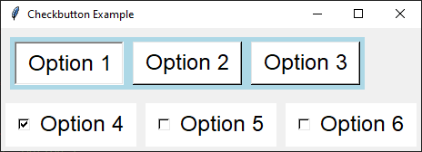

====================================================
tk Checkbutton
====================================================

| See: https://www.geeksforgeeks.org/python-tkinter-checkbutton-widget/

----

Usage
---------------

| The `tkinter.Checkbutton` widget provides a checkbutton (checkbox).
| To create a checkbutton widget, the general syntax is:

.. py:function:: checkbutton_widget = tk.Checkbutton(parent, option=value)

    | parent is the window or frame object.
    | Options can be passed as parameters separated by commas.

----

Using check buttons
---------------------------

This code demonstrates the use of check boxes (check buttons) and a text widget to display the selected options.

.. code-block:: python

    import tkinter as tk
    from tkinter import font

    def display_options():
        selected_options = []
        for i in range(len(options)):
            if option_vars[i].get():
                selected_options.append(options[i])
        text_widget.delete(1.0, 'end')
        text_widget.insert(tk.END, f"You selected: {', '.join(selected_options)}")

    # Create the main window
    root = tk.Tk()
    root.title("Checkbutton Example")

    # Create a frame with a background color
    frame = tk.Frame(root, bg="light blue")
    frame.pack(padx=10, pady=10, fill="both", expand=True)

    # Define a font style
    fontStyle = font.Font(family="Lucida Grande", size=18)

    # Define the options
    options = ["Option 1", "Option 2", "Option 3"]

    # Create a list to hold the IntVar for each checkbutton
    option_vars = []
    for _ in options:
        option_vars.append(tk.IntVar())

    # Create and pack the checkbuttons
    for i in range(len(options)):
        button = tk.Checkbutton(frame, text=options[i], variable=option_vars[i], command=display_options,
                                bg="white", fg="black", font=fontStyle, padx=10, pady=5)
        button.pack(side="left", padx=5, pady=5)

    # Create a text widget to display the selected options
    text_widget = tk.Text(root, height=2, width=40, bg="white", fg="black", font=fontStyle, bd=2, relief="solid")
    text_widget.pack(padx=10, pady=10)

    # Run the main event loop
    root.mainloop()

For loops
~~~~~~~~~~~~~~~

These loops help create and manage the checkbuttons and their states, as well as display the selected options in the text widget.

1. **Creating `IntVar` List**:

   .. code-block:: python

       option_vars = []
       for _ in options:
           option_vars.append(tk.IntVar())

   - This loop iterates over the `options` list.
   - For each option, it creates a new `IntVar` instance and appends it to the `option_vars` list.
   - The underscore `_` is used as a placeholder since the loop variable is not needed.

2. **Creating and Packing Checkbuttons**:

   .. code-block:: python

       for i in range(len(options)):
           button = tk.Checkbutton(frame, text=options[i], variable=option_vars[i],
                                    command=display_options, bg="white", fg="black",
                                    font=fontStyle, padx=10, pady=5)
           button.pack(side="left", padx=5, pady=5)

   - This loop iterates over the indices of the `options` list using `range(len(options))`.
   - For each index `i`, it creates a `Checkbutton` with the corresponding text from `options[i]` and variable from `option_vars[i]`.
   - The `Checkbutton` is then packed into the frame with specified padding and alignment.

3. **Displaying Selected Options**:

   .. code-block:: python

       def display_options():
           selected_options = []
           for i in range(len(options)):
               if option_vars[i].get():
                   selected_options.append(options[i])
           text_widget.delete(1.0, 'end')
           text_widget.insert(tk.END, f"You selected: {', '.join(selected_options)}")

   - This loop iterates over the indices of the `options` list.
   - For each index `i`, it checks if the corresponding `IntVar` in `option_vars[i]` is set (i.e., the checkbutton is selected).
   - If selected, the option from `options[i]` is appended to the `selected_options` list.
   - The text widget is then updated to display the selected options.

----

Parameter syntax
----------------------

.. py:function:: checkbutton_widget = tk.Checkbutton(parent, option=value)

    | parent is the window or frame object.
    | Options can be passed as parameters separated by commas.

    **Parameters:**

    .. py:attribute:: activebackground

        | Syntax: ``checkbutton_widget = tk.Checkbutton(parent, activebackground="color")``
        | Description: Sets the background color of the checkbutton when it is active.
        | Default: SystemButtonFace
        | Example: ``checkbutton_widget = tk.Checkbutton(window, activebackground="lightblue")``

    .. py:attribute:: activeforeground

        | Syntax: ``checkbutton_widget = tk.Checkbutton(parent, activeforeground="color")``
        | Description: Sets the foreground color of the checkbutton when it is active.
        | Default: SystemWindowText
        | Example: ``checkbutton_widget = tk.Checkbutton(window, activeforeground="blue")``

    .. py:attribute:: anchor

        | Syntax: ``checkbutton_widget = tk.Checkbutton(parent, anchor="position")``
        | Description: Sets the anchor position for the text and indicator.
        | Default: center
        | Example: ``checkbutton_widget = tk.Checkbutton(window, anchor="w")``

    .. py:attribute:: background

        | Syntax: ``checkbutton_widget = tk.Checkbutton(parent, background="color")``
        | Description: Sets the background color of the checkbutton.
        | Default: SystemButtonFace
        | Example: ``checkbutton_widget = tk.Checkbutton(window, background="lightyellow")``

    .. py:attribute:: bd

        | Syntax: ``checkbutton_widget = tk.Checkbutton(parent, bd=border_width)``
        | Description: Sets the border width of the checkbutton.
        | Default: 2
        | Example: ``checkbutton_widget = tk.Checkbutton(window, bd=5)``

    .. py:attribute:: bg

        | Syntax: ``checkbutton_widget = tk.Checkbutton(parent, bg="color")``
        | Description: Sets the background color of the checkbutton.
        | Default: SystemButtonFace
        | Example: ``checkbutton_widget = tk.Checkbutton(window, bg="lightyellow")``

    .. py:attribute:: bitmap

        | Syntax: ``checkbutton_widget = tk.Checkbutton(parent, bitmap="bitmap_name")``
        | Description: Sets a bitmap image to be displayed on the checkbutton.
        | Default: None
        | Example: ``checkbutton_widget = tk.Checkbutton(window, bitmap="error")``

    .. py:attribute:: borderwidth

        | Syntax: ``checkbutton_widget = tk.Checkbutton(parent, borderwidth=width)``
        | Description: Sets the width of the border around the checkbutton.
        | Default: 2
        | Example: ``checkbutton_widget = tk.Checkbutton(window, borderwidth=3)``

    .. py:attribute:: command

        | Syntax: ``checkbutton_widget = tk.Checkbutton(parent, command=function)``
        | Description: Specifies a function to be called when the checkbutton is toggled.
        | Default: None
        | Example: ``checkbutton_widget = tk.Checkbutton(window, command=my_function)``

    .. py:attribute:: compound

        | Syntax: ``checkbutton_widget = tk.Checkbutton(parent, compound="position")``
        | Description: Specifies how to display the image and text (if both are set).
        | Default: none
        | Example: ``checkbutton_widget = tk.Checkbutton(window, compound="left")``

    .. py:attribute:: cursor

        | Syntax: ``checkbutton_widget = tk.Checkbutton(parent, cursor="cursor_type")``
        | Description: Sets the mouse cursor when hovering over the checkbutton.
        | Default: arrow
        | Example: ``checkbutton_widget = tk.Checkbutton(window, cursor="hand2")``

    .. py:attribute:: disabledforeground

        | Syntax: ``checkbutton_widget = tk.Checkbutton(parent, disabledforeground="color")``
        | Description: Sets the foreground color when the checkbutton is disabled.
        | Default: SystemDisabledText
        | Example: ``checkbutton_widget = tk.Checkbutton(window, disabledforeground="gray")``

    .. py:attribute:: fg

        | Syntax: ``checkbutton_widget = tk.Checkbutton(parent, fg="color")``
        | Description: Sets the foreground color of the checkbutton (text color).
        | Default: SystemWindowText
        | Example: ``checkbutton_widget = tk.Checkbutton(window, fg="black")``

    .. py:attribute:: font

        | Syntax: ``checkbutton_widget = tk.Checkbutton(parent, font=("font_name", size, "style"))``
        | Description: Specifies the font type, size, and style for the text of the checkbutton.
        | Default: TkDefaultFont
        | Example: ``checkbutton_widget = tk.Checkbutton(window, font=("Arial", 12, "bold"))``

    .. py:attribute:: height

        | Syntax: ``checkbutton_widget = tk.Checkbutton(parent, height=value)``
        | Description: Sets the height of the checkbutton.
        | Default: 0 (automatically determined)
        | Example: ``checkbutton_widget = tk.Checkbutton(window, height=2)``

    .. py:attribute:: highlightbackground

        | Syntax: ``checkbutton_widget = tk.Checkbutton(parent, highlightbackground="color")``
        | Description: Sets the background color of the checkbutton when it does not have focus.
        | Default: SystemButtonFace
        | Example: ``checkbutton_widget = tk.Checkbutton(window, highlightbackground="gray")``

    .. py:attribute:: highlightcolor

        | Syntax: ``checkbutton_widget = tk.Checkbutton(parent, highlightcolor="color")``
        | Description: Sets the color of the highlight when the checkbutton has focus.
        | Default: SystemWindowFrame
        | Example: ``checkbutton_widget = tk.Checkbutton(window, highlightcolor="blue")``

    .. py:attribute:: highlightthickness

        | Syntax: ``checkbutton_widget = tk.Checkbutton(parent, highlightthickness=thickness)``
        | Description: Sets the thickness of the highlight border.
        | Default: 1
        | Example: ``checkbutton_widget = tk.Checkbutton(window, highlightthickness=2)``

    .. py:attribute:: image

        | Syntax: ``checkbutton_widget = tk.Checkbutton(parent, image="image_name")``
        | Description: Sets an image to be displayed on the checkbutton.
        | Default: None
        | Example: ``checkbutton_widget = tk.Checkbutton(window, image=my_image)``

    .. py:attribute:: indicatoron

        | Syntax: ``checkbutton_widget = tk.Checkbutton(parent, indicatoron=1)``
        | Description: Specifies whether to show the indicator (true or false).
        | Default: 1
        | Example: ``checkbutton_widget = tk.Checkbutton(window, indicatoron=0)``

    .. py:attribute:: justify

        | Syntax: ``checkbutton_widget = tk.Checkbutton(parent, justify="position")``
        | Description: Sets the justification of the text (left, center, right).
        | Default: center
        | Example: ``checkbutton_widget = tk.Checkbutton(window, justify="right")``

    .. py:attribute:: offrelief

        | Syntax: ``checkbutton_widget = tk.Checkbutton(parent, offrelief="style")``
        | Description: Sets the relief style for the indicator when off.
        | Default: raised
        | Example: ``checkbutton_widget = tk.Checkbutton(window, offrelief="flat")``

    .. py:attribute:: offvalue

        | Syntax: ``checkbutton_widget = tk.Checkbutton(parent, offvalue=value)``
        | Description: Sets the value associated with the checkbutton when it is not checked.
        | Default: 0
        | Example: ``checkbutton_widget = tk.Checkbutton(window, offvalue=0)``

    .. py:attribute:: onvalue

        | Syntax: ``checkbutton_widget = tk.Checkbutton(parent, onvalue=value)``
        | Description: Sets the value associated with the checkbutton when it is checked.
        | Default: 1
        | Example: ``checkbutton_widget = tk.Checkbutton(window, onvalue=1)``

    .. py:attribute:: overrelief

        | Syntax: ``checkbutton_widget = tk.Checkbutton(parent, overrelief="style")``
        | Description: Sets the relief style for the indicator when hovered over.
        | Default: None
        | Example: ``checkbutton_widget = tk.Checkbutton(window, overrelief="sunken")``

    .. py:attribute:: padx

        | Syntax: ``checkbutton_widget = tk.Checkbutton(parent, padx=padding_value)``
        | Description: Sets the horizontal padding within the checkbutton.
        | Default: 1
        | Example: ``checkbutton_widget = tk.Checkbutton(window, padx=10)``

    .. py:attribute:: pady

        | Syntax: ``checkbutton_widget = tk.Checkbutton(parent, pady=padding_value)``
        | Description: Sets the vertical padding within the checkbutton.
        | Default: 1
        | Example: ``checkbutton_widget = tk.Checkbutton(window, pady=10)``

    .. py:attribute:: relief

        | Syntax: ``checkbutton_widget = tk.Checkbutton(parent, relief="style")``
        | Description: Sets the border style of the checkbutton. Options include `flat`, `raised`, `sunken`, `groove`, `ridge`.
        | Default: flat
        | Example: ``checkbutton_widget = tk.Checkbutton(window, relief="raised")``

    .. py:attribute:: selectcolor

        | Syntax: ``checkbutton_widget = tk.Checkbutton(parent, selectcolor="color")``
        | Description: Sets the color of the indicator when the checkbutton is selected.
        | Default: SystemWindow
        | Example: ``checkbutton_widget = tk.Checkbutton(window, selectcolor="lightgreen")``

    .. py:attribute:: selectimage

        | Syntax: ``checkbutton_widget = tk.Checkbutton(parent, selectimage="image_name")``
        | Description: Sets an image to be displayed when the checkbutton is selected.
        | Default: None
        | Example: ``checkbutton_widget = tk.Checkbutton(window, selectimage=my_selected_image)``

    .. py:attribute:: state

        | Syntax: ``checkbutton_widget = tk.Checkbutton(parent, state="state_type")``
        | Description: Sets the state of the checkbutton. Options include `normal`, `disabled`, or `active`.
        | Default: normal
        | Example: ``checkbutton_widget = tk.Checkbutton(window, state="disabled")``

    .. py:attribute:: takefocus

        | Syntax: ``checkbutton_widget = tk.Checkbutton(parent, takefocus=1)``
        | Description: Allows the checkbutton to take focus on click.
        | Default: None
        | Example: ``checkbutton_widget = tk.Checkbutton(window, takefocus=1)``

    .. py:attribute:: text

        | Syntax: ``checkbutton_widget = tk.Checkbutton(parent, text="label")``
        | Description: Sets the text label for the checkbutton.
        | Default: None
        | Example: ``checkbutton_widget = tk.Checkbutton(window, text="Option 1")``

    .. py:attribute:: textvariable

        | Syntax: ``checkbutton_widget = tk.Checkbutton(parent, textvariable=variable)``
        | Description: Associates a variable with the text of the checkbutton.
        | Default: None
        | Example: ``checkbutton_widget = tk.Checkbutton(window, textvariable=my_text_var)``

    .. py:attribute:: tristateimage

        | Syntax: ``checkbutton_widget = tk.Checkbutton(parent, tristateimage="image_name")``
        | Description: Sets an image to be displayed when the checkbutton is in a tri-state mode.
        | Default: None
        | Example: ``checkbutton_widget = tk.Checkbutton(window, tristateimage=my_tristate_image)``

    .. py:attribute:: tristatevalue

        | Syntax: ``checkbutton_widget = tk.Checkbutton(parent, tristatevalue=value)``
        | Description: Sets the value associated with the checkbutton in a tri-state mode.
        | Default: None
        | Example: ``checkbutton_widget = tk.Checkbutton(window, tristatevalue=2)``

    .. py:attribute:: underline

        | Syntax: ``checkbutton_widget = tk.Checkbutton(parent, underline=index)``
        | Description: Specifies the index of the character to underline in the text.
        | Default: -1 (no underline)
        | Example: ``checkbutton_widget = tk.Checkbutton(window, underline=0)``

    .. py:attribute:: variable

        | Syntax: ``checkbutton_widget = tk.Checkbutton(parent, variable=control_variable)``
        | Description: Associates the checkbutton with a control variable (e.g., `IntVar`, `StringVar`).
        | Default: !checkbutton-1
        | Example: ``checkbutton_widget = tk.Checkbutton(window, variable=my_var)``

    .. py:attribute:: width

        | Syntax: ``checkbutton_widget = tk.Checkbutton(parent, width=width_value)``
        | Description: Sets the width of the checkbutton.
        | Default: 0 (automatically determined)
        | Example: ``checkbutton_widget = tk.Checkbutton(window, width=30)``

    .. py:attribute:: wraplength

        | Syntax: ``checkbutton_widget = tk.Checkbutton(parent, wraplength=length)``
        | Description: Sets the line length for text wrapping in the checkbutton.
        | Default: 0 (no wrapping)
        | Example: ``checkbutton_widget = tk.Checkbutton(window, wraplength=100)``
