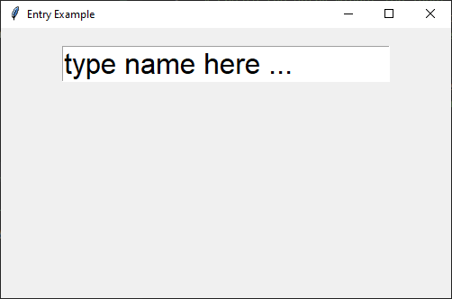

====================================================
tk Entry
====================================================

| See: `<https://www.geeksforgeeks.org/python-tkinter-entry-widget/>`_

----

Usage
---------------

| The `tkinter.Entry` widget provides an single line input field.
| The Entry widget is great for simple, single-line inputs like usernames or passwords, while the Text widget is better for larger text inputs, such as comments or descriptions.
| To create an entry widget the general syntax is (assuming import via "import tkinter as tk")

.. py:function:: entry_widget  = tk.Entry(parent, option=value)

    | `parent` is the window or frame object.
    | Options can be passed as parameters separated by commas.

----

Entry example
----------------------------------------------------

| The font and width are the options used in the entry widget below.

.. code-block:: python

    import tkinter as tk

    # Create the main window
    root = tk.Tk()
    root.geometry("500x300")  # Set window size
    root.title("Entry Example")  # Set window title

    # Create the entry widget for input
    name_entry = tk.Entry(root, font=('calibre', 24, 'normal'), width=20)
    name_entry.pack(pady=20)  # Add some padding to the top

    # Run the main event loop
    root.mainloop()

----

.. admonition:: Tasks

    #. Create a Tkinter application with a window size of 400x300, an `Entry` widget using the `Comic Sans MS` font (size 20, normal weight, roman slant), a background color of `#fafafa`, a foreground color of `#2f2f2f`, a border width of 2 with a sunken relief style, left-aligned text, and a width of 20 characters, with the widget displayed inside the window using padding of 20 in both directions and internal y padding of 5.

        .. image:: images/entry_question.png
            :scale: 67

    .. dropdown::
        :icon: codescan
        :color: primary
        :class-container: sd-dropdown-container

        .. tab-set::

            .. tab-item:: Q1

                Create a Tkinter window with an entry widget.

                .. code-block:: python

                    import tkinter as tk
                    from tkinter import font

                    # Create the main window
                    root = tk.Tk()
                    root.title("Entry Alphabet Example")
                    root.geometry("400x300")

                    # Define the custom font
                    custom_font = font.Font(family="Comic Sans MS", size=20, weight="normal", slant="roman")

                    # First Entry widget
                    entry = tk.Entry(root, font=custom_font, bg="#fafafa", fg="#2f2f2f", bd=2, relief="sunken", justify="left", width=20)
                    # ipadx does put move the left justification, so is omitted.
                    entry.pack(padx=20, pady=20, ipady=5)

                    # Run the Tkinter event loop
                    root.mainloop()

----

Option details
--------------------

.. py:function:: entry_widget = tk.Entry(parent, option=value)

    | parent is the window or frame object.
    | Options can be passed as parameters separated by commas.

    **Parameters:**

    .. py:attribute:: background
    .. py:attribute:: bg

        | Syntax: ``entry_widget = tk.Entry(parent, bg="color")``
        | Description: Sets the background color of the entry field.
        | Default: SystemWindow RGB: (255, 255, 255)
        | Example: ``entry_widget = tk.Entry(root, bg="lightgrey")``

    .. py:attribute:: bd
    .. py:attribute:: borderwidth

        | Syntax: ``entry_widget = tk.Entry(parent, bd=width)``
        | Description: Sets the width of the border around the entry field.
        | Default: ``2``
        | Example: ``entry_widget = tk.Entry(root, bd=5)``

    .. py:attribute:: cursor

        | Syntax: ``entry_widget = tk.Entry(parent, cursor="cursor_type")``
        | Description: Changes the cursor when hovering over the entry field.
        | Default: ``None``
        | Example: ``entry_widget = tk.Entry(root, cursor="xterm")``
        | Possible values include:

            - **"arrow"**: Standard arrow cursor.
            - **"xterm"**: I-beam cursor for text selection.
            - **"hand2"**: Hand cursor.
            - **"cross"**: Crosshair cursor.
            - **"plus"**: Plus sign cursor.
            - **"wait"**: Hourglass cursor.

    .. py:attribute:: disabledbackground

        | Syntax: ``entry_widget = tk.Entry(parent, disabledbackground="color")``
        | Description: Sets the background color when the entry is disabled.
        | Default: SystemDisabled RGB: (240, 240, 240)
        | Example: ``entry_widget = tk.Entry(root, disabledbackground="lightgrey")``

    .. py:attribute:: disabledforeground

        | Syntax: ``entry_widget = tk.Entry(parent, disabledforeground="color")``
        | Description: Sets the text color when the entry is disabled.
        | Default: SystemDisabledText RGB: (109, 109, 109)
        | Example: ``entry_widget = tk.Entry(root, disabledforeground="darkgrey")``

    .. py:attribute:: exportselection

        | Syntax: ``entry_widget = tk.Entry(parent, exportselection=boolean)``
        | Description: Determines if the text selection is exported to the clipboard.
        | Default: ``1``
        | Example: ``entry_widget = tk.Entry(root, exportselection=False)``

    .. py:attribute:: font

        | Syntax: ``entry_widget = tk.Entry(parent, font=("font_name", size))``
        | Description: Sets the font type and size of the entry text.
        | Default: System font and size
        | Example: ``entry_widget = tk.Entry(root, font=("Arial", 12))``

    .. py:attribute:: foreground
    .. py:attribute:: fg

        | Syntax: ``entry_widget = tk.Entry(parent, fg="color")``
        | Description: Sets the text color of the entry field.
        | Default: SystemWindowText RGB: (0, 0, 0)
        | Example: ``entry_widget = tk.Entry(root, fg="blue")``

    .. py:attribute:: highlightbackground

        | Syntax: ``entry_widget = tk.Entry(parent, highlightbackground="color")``
        | Description: Sets the color of the highlight when the entry does not have focus.
        | Default: SystemButtonFace RGB: (240, 240, 240)
        | Example: ``entry_widget = tk.Entry(root, highlightbackground="grey")``

    .. py:attribute:: highlightcolor

        | Syntax: ``entry_widget = tk.Entry(parent, highlightcolor="color")``
        | Description: Sets the color of the highlight when the entry has focus.
        | Default: SystemHighlight RGB: (100, 100, 100)
        | Example: ``entry_widget = tk.Entry(root, highlightcolor="blue")``

    .. py:attribute:: highlightthickness

        | Syntax: ``entry_widget = tk.Entry(parent, highlightthickness=thickness)``
        | Description: Sets the thickness of the focus highlight border.
        | Default: ``1``
        | Example: ``entry_widget = tk.Entry(root, highlightthickness=2)``

    .. py:attribute:: insertbackground

        | Syntax: ``entry_widget = tk.Entry(parent, insertbackground="color")``
        | Description: Sets the color of the insertion cursor (caret).
        | Default: SystemWindowText RGB: (0, 0, 0)
        | Example: ``entry_widget = tk.Entry(root, insertbackground="red")``

    .. py:attribute:: insertborderwidth

        | Syntax: ``entry_widget = tk.Entry(parent, insertborderwidth=width)``
        | Description: Sets the width of the insertion cursor's border.
        | Default: ``0``
        | Example: ``entry_widget = tk.Entry(root, insertborderwidth=1)``

    .. py:attribute:: insertofftime

        | Syntax: ``entry_widget = tk.Entry(parent, insertofftime=milliseconds)``
        | Description: Sets the time the insertion cursor is off per blink in milliseconds.
        | Default: ``300``
        | Example: ``entry_widget = tk.Entry(root, insertofftime=500)``

    .. py:attribute:: insertontime

        | Syntax: ``entry_widget = tk.Entry(parent, insertontime=milliseconds)``
        | Description: Sets the time the insertion cursor is on per blink in milliseconds.
        | Default: ``600``
        | Example: ``entry_widget = tk.Entry(root, insertontime=500)``

    .. py:attribute:: insertwidth

        | Syntax: ``entry_widget = tk.Entry(parent, insertwidth=width)``
        | Description: Sets the width of the insertion cursor.
        | Default: ``2``
        | Example: ``entry_widget = tk.Entry(root, insertwidth=3)``

    .. py:attribute:: justify

        | Syntax: ``entry_widget = tk.Entry(parent, justify="alignment")``
        | Description: Specifies how the text is aligned within the entry field.
        | Default: ``left``
        | Example: ``entry_widget = tk.Entry(root, justify="center")``
        | Possible values include:

            - **"left"**: Aligns text to the left.
            - **"center"**: Centers text within the field.
            - **"right"**: Aligns text to the right.

    .. py:attribute:: relief

        | Syntax: ``entry_widget = tk.Entry(parent, relief="relief_type")``
        | Description: Sets the border style of the entry field.
        | Default: ``flat``
        | Example: ``entry_widget = tk.Entry(root, relief="sunken")``
        | Possible values include:

            - **"flat"**
            - **"raised"**
            - **"sunken"**
            - **"groove"**
            - **"ridge"**

    .. py:attribute:: show

        | Syntax: ``entry_widget = tk.Entry(parent, show="character")``
        | Description: Masks characters, often used for passwords.
        | Default: ``None``
        | Example: ``entry_widget = tk.Entry(root, show="*")``

    .. py:attribute:: state

        | Syntax: ``entry_widget = tk.Entry(parent, state="state")``
        | Description: Sets the state of the entry field.
        | Default: ``normal``
        | Example: ``entry_widget = tk.Entry(root, state="disabled")``
        | Possible values include:

            - **"normal"**
            - **"disabled"**
            - **"readonly"**

    .. py:attribute:: takefocus

        | Syntax: ``entry_widget = tk.Entry(parent, takefocus=boolean)``
        | Description: Determines if the entry field can receive focus via keyboard navigation.
        | Default: ``1``
        | Example: ``entry_widget = tk.Entry(root, takefocus=False)``

    .. py:attribute:: textvariable

        | Syntax: ``entry_widget = tk.Entry(parent, textvariable=variable)``
        | Description: Associates a Tkinter variable (usually a StringVar) with the entry text.
        | Default: ``None``
        | Example: ``entry_widget = tk.Entry(root, textvariable=my_var)``

    .. py:attribute:: validate

        | Syntax: ``entry_widget = tk.Entry(parent, validate="validation_type")``
        | Description: Sets the type of validation to apply to the entry field.
        | Default: ``none``
        | Example: ``entry_widget = tk.Entry(root, validate="focusout")``
        | Possible values include:

            - **"none"**: No validation.
            - **"focus"**: Validation occurs when the entry loses focus.
            - **"focusin"**: Validation occurs when the entry gains focus.
            - **"focusout"**: Validation occurs when the entry loses focus.
            - **"key"**: Validation occurs on every keystroke.

    .. py:attribute:: width

        | Syntax: ``entry_widget = tk.Entry(parent, width=characters)``
        | Description: Sets the width of the entry field in characters.
        | Default: ``20``
        | Example: ``entry_widget = tk.Entry(root, width=30)``

    .. py:attribute:: xscrollcommand

        | Syntax: ``entry_widget = tk.Entry(parent, xscrollcommand=scroll_function)``
        | Description: Specifies a function for horizontal scrolling.
        | Default: ``None``
        | Example: ``entry_widget = tk.Entry(root, xscrollcommand=my_scroll_function)``
