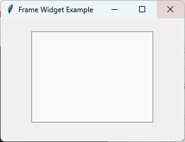

====================================================
tk Frame
====================================================

| See: `<https://docs.python.org/3/library/tkinter.html#tkinter.Frame>`_

----

Usage
---------------

| The `tkinter.Frame` widget acts as a container for other widgets.
| To create a frame widget the general syntax is
| (assuming import via "import tkinter as tk"):

.. py:function:: frame_widget = tk.Frame(parent, option=value)

    | parent is the window or frame object.
    | Options can be passed as parameters separated by commas.

----

Sample Frame
---------------

| The code below creates a frame with a specific border style and size.
| The background color is set to a light gray so it can be easily seen.
| The border is set to 2 pixels.
| The relief is set to "groove" so it can be easily seen as there is no border colour setting.
| The internalpadding is set to 10 pixels on all sides.

.. code-block:: python

    import tkinter as tk

    root = tk.Tk()
    root.title("Frame Widget Example")
    root.geometry("300x200")

    # Creating a frame with specified options
    frame = tk.Frame(
        root,
        bg="#f9f9f9",
        bd=2,
        relief="groove",
        width=200,
        height=150,
        padx=10,
        pady=10
    )

    frame.pack(padx=20, pady=20)

root.mainloop()

----

Parameter syntax
----------------------

| The main options are below.

.. note::

    The ``width`` and ``height`` options only specify the requested size.
    If the frame contains widgets, it will normally resize itself to fit them.
    To force the frame to keep its specified size, disable geometry propagation.

    .. code-block:: python

        frame.pack_propagate(False)
        # or
        frame.grid_propagate(False)

.. py:function:: frame_widget = tk.Frame(parent, option=value)

    **Parameters:**

    .. py:attribute:: background
    .. py:attribute:: bg

        | Syntax: ``frame_widget = tk.Frame(parent, bg="color")``
        | Description: Sets the background color of the frame.
        | Default: SystemButtonFace RGB: (240, 240, 240)

    .. py:attribute:: borderwidth
    .. py:attribute:: bd

        | Syntax: ``frame_widget = tk.Frame(parent, bd=width)``
        | Description: Sets the width of the frame's border.
        | Default: ``0``

    .. py:attribute:: cursor

        | Syntax: ``frame_widget = tk.Frame(parent, cursor="cursor_type")``
        | Description: Changes the mouse cursor when it hovers over the frame.

    .. py:attribute:: height

        | Syntax: ``frame_widget = tk.Frame(parent, height=height_in_pixels)``
        | Description: Sets the height of the frame in pixels.
        | Default: ``0``

    .. py:attribute:: highlightbackground

        | Syntax: ``frame_widget = tk.Frame(parent, highlightbackground="color")``
        | Description: Sets the color of the focus highlight when the frame does not have focus.

    .. py:attribute:: highlightcolor

        | Syntax: ``frame_widget = tk.Frame(parent, highlightcolor="color")``
        | Description: Sets the color of the focus highlight when the frame has focus.

    .. py:attribute:: highlightthickness

        | Syntax: ``frame_widget = tk.Frame(parent, highlightthickness=thickness)``
        | Description: Sets the thickness of the focus highlight.
        | Default: ``0``

    .. py:attribute:: padx

        | Syntax: ``frame_widget = tk.Frame(parent, padx=padding)``
        | Description: Sets the horizontal padding to add inside the frame.

    .. py:attribute:: pady

        | Syntax: ``frame_widget = tk.Frame(parent, pady=padding)``
        | Description: Sets the vertical padding to add inside the frame.

    .. py:attribute:: relief

        | Syntax: ``frame_widget = tk.Frame(parent, relief="relief_type")``
        | Description: Sets the border style of the frame. Values include "flat", "raised", "sunken", "ridge", "solid", "groove".
        | Default: ``"flat"``

    .. py:attribute:: takefocus

        | Syntax: ``frame_widget = tk.Frame(parent, takefocus=True)``
        | Description: Determines whether the frame can receive keyboard focus during focus traversal (for example, when pressing the Tab key).
        | Default: ``0``

    .. py:attribute:: width

        | Syntax: ``frame_widget = tk.Frame(parent, width=width_in_pixels)``
        | Description: Sets the width of the frame in pixels.
        | Default: ``0``

----

Default options
-----------------------

| Code to get the defaults for each frame option is below.

.. code-block:: python

    import tkinter as tk

    root = tk.Tk()

    frame = tk.Frame(root)
    frame_options = frame.keys()

    for option in frame_options:
        print(f"{option}: {frame.cget(option)}")

