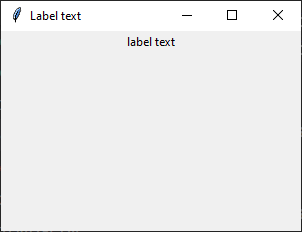
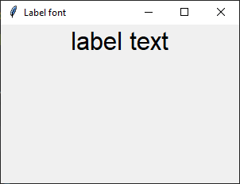
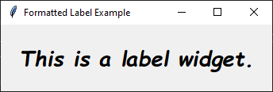
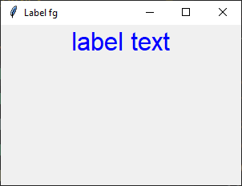
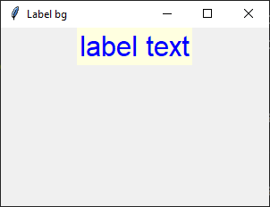
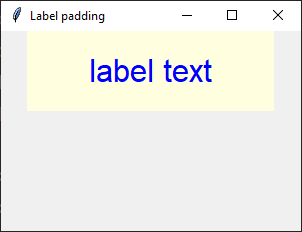
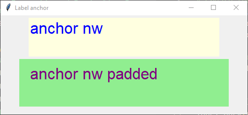
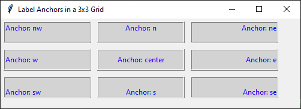
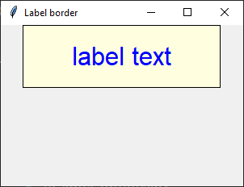

====================================================
tk Label
====================================================

| See: https://www.geeksforgeeks.org/python-tkinter-label/

----

Usage
---------------

| The `tkinter.Label` widget provides a text label.
| To create a label widget the general syntax is (assuming import via "import tkinter as tk"):

.. py:function:: label_widget  = tk.Label(parent, option=value)

    | `parent` is the window or frame object.
    | Options can be passed as parameters separated by commas.

----

Text
--------------

.. py:function:: label_widget  = tk.Label(parent, text=text_string)

    | `text_string` is text to display in the label widget.
    | e.g. label = tk.Label(window, text="label text")

Text example
~~~~~~~~~~~~~~~~~~

.. code-block:: python

    import tkinter as tk

    # Create the main window
    window = tk.Tk()
    window.geometry("300x200")  # Set window size
    window.title("Label text")  # Set window title

    # Create the label widget
    label = tk.Label(window, text="label text")

    # Pack the label into the window
    label.pack()

    # Run the main event loop
    window.mainloop()

----

Font
----------

.. py:function:: label_widget  = tk.Label(parent, font=(font_type, font_size, font_style))

   - font_type is a font name. e.g "Arial"
   - font_size is the size of the font.  eg. 12
   - font_style can be bold, italic, underline or a space separated combination
   - Default Value: System-dependent (usually a default font)
   - Description: Specifies the font family, size, and style for the label text.
   - Example: To use a 12-point Arial font, use `font=("Arial", 12)`.
   - Example: To use a bold 12-point Arial font, use `font=("Arial", 12, "bold")`.
   - Example: To use a bold underlines 12-point Arial font, use `font=("Arial", 12, "bold underline")`.

font example
~~~~~~~~~~~~~~~~~~

.. code-block:: python

    import tkinter as tk

    # Create the main window
    window = tk.Tk()
    window.geometry("300x200")  # Set window size
    window.title("Label font")  # Set window title

    # Create the label widget with options
    label = tk.Label(window, text="label text", font=("Arial", 24))

    # Pack the label into the window
    label.pack()

    # Run the main event loop
    window.mainloop()

----

Custom Font
------------

| **font.Font** is a constructor from the ``tkinter.font`` module that is used to create a new font object.
| **from tkinter import font** is required.

.. py:function:: custom_font = font.Font(family=v_family, size=v_size, weight=v_weight, slant=v_slant)

    **Parameters**

      - **family=v_family** Specifies the font family to use. e.g. **family="Comic Sans MS"**
      - **size=v_size** Sets the font size in points.e.g. **size=20**:
      - **weight=v_weight** Sets the font weight. e.g. **weight="bold"**. e.g. **weight="normal"**.
      - **slant=v_slant** Makes the font italic or normal. e.g **slant="italic"**. Other possible values include "roman" (normal, upright text).

custom font example
~~~~~~~~~~~~~~~~~~~~~

This code below uses a font object to style text in a Tkinter Label.

.. code-block:: python

    import tkinter as tk
    from tkinter import font

    # Create the main window
    window = tk.Tk()
    window.title("Label Custom Font")

    # Define the custom font
    custom_font = font.Font(family="Comic Sans MS", size=20, weight="bold", slant="italic")

    # Create a Label widget using the custom font
    label = tk.Label(window, text="This is a label widget.", font=custom_font)
    label.pack(padx=20, pady=20)

    # Run the Tkinter event loop
    window.mainloop()

----

Text color
---------------

.. py:function:: label_widget  = tk.Label(parent, fg=color)

   - color can be a color name, e.g blue, or a hex colour, e.g. #0000FF.
   - Default Value: System-dependent (usually black)
   - Description: Sets the foreground (text) color of the label.
   - Example: To set the text color to blue, use `fg="blue"` or `fg="#0000FF"`.

fg example
~~~~~~~~~~~~~~~~~~

.. code-block:: python

    import tkinter as tk

    # Create the main window
    window = tk.Tk()
    window.geometry("300x200")  # Set window size
    window.title("Label fg")  # Set window title

    # Create the label widget with options
    label = tk.Label(window, text="label text", font=("Arial", 24), fg="blue")

    # Pack the label into the window
    label.pack()

    # Run the main event loop
    window.mainloop()

----

Background color
--------------------------

.. py:function:: label_widget  = tk.Label(parent, bg=color)

   - color can be a color name or a hex colour.
   - Default Value: System-dependent (usually white)
   - Description: Sets the background color of the label.
   - Example: To set the background color to light yellow, use `bg="lightyellow"`.

bg example
~~~~~~~~~~~~~~~~~~

.. code-block:: python

    import tkinter as tk

    # Create the main window
    window = tk.Tk()
    window.geometry("300x200")  # Set window size
    window.title("Label bg")  # Set window title

    # Create the label widget with options
    label = tk.Label(window, text="label text", font=("Arial", 24), fg="blue", bg="lightyellow")

    # Pack the label into the window
    label.pack()

    # Run the main event loop
    window.mainloop()

----

Padding
-------------------

.. py:function:: label_widget  = tk.Label(parent, padx=x_integer, pady=y_integer)

   - x_integer and y_integer are integers
   - Default Value: 0
   - Description: Adds extra space (in pixels) around the label text.
   - Example: To add 12 pixels of padding on the left and right sides, use `padx=12`.
   - Example: To add 5 pixels of padding on the top and bottom, use `pady=5`.

padding example
~~~~~~~~~~~~~~~~~~

.. code-block:: python

    import tkinter as tk

    # Create the main window
    window = tk.Tk()
    window.geometry("300x200")  # Set window size
    window.title("Label padding]")  # Set window title

    # Create the label widget with options
    label = tk.Label(text="label text", font=("Arial", 24), fg="blue", bg="lightyellow",
                    padx=60, pady=20)

    # Pack the label into the window
    label.pack()

    # Run the main event loop
    window.mainloop()

----

Anchor
-------------------

.. py:attribute:: anchor

    | Syntax: ``label_widget = tk.Label(parent, anchor="position")``
    | Description: Sets the position of the text within the label. Options are "nw", "n", "ne", "w", "center", "e", "sw", "s", "se".
    | Default: center
    | Example: ``label_widget = tk.Label(window, anchor="center")``

.. py:attribute:: height

    | Syntax: ``label_widget = tk.Label(parent, height=value)``
    | Description: Sets the height of the label in number of lines.
    | Default: 0
    | Example: ``label_widget = tk.Label(window, height=2)``

    .. py:attribute:: width

        | Syntax: ``label_widget = tk.Label(parent, width=value)``
        | Description: Sets the width of the label in number of characters.
        | Default: 0
        | Example: ``label_widget = tk.Label(window, width=20)``

Anchor example
~~~~~~~~~~~~~~~~~~~~~

| The label height and width need to be set larger than needed for the text to fit so that the anchor setting can move the text.

.. code-block:: python

    import tkinter as tk

    # Create the main window
    window = tk.Tk()
    window.geometry("500x200")  # Set window size
    window.title("Label anchor")  # Set window title

    # Create the label widget with options
    label = tk.Label(text="anchor nw", font=("Arial", 24), fg="blue", bg="lightyellow",
                    width=20, height=2, anchor="nw")

    # Pack the label into the window
    label.pack(pady=5)

    # Create the label widget with options
    label_2 = tk.Label(text="anchor nw padded", font=("Arial", 24), fg="purple", bg="lightgreen",
                    width=20, height=2, anchor="nw", padx=20, pady=10)

    # Pack the label into the window
    label_2.pack()

    # Run the main event loop
    window.mainloop()

----

Border
---------------

.. py:function:: label_widget  = tk.Label(parent, borderwidth=width)

   - width is an integer
   - Default Value: 0
   - Description: Specifies the border width for the label.
   - Example: To create a width of 2 pixels, use `borderwidth=2`.

.. py:function:: label_widget  = tk.Label(parent, relief=border_style)

   - border_style is one of "flat", "raised", "sunken", "solid", "ridge", "groove"
   - Default Value: "flat" (no border)
   - Description: Specifies the border style and width for the label.
   - Example: To create a solid border with a width of 1 pixels, use `relief="solid"` and `borderwidth=1`.

border example
~~~~~~~~~~~~~~~~~~~~~

.. code-block:: python

    import tkinter as tk

    # Create the main window
    window = tk.Tk()
    window.geometry("300x200")  # Set window size
    window.title("Label border")  # Set window title

    # Create the label widget with options
    label = tk.Label(text="label text", font=("Arial", 24), fg="blue", bg="lightyellow",
                    padx=60, pady=20, relief="solid", borderwidth=1)

    # Pack the label into the window
    label.pack()

    # Run the main event loop
    window.mainloop()

.. image:: images/label_borders.png
    :scale: 67%

----

.. admonition:: Tasks

    #. Create a Tkinter window with a label using the following specifications:

        .. image:: images/label_question.png
            :scale: 67%

      - The window should have a title "Formatted Label Example" and a size of 500x300 pixels.
      - Use the "Comic Sans MS" font with a size of 20, bold weight, and italic slant for the Label widget.
      - The Label widget should display the text "This is a label widget." with a pale mauve background (`#e0b0ff`) and purple text color.
      - Add a raised border with a width of 2 pixels, padding of 10 pixels on all sides, and anchor the text to the northwest.
      - Set the width of the Label widget to 300 and the height to 2.
      - Ensure the Label widget is packed with padding of 20 pixels on all sides.

    .. dropdown::
        :icon: codescan
        :color: primary
        :class-container: sd-dropdown-container

        .. tab-set::

            .. tab-item:: Q1

                Create a Tkinter window with a label.

                .. code-block:: python

                    import tkinter as tk
                    from tkinter import font

                    # Create the main window
                    window = tk.Tk()
                    window.title("Formatted Label Example")
                    window.geometry("500x300")

                    # Define the custom font
                    custom_font = font.Font(family="Comic Sans MS", size=20, weight="bold", slant="italic")

                    # Create the Label widget with the specified formatting, border, padding, and anchor options
                    label = tk.Label(window, text="This is a label widget.", font=custom_font, bg="#e0b0ff", fg="purple",
                                    bd=2, relief="raised", padx=10, pady=10, anchor="nw", width=300, height=2)
                    label.pack(padx=20, pady=20)

                    # Run the Tkinter event loop
                    window.mainloop()

----

Options
--------------

.. py:function:: label_widget = tk.Label(parent, option=value)

    | parent is the window or frame object.
    | Options can be passed as parameters separated by commas.

    **Parameters:**

    .. py:attribute:: activebackground

        | Syntax: ``label_widget = tk.Label(parent, activebackground="color")``
        | Description: Sets the background color when the label is active.
        | Default: SystemButtonFace
        | Example: ``label_widget = tk.Label(window, activebackground="SystemButtonFace")``

    .. py:attribute:: activeforeground

        | Syntax: ``label_widget = tk.Label(parent, activeforeground="color")``
        | Description: Sets the foreground color when the label is active.
        | Default: SystemButtonText
        | Example: ``label_widget = tk.Label(window, activeforeground="SystemButtonText")``

    .. py:attribute:: anchor

        | Syntax: ``label_widget = tk.Label(parent, anchor="position")``
        | Description: Sets the position of the text within the label.
        | Default: center
        | Example: ``label_widget = tk.Label(window, anchor="center")``

    .. py:attribute:: background
    .. py:attribute:: bg

        | Syntax: ``label_widget = tk.Label(parent, bg="color")``
        | Description: Sets the background color of the label.
        | Default: SystemButtonFace
        | Example: ``label_widget = tk.Label(window, bg="SystemButtonFace")``

    .. py:attribute:: bd
    .. py:attribute:: borderwidth

        | Syntax: ``label_widget = tk.Label(parent, bd=value)``
        | Description: Sets the border width of the label.
        | Default: 2
        | Example: ``label_widget = tk.Label(window, bd=2)``

    .. py:attribute:: bitmap

        | Syntax: ``label_widget = tk.Label(parent, bitmap="bitmap")``
        | Description: Sets a bitmap to be displayed in the label.
        | Default: None
        | Example: ``label_widget = tk.Label(window, bitmap="error")``

    .. py:attribute:: compound

        | Syntax: ``label_widget = tk.Label(parent, compound="position")``
        | Description: Specifies the relative position of the image and text. Controls how to combine text and image in the label. By default, if an image or bitmap is given, it is drawn instead of the text. If this option is set to CENTER, the text is drawn on top of the image. If this option is set to one of BOTTOM, LEFT, RIGHT, or TOP, the image is drawn besides the text (use BOTTOM to draw the image under the text, etc.).
        | Default: none
        | Example: ``label_widget = tk.Label(window, compound="left")``

    .. py:attribute:: cursor

        | Syntax: ``label_widget = tk.Label(parent, cursor="cursor_type")``
        | Description: Sets the cursor that appears when the mouse is over the label.
        | Default: None; standard cursor
        | Example: ``label_widget = tk.Label(window, cursor="arrow")``

    .. py:attribute:: disabledforeground

        | Syntax: ``label_widget = tk.Label(parent, disabledforeground="color")``
        | Description: Sets the foreground color of the label when it is disabled.
        | Default: SystemDisabledText
        | Example: ``label_widget = tk.Label(window, disabledforeground="SystemDisabledText")``

    .. py:attribute:: fg
    .. py:attribute:: foreground

        | Syntax: ``label_widget = tk.Label(parent, fg="color")``
        | Description: Sets the foreground color of the label.
        | Default: SystemButtonText
        | Example: ``label_widget = tk.Label(window, fg="SystemButtonText")``

    .. py:attribute:: font

        | Syntax: ``label_widget = tk.Label(parent, font="font")``
        | Description: Sets the font of the label text. The label can only contain text in single font.
        | Default: TkDefaultFont
        | Example: ``label_widget = tk.Label(window, font="TkDefaultFont")``

    .. py:attribute:: height

        | Syntax: ``label_widget = tk.Label(parent, height=value)``
        | Description: Sets the height of the label in number of lines. If the label displays an image, the size is given in pixels. If the size is set to 0, or omitted, it is calculated based on the label contents.
        | Default: 0
        | Example: ``label_widget = tk.Label(window, height=2)``

    .. py:attribute:: highlightbackground

        | Syntax: ``label_widget = tk.Label(parent, highlightbackground="color")``
        | Description: Sets the color of the focus highlight border when the label does not have focus.
        | Default: SystemButtonFace
        | Example: ``label_widget = tk.Label(window, highlightbackground="SystemButtonFace")``

    .. py:attribute:: highlightcolor

        | Syntax: ``label_widget = tk.Label(parent, highlightcolor="color")``
        | Description: Sets the color of the focus highlight border when the label has focus.
        | Default: SystemWindowFrame
        | Example: ``label_widget = tk.Label(window, highlightcolor="SystemWindowFrame")``

    .. py:attribute:: highlightthickness

        | Syntax: ``label_widget = tk.Label(parent, highlightthickness=value)``
        | Description: Sets the thickness of the focus highlight border.
        | Default: 0
        | Example: ``label_widget = tk.Label(window, highlightthickness=1)``

    .. py:attribute:: image

        | Syntax: ``label_widget = tk.Label(parent, image="image")``
        | Description: Sets an image to be displayed in the label. The value should be a PhotoImage, BitmapImage, or a compatible object. If specified, this takes precedence over the text and bitmap options.
        | Default: None
        | Example: ``label_widget = tk.Label(window, image=my_image)``

    .. py:attribute:: justify

        | Syntax: ``label_widget = tk.Label(parent, justify="alignment")``
        | Description: Sets the justification of multiple lines of text within the label. Use LEFT, RIGHT, or CENTER. Note that to position the text inside the widget, use the anchor option.
        | Default: center
        | Example: ``label_widget = tk.Label(window, justify="center")``

    .. py:attribute:: padx

        | Syntax: ``label_widget = tk.Label(parent, padx=value)``
        | Description: Sets the horizontal padding to add around the text of the label.
        | Default: 1
        | Example: ``label_widget = tk.Label(window, padx=5)``

    .. py:attribute:: pady

        | Syntax: ``label_widget = tk.Label(parent, pady=value)``
        | Description: Sets the vertical padding to add around the text of the label.
        | Default: 1
        | Example: ``label_widget = tk.Label(window, pady=5)``

    .. py:attribute:: relief

        | Syntax: ``label_widget = tk.Label(parent, relief="style")``
        | Description: Sets the 3D effect of the label border. Possible values are FLAT, SUNKEN, RAISED, GROOVE, and RIDGE.
        | Default: flat
        | Example: ``label_widget = tk.Label(window, relief="raised")``

    .. py:attribute:: state

        | Syntax: ``label_widget = tk.Label(parent, state="state")``
        | Description: Sets the state of the label (normal, active or disabled).
        | Default: normal
        | Example: ``label_widget = tk.Label(window, state="normal")``

    .. py:attribute:: takefocus

        | Syntax: ``label_widget = tk.Label(parent, takefocus=value)``
        | Description: Controls whether the label accepts focus.
        | Default: 0; False
        | Example: ``label_widget = tk.Label(window, takefocus=1)``

    .. py:attribute:: text

        | Syntax: ``label_widget = tk.Label(parent, text="text")``
        | Description: Sets the text to be displayed in the label. The text can contain newlines. If the bitmap or image options are used, this option is ignored.
        | Default: None
        | Example: ``label_widget = tk.Label(window, text="Hello, World!")``

    .. py:attribute:: textvariable

        | Syntax: ``label_widget = tk.Label(parent, textvariable=variable)``
        | Description: Associates a Tkinter variable with the label text. If the variable is changed, the label text is updated.
        | Default: None
        | Example: ``label_widget = tk.Label(window, textvariable=my_var)``

    .. py:attribute:: underline

        | Syntax: ``label_widget = tk.Label(parent, underline=index)``
        | Description: Underlines the character at the given index. (e.g. for keyboard shortcuts)
        | Default: -1; (no underline)
        | Example: ``label_widget = tk.Label(window, underline=0)``

    .. py:attribute:: width

        | Syntax: ``label_widget = tk.Label(parent, width=value)``
        | Description: Sets the width of the label in number of characters. If the label displays an image, the size is given in pixels. If the size is set to 0, or omitted, it is calculated based on the label contents.
        | Default: 0
        | Example: ``label_widget = tk.Label(window, width=20)``

    .. py:attribute:: wraplength

        | Syntax: ``label_widget = tk.Label(parent, wraplength=value)``
        | Description: Sets the maximum line length before wrapping into multiple lines. This is given in screen units.
        | Default: 0
        | Example: ``label_widget = tk.Label(window, wraplength=100)``
