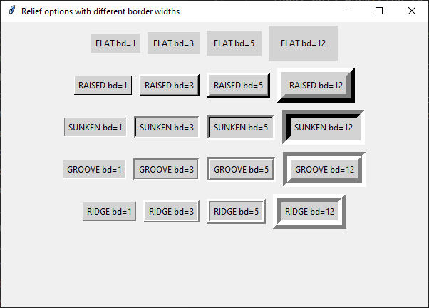

====================================================
tk Label
====================================================

| See: https://www.geeksforgeeks.org/python-tkinter-label/

----

Usage
---------------

| The `tkinter.Label` widget provides a text label.
| To create a label widget the general syntax is:

.. py:function:: label_widget  = tk.Label(parent, option=value)

    | `parent` is the window or frame object.
    | Options can be passed as parameters separated by commas.

----

Text
--------------

.. py:function:: label_widget  = tk.Label(parent, text=text_string)

    | `text_string` is text to display in the label widget.
    | e.g. label = tk.Label(window, text="label text")

Text example
~~~~~~~~~~~~~~~~~~

.. code-block:: python

    import tkinter as tk

    # Create the main window
    window = tk.Tk()
    window.geometry("300x200")  # Set window size
    window.title("Label text")  # Set window title

    # Create the label widget
    label = tk.Label(window, text="label text")

    # Pack the label into the window
    label.pack()

    # Run the main event loop
    window.mainloop()

.. image:: images/label_text.png
    :scale: 100%

----

Font
----------

.. py:function:: label_widget  = tk.Label(parent, font=(font_type, font_size, font_style))

   - font_type is a font name. e.g "Arial"
   - font_size is the size of the font.  eg. 12
   - font_style can be bold, italic, underline or a space separated combination
   - Default Value: System-dependent (usually a default font)
   - Description: Specifies the font family, size, and style for the label text.
   - Example: To use a 12-point Arial font, use `font=("Arial", 12)`.
   - Example: To use a bold 12-point Arial font, use `font=("Arial", 12, "bold")`.
   - Example: To use a bold underlines 12-point Arial font, use `font=("Arial", 12, "bold underline")`.

font example
~~~~~~~~~~~~~~~~~~

.. code-block:: python

    import tkinter as tk

    # Create the main window
    window = tk.Tk()
    window.geometry("300x200")  # Set window size
    window.title("Label font")  # Set window title

    # Create the label widget with options
    label = tk.Label(window, text="label text", font=("Arial", 24))

    # Pack the label into the window
    label.pack()

    # Run the main event loop
    window.mainloop()

.. image:: images/label_font.png
    :scale: 100%

----

Text color
---------------

.. py:function:: label_widget  = tk.Label(parent, fg=color)

   - color can be a color name, e.g blue, or a hex colour, e.g. #0000FF.
   - Default Value: System-dependent (usually black)
   - Description: Sets the foreground (text) color of the label.
   - Example: To set the text color to blue, use `fg="blue"` or `fg="#0000FF"`.

fg example
~~~~~~~~~~~~~~~~~~

.. code-block:: python

    import tkinter as tk

    # Create the main window
    window = tk.Tk()
    window.geometry("300x200")  # Set window size
    window.title("Label fg")  # Set window title

    # Create the label widget with options
    label = tk.Label(window, text="label text", font=("Arial", 24), fg="blue")

    # Pack the label into the window
    label.pack()

    # Run the main event loop
    window.mainloop()

.. image:: images/label_fg.png
    :scale: 100%

----

Background color
--------------------------

.. py:function:: label_widget  = tk.Label(parent, bg=color)

   - color can be a color name or a hex colour.
   - Default Value: System-dependent (usually white)
   - Description: Sets the background color of the label.
   - Example: To set the background color to light yellow, use `bg="lightyellow"`.

bg example
~~~~~~~~~~~~~~~~~~

.. code-block:: python

    import tkinter as tk

    # Create the main window
    window = tk.Tk()
    window.geometry("300x200")  # Set window size
    window.title("Label bg")  # Set window title

    # Create the label widget with options
    label = tk.Label(window, text="label text", font=("Arial", 24), fg="blue", bg="lightyellow")

    # Pack the label into the window
    label.pack()

    # Run the main event loop
    window.mainloop()

.. image:: images/label_bg.png
    :scale: 100%

----

Padding
-------------------

.. py:function:: label_widget  = tk.Label(parent, padx=x_integer, pady=y_integer)

   - x_integer and y_integer are integers
   - Default Value: 0
   - Description: Adds extra space (in pixels) around the label text.
   - Example: To add 12 pixels of padding on the left and right sides, use `padx=12`.
   - Example: To add 5 pixels of padding on the top and bottom, use `pady=5`.

padding example
~~~~~~~~~~~~~~~~~~

.. code-block:: python

    import tkinter as tk

    # Create the main window
    window = tk.Tk()
    window.geometry("300x200")  # Set window size
    window.title("Label padding]")  # Set window title

    # Create the label widget with options
    label = tk.Label(text="label text", font=("Arial", 24), fg="blue", bg="lightyellow",
                    padx=60, pady=20)

    # Pack the label into the window
    label.pack()

    # Run the main event loop
    window.mainloop()

.. image:: images/label_padding.png
    :scale: 100%

----

Anchor
-------------------

.. py:attribute:: anchor

    | Syntax: ``label_widget = tk.Label(parent, anchor="position")``
    | Description: Sets the position of the text within the label. Options are "nw", "n", "ne", "w", "center", "e", "sw", "s", "se".
    | Default: center
    | Example: ``label_widget = tk.Label(window, anchor="center")``

.. py:attribute:: height

    | Syntax: ``label_widget = tk.Label(parent, height=value)``
    | Description: Sets the height of the label in number of lines.
    | Default: 0
    | Example: ``label_widget = tk.Label(window, height=2)``

    .. py:attribute:: width

        | Syntax: ``label_widget = tk.Label(parent, width=value)``
        | Description: Sets the width of the label in number of characters.
        | Default: 0
        | Example: ``label_widget = tk.Label(window, width=20)``

Anchor example
~~~~~~~~~~~~~~~~~~~~~

| The label height and width need to be set larger than needed for the text to fit so that the anchor setting can move the text.

.. code-block:: python

    import tkinter as tk

    # Create the main window
    window = tk.Tk()
    window.geometry("500x200")  # Set window size
    window.title("Label anchor")  # Set window title

    # Create the label widget with options
    label = tk.Label(text="anchor nw", font=("Arial", 24), fg="blue", bg="lightyellow",
                    width=20, height=2, anchor="nw")

    # Pack the label into the window
    label.pack(pady=5)

    # Create the label widget with options
    label_2 = tk.Label(text="anchor nw padded", font=("Arial", 24), fg="purple", bg="lightgreen",
                    width=20, height=2, anchor="nw", padx=20, pady=10)

    # Pack the label into the window
    label_2.pack()

    # Run the main event loop
    window.mainloop()

.. image:: images/label_anchor.png
    :scale: 50%

.. image:: images/label_anchors.png
    :scale: 67%

----

Border
---------------

.. py:function:: label_widget  = tk.Label(parent, borderwidth=width)

   - width is an integer
   - Default Value: 0
   - Description: Specifies the border width for the label.
   - Example: To create a width of 2 pixels, use `borderwidth=2`.

.. py:function:: label_widget  = tk.Label(parent, relief=border_style)

   - border_style is one of "flat", "raised", "sunken", "solid", "ridge", "groove"
   - Default Value: "flat" (no border)
   - Description: Specifies the border style and width for the label.
   - Example: To create a solid border with a width of 1 pixels, use `relief="solid"` and `borderwidth=1`.

border example
~~~~~~~~~~~~~~~~~~~~~

.. code-block:: python

    import tkinter as tk

    # Create the main window
    window = tk.Tk()
    window.geometry("300x200")  # Set window size
    window.title("Label border")  # Set window title

    # Create the label widget with options
    label = tk.Label(text="label text", font=("Arial", 24), fg="blue", bg="lightyellow",
                    padx=60, pady=20, relief="solid", borderwidth=1)

    # Pack the label into the window
    label.pack()

    # Run the main event loop
    window.mainloop()

----

Textvariable
---------------

.. py:attribute:: textvariable

    | Syntax: ``label_widget = tk.Label(parent, textvariable=variable)``
    | Description: Associates a Tkinter variable with the label text.
    | Default: None
    | Example: ``label_widget = tk.Label(window, textvariable=my_var)``

Textvariable example
~~~~~~~~~~~~~~~~~~~~~

**Code Explanation:**

This code creates a basic GUI with a button that toggles the text of a label..

1. **Using StringVar**:
   - `text_var = tk.StringVar()`: Creates a `StringVar` instance, `text_var`, which is a special tkinter variable for holding string data.
   - `text_var.set("Initial Text")`: Sets the initial value of `text_var`.

2. **Creating the Label Widget**:
   - `label = tk.Label(root, textvariable=text_var, font=("Helvetica", 16))`: Creates a label in the `root` window. The `textvariable` parameter is linked to `text_var`, so the label text displays `text_var`'s value.
   - `label.pack(pady=20)`: Adds the label to the window with 20 pixels of vertical padding.

3. **Defining the Update Function**:
   - `def update_text()`: Defines a function, `update_text`, that checks `text_var`'s current value and toggles it between "Initial Text" and "Updated Text" by using `text_var.set()`.

4. **Creating the Button Widget**:
   - `button = tk.Button(root, text="Toggle Text", command=update_text)`: Creates a button with the label "Toggle Text" and sets `update_text` as the function that runs when clicked.
   - `button.pack(pady=20)`: Adds the button to the window with 20 pixels of vertical padding.

.. code-block:: python

    import tkinter as tk

    # Create the main window
    root = tk.Tk()
    root.geometry("300x200")
    root.title("TextVariable Example")

    # Create a StringVar to hold the text
    text_var = tk.StringVar()
    text_var.set("Initial Text")

    # Create a Label widget with textvariable
    label = tk.Label(root, textvariable=text_var, font=("Helvetica", 16))
    label.pack(pady=20)

    # Function to update the text
    def update_text():
        if text_var.get() == "Initial Text":
            text_var.set("Updated Text")
        else:
            text_var.set("Initial Text")

    # Create a Button to trigger the text update
    button = tk.Button(root, text="Toggle Text", command=update_text)
    button.pack(pady=20)

    # Run the application
    root.mainloop()

.. image:: images/label_textvariable.png
    :scale: 100%

----

Options
--------------

.. py:function:: label_widget = tk.Label(parent, option=value)

    | parent is the window or frame object.
    | Options can be passed as parameters separated by commas.

    **Parameters:**

    .. py:attribute:: activebackground

        | Syntax: ``label_widget = tk.Label(parent, activebackground="color")``
        | Description: Sets the background color when the label is active.
        | Default: SystemButtonFace
        | Example: ``label_widget = tk.Label(window, activebackground="SystemButtonFace")``

    .. py:attribute:: activeforeground

        | Syntax: ``label_widget = tk.Label(parent, activeforeground="color")``
        | Description: Sets the foreground color when the label is active.
        | Default: SystemButtonText
        | Example: ``label_widget = tk.Label(window, activeforeground="SystemButtonText")``

    .. py:attribute:: anchor

        | Syntax: ``label_widget = tk.Label(parent, anchor="position")``
        | Description: Sets the position of the text within the label.
        | Default: center
        | Example: ``label_widget = tk.Label(window, anchor="center")``

    .. py:attribute:: background
    .. py:attribute:: bg

        | Syntax: ``label_widget = tk.Label(parent, bg="color")``
        | Description: Sets the background color of the label.
        | Default: SystemButtonFace
        | Example: ``label_widget = tk.Label(window, bg="SystemButtonFace")``

    .. py:attribute:: bd
    .. py:attribute:: borderwidth

        | Syntax: ``label_widget = tk.Label(parent, bd=value)``
        | Description: Sets the border width of the label.
        | Default: 2
        | Example: ``label_widget = tk.Label(window, bd=2)``

    .. py:attribute:: bitmap

        | Syntax: ``label_widget = tk.Label(parent, bitmap="bitmap")``
        | Description: Sets a bitmap to be displayed in the label.
        | Default: None
        | Example: ``label_widget = tk.Label(window, bitmap="error")``

    .. py:attribute:: compound

        | Syntax: ``label_widget = tk.Label(parent, compound="position")``
        | Description: Specifies the relative position of the image and text.
        | Default: none
        | Example: ``label_widget = tk.Label(window, compound="left")``

    .. py:attribute:: cursor

        | Syntax: ``label_widget = tk.Label(parent, cursor="cursor_type")``
        | Description: Sets the cursor that appears when the mouse is over the label.
        | Default: None
        | Example: ``label_widget = tk.Label(window, cursor="arrow")``

    .. py:attribute:: disabledforeground

        | Syntax: ``label_widget = tk.Label(parent, disabledforeground="color")``
        | Description: Sets the foreground color of the label when it is disabled.
        | Default: SystemDisabledText
        | Example: ``label_widget = tk.Label(window, disabledforeground="SystemDisabledText")``

    .. py:attribute:: fg
    .. py:attribute:: foreground

        | Syntax: ``label_widget = tk.Label(parent, fg="color")``
        | Description: Sets the foreground color of the label.
        | Default: SystemButtonText
        | Example: ``label_widget = tk.Label(window, fg="SystemButtonText")``

    .. py:attribute:: font

        | Syntax: ``label_widget = tk.Label(parent, font="font")``
        | Description: Sets the font of the label text.
        | Default: TkDefaultFont
        | Example: ``label_widget = tk.Label(window, font="TkDefaultFont")``

    .. py:attribute:: height

        | Syntax: ``label_widget = tk.Label(parent, height=value)``
        | Description: Sets the height of the label in number of lines.
        | Default: 0
        | Example: ``label_widget = tk.Label(window, height=2)``

    .. py:attribute:: highlightbackground

        | Syntax: ``label_widget = tk.Label(parent, highlightbackground="color")``
        | Description: Sets the color of the focus highlight when the label does not have focus.
        | Default: SystemButtonFace
        | Example: ``label_widget = tk.Label(window, highlightbackground="SystemButtonFace")``

    .. py:attribute:: highlightcolor

        | Syntax: ``label_widget = tk.Label(parent, highlightcolor="color")``
        | Description: Sets the color of the focus highlight when the label has focus.
        | Default: SystemWindowFrame
        | Example: ``label_widget = tk.Label(window, highlightcolor="SystemWindowFrame")``

    .. py:attribute:: highlightthickness

        | Syntax: ``label_widget = tk.Label(parent, highlightthickness=value)``
        | Description: Sets the thickness of the focus highlight.
        | Default: 0
        | Example: ``label_widget = tk.Label(window, highlightthickness=1)``

    .. py:attribute:: image

        | Syntax: ``label_widget = tk.Label(parent, image="image")``
        | Description: Sets an image to be displayed in the label.
        | Default: None
        | Example: ``label_widget = tk.Label(window, image=my_image)``

    .. py:attribute:: justify

        | Syntax: ``label_widget = tk.Label(parent, justify="alignment")``
        | Description: Sets the justification of the text within the label.
        | Default: center
        | Example: ``label_widget = tk.Label(window, justify="center")``

    .. py:attribute:: padx

        | Syntax: ``label_widget = tk.Label(parent, padx=value)``
        | Description: Sets the horizontal padding of the label.
        | Default: 1
        | Example: ``label_widget = tk.Label(window, padx=5)``

    .. py:attribute:: pady

        | Syntax: ``label_widget = tk.Label(parent, pady=value)``
        | Description: Sets the vertical padding of the label.
        | Default: 1
        | Example: ``label_widget = tk.Label(window, pady=5)``

    .. py:attribute:: relief

        | Syntax: ``label_widget = tk.Label(parent, relief="style")``
        | Description: Sets the 3D effect of the label border.
        | Default: flat
        | Example: ``label_widget = tk.Label(window, relief="raised")``

    .. py:attribute:: state

        | Syntax: ``label_widget = tk.Label(parent, state="state")``
        | Description: Sets the state of the label (normal or disabled).
        | Default: normal
        | Example: ``label_widget = tk.Label(window, state="normal")``

    .. py:attribute:: takefocus

        | Syntax: ``label_widget = tk.Label(parent, takefocus=value)``
        | Description: Controls whether the label accepts focus.
        | Default: 0
        | Example: ``label_widget = tk.Label(window, takefocus=1)``

    .. py:attribute:: text

        | Syntax: ``label_widget = tk.Label(parent, text="text")``
        | Description: Sets the text to be displayed in the label.
        | Default: None
        | Example: ``label_widget = tk.Label(window, text="Hello, World!")``

    .. py:attribute:: textvariable

        | Syntax: ``label_widget = tk.Label(parent, textvariable=variable)``
        | Description: Associates a Tkinter variable with the label text.
        | Default: None
        | Example: ``label_widget = tk.Label(window, textvariable=my_var)``

    .. py:attribute:: underline

        | Syntax: ``label_widget = tk.Label(parent, underline=index)``
        | Description: Underlines the character at the given index.
        | Default: -1
        | Example: ``label_widget = tk.Label(window, underline=0)``

    .. py:attribute:: width

        | Syntax: ``label_widget = tk.Label(parent, width=value)``
        | Description: Sets the width of the label in number of characters.
        | Default: 0
        | Example: ``label_widget = tk.Label(window, width=20)``

    .. py:attribute:: wraplength

        | Syntax: ``label_widget = tk.Label(parent, wraplength=value)``
        | Description: Sets the maximum line length before wrapping.
        | Default: 0
        | Example: ``label_widget = tk.Label(window, wraplength=100)``
