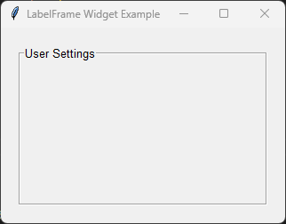

====================================================
tk LabelFrame
====================================================

| See: `<https://docs.python.org/3/library/tkinter.html#tkinter.LabelFrame>`_

----

Usage
---------------

| The `tkinter.LabelFrame` widget is a container used to group related widgets.
| It is similar to a `Frame` but displays a text label along its border, making it useful for visually grouping related controls.
| To create a LabelFrame widget the general syntax is
| (assuming import via "import tkinter as tk"):

.. py:function:: labelframe_widget = tk.LabelFrame(parent, option=value)

    | parent is the window or frame object.
    | Options can be passed as parameters separated by commas.

----

Sample LabelFrame
-----------------

| The code below creates a labelled frame that could be used to group several related widgets.
| The title appears in the upper border of the LabelFrame.

.. code-block:: python

    import tkinter as tk

    root = tk.Tk()
    root.title("LabelFrame Widget Example")
    root.geometry("320x220")

    settings = tk.LabelFrame(
        root,
        text="User Settings",
        font=("Arial", 10),
        padx=10,
        pady=10,
        bd=2,
        relief="groove"
    )

    settings.pack(padx=20, pady=20, fill="both", expand=True)

    root.mainloop()

----

When to use a LabelFrame
------------------------

A ``LabelFrame`` is useful when related widgets should be grouped together and identified with a descriptive title.

Typical uses include:

* User details
* Network settings
* Display options
* File selection controls
* Search filters
* Preferences and configuration dialogs

----

Parameter syntax
----------------------

| The main options are below.

.. note::

    The ``width`` and ``height`` options only specify the requested size.
    If the LabelFrame contains widgets, it will normally resize itself to fit them.
    To force the LabelFrame to keep its specified size, disable geometry propagation.

    .. code-block:: python

        labelframe.pack_propagate(False)
        # or
        labelframe.grid_propagate(False)

.. py:function:: labelframe_widget = tk.LabelFrame(parent, option=value)

    **Parameters:**

    .. py:attribute:: background
    .. py:attribute:: bg

        | Syntax: ``labelframe_widget = tk.LabelFrame(parent, bg="color")``
        | Description: Sets the background color of the LabelFrame.
        | Default: SystemButtonFace

    .. py:attribute:: borderwidth
    .. py:attribute:: bd

        | Syntax: ``labelframe_widget = tk.LabelFrame(parent, bd=width)``
        | Description: Sets the width of the LabelFrame border.
        | Default: ``0``

    .. py:attribute:: cursor

        | Syntax: ``labelframe_widget = tk.LabelFrame(parent, cursor="cursor_type")``
        | Description: Changes the mouse cursor when it hovers over the LabelFrame.

    .. py:attribute:: font

        | Syntax: ``labelframe_widget = tk.LabelFrame(parent, font=("Arial", 10, "bold"))``
        | Description: Sets the font used for the LabelFrame title.
        | Default: System default font.

    .. py:attribute:: foreground
    .. py:attribute:: fg

        | Syntax: ``labelframe_widget = tk.LabelFrame(parent, fg="blue")``
        | Description: Sets the color of the LabelFrame title.

    .. py:attribute:: height

        | Syntax: ``labelframe_widget = tk.LabelFrame(parent, height=height_in_pixels)``
        | Description: Sets the height of the LabelFrame in pixels.
        | Default: ``0``

    .. py:attribute:: highlightbackground

        | Syntax: ``labelframe_widget = tk.LabelFrame(parent, highlightbackground="color")``
        | Description: Sets the color of the focus highlight when the LabelFrame does not have focus.

    .. py:attribute:: highlightcolor

        | Syntax: ``labelframe_widget = tk.LabelFrame(parent, highlightcolor="color")``
        | Description: Sets the color of the focus highlight when the LabelFrame has focus.

    .. py:attribute:: highlightthickness

        | Syntax: ``labelframe_widget = tk.LabelFrame(parent, highlightthickness=thickness)``
        | Description: Sets the thickness of the focus highlight.
        | Default: ``0``

    .. py:attribute:: labelanchor

        | Syntax: ``labelframe_widget = tk.LabelFrame(parent, labelanchor="nw")``
        | Description: Specifies the position of the LabelFrame title around the border.
        | Default: ``"nw"``

        **Valid values:**

        .. list-table::
            :header-rows: 1
            :widths: 20 80

            * - Value
              - Position
            * - ``n``
              - Top centre.
            * - ``ne``
              - Top right.
            * - ``nw``
              - Top left (default).
            * - ``e``
              - Right side.
            * - ``w``
              - Left side.
            * - ``s``
              - Bottom centre.
            * - ``se``
              - Bottom right.
            * - ``sw``
              - Bottom left.

    .. py:attribute:: padx

        | Syntax: ``labelframe_widget = tk.LabelFrame(parent, padx=padding)``
        | Description: Sets the horizontal padding inside the LabelFrame.

    .. py:attribute:: pady

        | Syntax: ``labelframe_widget = tk.LabelFrame(parent, pady=padding)``
        | Description: Sets the vertical padding inside the LabelFrame.

    .. py:attribute:: relief

        | Syntax: ``labelframe_widget = tk.LabelFrame(parent, relief="relief_type")``
        | Description: Sets the border style of the LabelFrame.
        | Values include ``"flat"``, ``"raised"``, ``"sunken"``, ``"ridge"``, ``"solid"``, and ``"groove"``.
        | Default: ``"groove"``

    .. py:attribute:: takefocus

        | Syntax: ``labelframe_widget = tk.LabelFrame(parent, takefocus=True)``
        | Description: Determines whether the LabelFrame can receive keyboard focus.
        | Default: ``0``

    .. py:attribute:: text

        | Syntax: ``labelframe_widget = tk.LabelFrame(parent, text="Settings")``
        | Description: Sets the text displayed as the LabelFrame title.
        | Default: ``""``

    .. py:attribute:: width

        | Syntax: ``labelframe_widget = tk.LabelFrame(parent, width=width_in_pixels)``
        | Description: Sets the width of the LabelFrame in pixels.
        | Default: ``0``

----

Default options
-----------------------

| Code to display the default values for each LabelFrame option is shown below.

.. code-block:: python

    import tkinter as tk

    root = tk.Tk()

    labelframe = tk.LabelFrame(root)
    labelframe_options = labelframe.keys()

    for option in labelframe_options:
        print(f"{option}: {labelframe.cget(option)}")

