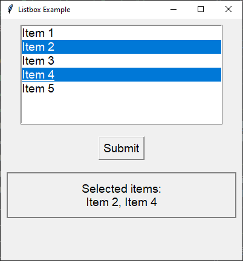

====================================================
tk Listbox
====================================================

| See: `<https://www.geeksforgeeks.org/-tkinter-listbox-widget/>`_

----

Usage
---------------

| The `tkinter.Listbox` widget provides a list from which the user can select one or more items.
| To create a listbox widget, the general syntax is (assuming import via "import tkinter as tk"):

.. py:function:: listbox_widget = tk.Listbox(parent, option=value)

    | `parent` is the window or frame object.
    | Options can be passed as parameters separated by commas.
    | e.g. listbox_widget = tk.Listbox(root, height=10, width=50)

----

Using a listbox widget
----------------------------

This code creates a simple Tkinter GUI application that allows a user to select from a list.

.. code-block::

    import tkinter as tk  # Import the tkinter module for GUI creation.

    root = tk.Tk()  # Create the main root.
    root.geometry("400x400")  # Set window size.
    root.title("Listbox Example")  # Set window title.

    def get_selection():  # Define a function to get selected items from the listbox.
        selected_indices = listbox.curselection()  # Get indices of selected items.
        selected_items = [listbox.get(i) for i in selected_indices]  # Retrieve selected items.
        output_label.config(text=f"Selected items:\n{', '.join(selected_items)}")  # Display selected items in the label.

    listbox = tk.Listbox(root, selectmode=tk.MULTIPLE, font=('calibre', 14, 'normal'), width=30, height=7)  # Create a listbox widget.
    listbox.pack(pady=10)  # Add padding to the top of the listbox.

    items = ["Item 1", "Item 2", "Item 3", "Item 4", "Item 5"]  # Define items to add to the listbox.
    for item in items:
        listbox.insert(tk.END, item)  # Insert items into the listbox.

    submit_button = tk.Button(root, text="Submit", font=('calibre', 14, 'normal'), command=get_selection)  # Create a button to trigger the get_selection function.
    submit_button.pack(pady=10)  # Add padding to the button.

    output_label = tk.Label(root, text="", font=('calibre', 14, 'normal'), width=50, height=3,
                             bd=2, highlightthickness=2 highlightbackground="gray")  # Create a label to display the output.
    output_label.pack(pady=10, padx=10)  # Add padding around the label.

    root.mainloop()  # Run the main event loop.

----

Listbox methods
---------------------

Tkinter's `Listbox` widget provides several methods to help you work with selected items. Here are some key methods:

1. **`curselection()`**: Returns a tuple of indices of the selected items.

   selected_indices = listbox.curselection()

2. **`get(index)`**: Retrieves the item at the specified index.

   item = listbox.get(index)

3. **`selection_set(first, last=None)`**: Selects items from the `first` index to the `last` index. If `last` is not specified, only the item at `first` is selected.

   listbox.selection_set(0, 2)  # Selects items from index 0 to 2

4. **`selection_clear(first, last=None)`**: Deselects items from the `first` index to the `last` index. If `last` is not specified, only the item at `first` is deselected.

   listbox.selection_clear(0, 2)  # Deselects items from index 0 to 2

5. **`selection_includes(index)`**: Returns `True` if the item at the specified index is selected.

   is_selected = listbox.selection_includes(index)

6. **`size()`**: Returns the number of items in the listbox.

   num_items = listbox.size()

7. **`activate(index)`**: Sets the active item to the specified index.

   listbox.activate(index)

8. **`see(index)`**: Scrolls the listbox to make the item at the specified index visible.

   listbox.see(index)

----

Option details
--------------------

.. py:function:: listbox_widget = tk.Listbox(parent, option=value)

    | parent is the window or frame object.
    | Options can be passed as parameters separated by commas.

    **Parameters:**

    .. py:attribute:: activestyle

        | Syntax: ``listbox_widget = tk.Listbox(parent, activestyle="underline")``
        | Description: Sets the style of the active item.
        | Default: underline
        | Example: ``listbox_widget = tk.Listbox(root, activestyle="underline")``

    .. py:attribute:: background
    .. py:attribute:: bg

        | Syntax: ``listbox_widget = tk.Listbox(parent, bg="color")``
        | Description: Sets the background color of the listbox.
        | Default: SystemWindow
        | Example: ``listbox_widget = tk.Listbox(root, bg="SystemWindow")``

    .. py:attribute:: bd
    .. py:attribute:: borderwidth

        | Syntax: ``listbox_widget = tk.Listbox(parent, bd=value)``
        | Description: Sets the border width of the listbox.
        | Default: 1
        | Example: ``listbox_widget = tk.Listbox(root, bd=1)``

    .. py:attribute:: cursor

        | Syntax: ``listbox_widget = tk.Listbox(parent, cursor="cursor_type")``
        | Description: Sets the cursor that appears when the mouse is over the listbox.
        | Default: None
        | Example: ``listbox_widget = tk.Listbox(root, cursor="arrow")``

    .. py:attribute:: disabledforeground

        | Syntax: ``listbox_widget = tk.Listbox(parent, disabledforeground="color")``
        | Description: Sets the foreground color of the listbox when it is disabled.
        | Default: SystemDisabledText
        | Example: ``listbox_widget = tk.Listbox(root, disabledforeground="SystemDisabledText")``

    .. py:attribute:: exportselection

        | Syntax: ``listbox_widget = tk.Listbox(parent, exportselection=value)``
        | Description: Controls whether the selection is exported to the clipboard.
        | Default: 1
        | Example: ``listbox_widget = tk.Listbox(root, exportselection=1)``

    .. py:attribute:: fg
    .. py:attribute:: foreground

        | Syntax: ``listbox_widget = tk.Listbox(parent, fg="color")``
        | Description: Sets the foreground color of the listbox.
        | Default: SystemButtonText
        | Example: ``listbox_widget = tk.Listbox(root, fg="SystemButtonText")``

    .. py:attribute:: font

        | Syntax: ``listbox_widget = tk.Listbox(parent, font="font")``
        | Description: Sets the font of the listbox text.
        | Default: TkDefaultFont
        | Example: ``listbox_widget = tk.Listbox(root, font="TkDefaultFont")``

    .. py:attribute:: height

        | Syntax: ``listbox_widget = tk.Listbox(parent, height=value)``
        | Description: Sets the height of the listbox in number of lines.
        | Default: 10
        | Example: ``listbox_widget = tk.Listbox(root, height=10)``

    .. py:attribute:: highlightbackground

        | Syntax: ``listbox_widget = tk.Listbox(parent, highlightbackground="color")``
        | Description: Sets the color of the focus highlight when the listbox does not have focus.
        | Default: SystemButtonFace
        | Example: ``listbox_widget = tk.Listbox(root, highlightbackground="SystemButtonFace")``

    .. py:attribute:: highlightcolor

        | Syntax: ``listbox_widget = tk.Listbox(parent, highlightcolor="color")``
        | Description: Sets the color of the focus highlight when the listbox has focus.
        | Default: SystemWindowFrame
        | Example: ``listbox_widget = tk.Listbox(root, highlightcolor="SystemWindowFrame")``

    .. py:attribute:: highlightthickness

        | Syntax: ``listbox_widget = tk.Listbox(parent, highlightthickness=value)``
        | Description: Sets the thickness of the focus highlight.
        | Default: 1
        | Example: ``listbox_widget = tk.Listbox(root, highlightthickness=1)``

    .. py:attribute:: justify

        | Syntax: ``listbox_widget = tk.Listbox(parent, justify="left")``
        | Description: Sets the justification of the text within the listbox.
        | Default: left
        | Example: ``listbox_widget = tk.Listbox(root, justify="left")``

    .. py:attribute:: relief

        | Syntax: ``listbox_widget = tk.Listbox(parent, relief="style")``
        | Description: Sets the 3D effect of the listbox border.
        | Default: sunken
        | Example: ``listbox_widget = tk.Listbox(root, relief="sunken")``

    .. py:attribute:: selectbackground

        | Syntax: ``listbox_widget = tk.Listbox(parent, selectbackground="color")``
        | Description: Sets the background color of selected items.
        | Default: SystemHighlight
        | Example: ``listbox_widget = tk.Listbox(root, selectbackground="SystemHighlight")``

    .. py:attribute:: selectborderwidth

        | Syntax: ``listbox_widget = tk.Listbox(parent, selectborderwidth=value)``
        | Description: Sets the width of the border around selected items.
        | Default: 0
        | Example: ``listbox_widget = tk.Listbox(root, selectborderwidth=0)``

    .. py:attribute:: selectforeground

        | Syntax: ``listbox_widget = tk.Listbox(parent, selectforeground="color")``
        | Description: Sets the foreground color of selected items.
        | Default: SystemHighlightText
        | Example: ``listbox_widget = tk.Listbox(root, selectforeground="SystemHighlightText")``

    .. py:attribute:: selectmode

        | Syntax: ``listbox_widget = tk.Listbox(parent, selectmode="mode")``
        | Description: Sets the selection mode of the listbox.
        | Default: browse
        | Example: ``listbox_widget = tk.Listbox(root, selectmode="browse")``

    .. py:attribute:: setgrid

        | Syntax: ``listbox_widget = tk.Listbox(parent, setgrid=value)``
        | Description: Controls whether the listbox is gridded.
        | Default: 0
        | Example: ``listbox_widget = tk.Listbox(root, setgrid=0)``

    .. py:attribute:: state

        | Syntax: ``listbox_widget = tk.Listbox(parent, state="state")``
        | Description: Sets the state of the listbox (normal or disabled).
        | Default: normal
        | Example: ``listbox_widget = tk.Listbox(root, state="normal")``

    .. py:attribute:: takefocus

        | Syntax: ``listbox_widget = tk.Listbox(parent, takefocus=value)``
        | Description: Controls whether the listbox accepts focus.
        | Default: None
        | Example: ``listbox_widget = tk.Listbox(root, takefocus=1)``

    .. py:attribute:: width

        | Syntax: ``listbox_widget = tk.Listbox(parent, width=value)``
        | Description: Sets the width of the listbox in number of characters.
        | Default: 20
        | Example: ``listbox_widget = tk.Listbox(root, width=20)``

    .. py:attribute:: xscrollcommand

        | Syntax: ``listbox_widget = tk.Listbox(parent, xscrollcommand=callback)``
        | Description: Sets the horizontal scroll command.
        | Default: None
        | Example: ``listbox_widget = tk.Listbox(root, xscrollcommand=scrollbar.set)``

    .. py:attribute:: yscrollcommand

        | Syntax: ``listbox_widget = tk.Listbox(parent, yscrollcommand=callback)``
        | Description: Sets the vertical scroll command.
        | Default: None
        | Example: ``listbox_widget = tk.Listbox(root, yscrollcommand=scrollbar.set)``

    .. py:attribute:: listvariable

        | Syntax: ``listbox_widget = tk.Listbox(parent, listvariable=variable)``
        | Description: Sets the variable associated with the listbox.
        | Default: None
        | Example: ``listbox_widget = tk.Listbox(root, listvariable=my_var)``
