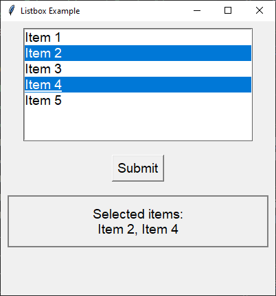

====================================================
tk Listbox
====================================================

| See: `<https://docs.python.org/3/library/tkinter.html#tkinter.Listbox>`_
| See: `<https://www.geeksforgeeks.org/-tkinter-listbox-widget/>`_

----

Usage
---------------

| The `tkinter.Listbox` widget displays a list of text items from which the user can select one or more entries.
| It is commonly used for item selection, file lists, option menus, and simple data browsing.
| To create a listbox widget, the general syntax is (assuming import via "import tkinter as tk"):

.. py:function:: listbox_widget = tk.Listbox(parent, option=value)

    | `parent` is the window or frame object.
    | Widget configuration options are supplied as keyword arguments, comma separated.
    | e.g. listbox_widget = tk.Listbox(root, height=10, width=50)

Selection modes
----------------

The ``selectmode`` option determines how users can select items in a ``Listbox``.

.. list-table::
    :header-rows: 1
    :widths: 20 80

    * - Selection mode
      - Description
    * - ``tk.BROWSE``
      - Default mode. Only one item can be selected at a time. Dragging the mouse moves the selection to the item under the pointer.
    * - ``tk.SINGLE``
      - Only one item can be selected at a time. Clicking an item selects it and deselects any previously selected item.
    * - ``tk.MULTIPLE``
      - Multiple items can be selected independently. Click each item to toggle its selection without affecting other selected items.
    * - ``tk.EXTENDED``
      - Allows multiple selections using standard keyboard and mouse combinations. Hold **Shift** to select a range of items or **Ctrl** (or **Command** on macOS) to select or deselect individual items.

----

Indices
------------------

| Listbox items are numbered from 0.

| Index       | Meaning     |
| ----------- | ----------- |
| `0`         | First item  |
| `1`         | Second item |
| `tk.END`    | Last item   |
| `tk.ACTIVE` | Active item |
| `tk.ANCHOR` | Anchor item |

----

Using a listbox widget
----------------------------

This code creates a simple Tkinter GUI application that allows a user to select from a list.

.. code-block:: python

    import tkinter as tk  # Import the tkinter module for GUI creation.

    def get_selection():  # Define a function to get selected items from the listbox.
        selected_indices = listbox.curselection()  # Get indices of selected items.
        selected_items = [listbox.get(i) for i in selected_indices]  # Retrieve selected items.
        output_label.config(text=f"Selected items:\n{', '.join(selected_items)}")  # Display selected items in the label.

    root = tk.Tk()  # Create the main root.
    root.geometry("400x400")  # Set window size.
    root.title("Listbox Example")  # Set window title.

    listbox = tk.Listbox(root, selectmode=tk.MULTIPLE, font=('calibre', 14, 'normal'), width=30, height=7)  # Create a listbox widget.
    listbox.pack(pady=10)  # Add padding to the top of the listbox.

    items = ["Item 1", "Item 2", "Item 3", "Item 4", "Item 5"]  # Define items to add to the listbox.
    for item in items:
        listbox.insert(tk.END, item)  # Insert items into the listbox.

    submit_button = tk.Button(root, text="Submit", font=('calibre', 14, 'normal'), command=get_selection)  # Create a button to trigger the get_selection function.
    submit_button.pack(pady=10)  # Add padding to the button.

    output_label = tk.Label(root, text="", font=('calibre', 14, 'normal'), width=50, height=3,
                             bd=2, highlightthickness=2, highlightbackground="gray")  # Create a label to display the output.
    output_label.pack(pady=10, padx=10)  # Add padding around the label.

    root.mainloop()  # Run the main event loop.

----

Listbox methods
---------------------

Tkinter's `Listbox` widget provides several methods for adding, removing, selecting, and retrieving items.

.. py:function:: curselection()

    | Returns a tuple containing the indices of the selected items.
    | e.g. ``selected_indices = listbox.curselection()``

.. py:function:: get(first, last=None)

    | Returns the item at the specified index. If both ``first`` and ``last`` are supplied, returns a tuple of items within the specified range.
    | e.g. ``item = listbox.get(0)``
    | e.g. ``items = listbox.get(0, tk.END)``

.. py:function:: insert(index, *elements)

    | Inserts one or more items at the specified index.
    | e.g. ``listbox.insert(tk.END, "Apple")``
    | e.g. ``listbox.insert(0, "First Item")``

.. py:function:: delete(first, last=None)

    | Removes one item or a range of items from the listbox.
    | e.g. ``listbox.delete(0)``
    | e.g. ``listbox.delete(0, tk.END)``

.. py:function:: selection_set(first, last=None)

    | Selects one item or a range of items.
    | e.g. ``listbox.selection_set(0)``
    | e.g. ``listbox.selection_set(0, 2)``

.. py:function:: selection_clear(first, last=None)

    | Clears the selection from one item or a range of items.
    | e.g. ``listbox.selection_clear(0)``
    | e.g. ``listbox.selection_clear(0, 2)``

.. py:function:: selection_includes(index)

    | Returns ``True`` if the specified item is currently selected.
    | e.g. ``is_selected = listbox.selection_includes(3)``

.. py:function:: size()

    | Returns the total number of items in the listbox.
    | e.g. ``num_items = listbox.size()``

.. py:function:: activate(index)

    | Sets the active item to the specified index.
    | e.g. ``listbox.activate(4)``

.. py:function:: see(index)

    | Scrolls the listbox so the specified item is visible.
    | e.g. ``listbox.see(tk.END)``

.. py:function:: nearest(y)

    | Returns the index of the item nearest the specified y-coordinate.
    | e.g. ``index = listbox.nearest(event.y)``

.. py:function:: bbox(index)

    | Returns the bounding box ``(x, y, width, height)`` of the specified item, or ``None`` if the item is not visible.
    | e.g. ``box = listbox.bbox(0)``

.. py:function:: index(index)

    | Returns the numerical index corresponding to the specified index expression.
    | e.g. ``last = listbox.index(tk.END)``

.. py:function:: itemconfig(index, option=value)

    | Configures the display options for an individual item.
    | e.g. ``listbox.itemconfig(0, fg="red")``
    | e.g. ``listbox.itemconfig(2, bg="yellow")``

----

----

Common tasks
----------------

**Add an item**

.. code-block:: python

    listbox.insert(tk.END, "New Item")

**Insert an item at the beginning**

.. code-block:: python

    listbox.insert(0, "First Item")

**Remove the selected items**

.. code-block:: python

    for index in reversed(listbox.curselection()):
        listbox.delete(index)

**Remove all items**

.. code-block:: python

    listbox.delete(0, tk.END)

**Select all items**

.. code-block:: python

    listbox.selection_set(0, tk.END)

**Clear the selection**

.. code-block:: python

    listbox.selection_clear(0, tk.END)

**Get the selected item (single selection)**

.. code-block:: python

    index = listbox.curselection()[0]
    item = listbox.get(index)

**Get all selected items**

.. code-block:: python

    selected_items = [listbox.get(i) for i in listbox.curselection()]

**Scroll to the last item**

.. code-block:: python

    listbox.see(tk.END)

**Determine the number of items**

.. code-block:: python

    count = listbox.size()

**Check whether an item is selected**

.. code-block:: python

    if listbox.selection_includes(3):
        print("Item 3 is selected")

----

Option details
--------------------

.. py:function:: listbox_widget = tk.Listbox(parent, option=value)

    | parent is the window or frame object.
    | Options can be passed as parameters separated by commas.

    **Parameters:**

    .. py:attribute:: activestyle

        | Syntax: ``listbox_widget = tk.Listbox(parent, activestyle="underline")``
        | Description: Sets the style of the active item.
        | Default: underline
        | Example: ``listbox_widget = tk.Listbox(root, activestyle="underline")``

    .. py:attribute:: background
    .. py:attribute:: bg

        | Syntax: ``listbox_widget = tk.Listbox(parent, bg="color")``
        | Description: Sets the background color of the listbox.
        | Default: SystemWindow
        | Example: ``listbox_widget = tk.Listbox(root, bg="SystemWindow")``

    .. py:attribute:: bd
    .. py:attribute:: borderwidth

        | Syntax: ``listbox_widget = tk.Listbox(parent, bd=value)``
        | Description: Sets the border width of the listbox.
        | Default: 1
        | Example: ``listbox_widget = tk.Listbox(root, bd=1)``

    .. py:attribute:: cursor

        | Syntax: ``listbox_widget = tk.Listbox(parent, cursor="cursor_type")``
        | Description: Sets the cursor that appears when the mouse is over the listbox.
        | Default: None
        | Example: ``listbox_widget = tk.Listbox(root, cursor="arrow")``

    .. py:attribute:: disabledforeground

        | Syntax: ``listbox_widget = tk.Listbox(parent, disabledforeground="color")``
        | Description: Sets the foreground color of the listbox when it is disabled.
        | Default: SystemDisabledText
        | Example: ``listbox_widget = tk.Listbox(root, disabledforeground="SystemDisabledText")``

    .. py:attribute:: exportselection

        | Syntax: ``listbox_widget = tk.Listbox(parent, exportselection=value)``
        | Description: Controls whether the selection is exported to the clipboard.
        | Default: 1
        | Example: ``listbox_widget = tk.Listbox(root, exportselection=1)``
        | On many platforms, exportselection=True causes the Listbox selection to be linked to the system's primary selection.
        | Setting exportselection=False keeps the selection even when another widget gains focus.

    .. py:attribute:: fg
    .. py:attribute:: foreground

        | Syntax: ``listbox_widget = tk.Listbox(parent, fg="color")``
        | Description: Sets the foreground color of the listbox.
        | Default: SystemButtonText
        | Example: ``listbox_widget = tk.Listbox(root, fg="SystemButtonText")``

    .. py:attribute:: font

        | Syntax: ``listbox_widget = tk.Listbox(parent, font="font")``
        | Description: Sets the font of the listbox text.
        | Default: TkDefaultFont
        | Example: ``listbox_widget = tk.Listbox(root, font="TkDefaultFont")``

    .. py:attribute:: height

        | Syntax: ``listbox_widget = tk.Listbox(parent, height=value)``
        | Description: Sets the height of the listbox in number of lines.
        | Default: 10
        | Example: ``listbox_widget = tk.Listbox(root, height=10)``

    .. py:attribute:: highlightbackground

        | Syntax: ``listbox_widget = tk.Listbox(parent, highlightbackground="color")``
        | Description: Sets the color of the focus highlight when the listbox does not have focus.
        | Default: SystemButtonFace
        | Example: ``listbox_widget = tk.Listbox(root, highlightbackground="SystemButtonFace")``

    .. py:attribute:: highlightcolor

        | Syntax: ``listbox_widget = tk.Listbox(parent, highlightcolor="color")``
        | Description: Sets the color of the focus highlight when the listbox has focus.
        | Default: SystemWindowFrame
        | Example: ``listbox_widget = tk.Listbox(root, highlightcolor="SystemWindowFrame")``

    .. py:attribute:: highlightthickness

        | Syntax: ``listbox_widget = tk.Listbox(parent, highlightthickness=value)``
        | Description: Sets the thickness of the focus highlight.
        | Default: 1
        | Example: ``listbox_widget = tk.Listbox(root, highlightthickness=1)``

    .. py:attribute:: justify

        | Syntax: ``listbox_widget = tk.Listbox(parent, justify="left")``
        | Description: Sets the justification of the text within the listbox.
        | Default: left
        | Example: ``listbox_widget = tk.Listbox(root, justify="left")``

    .. py:attribute:: relief

        | Syntax: ``listbox_widget = tk.Listbox(parent, relief="style")``
        | Description: Sets the 3D effect of the listbox border.
        | Default: sunken
        | Example: ``listbox_widget = tk.Listbox(root, relief="sunken")``

    .. py:attribute:: selectbackground

        | Syntax: ``listbox_widget = tk.Listbox(parent, selectbackground="color")``
        | Description: Sets the background color of selected items.
        | Default: SystemHighlight
        | Example: ``listbox_widget = tk.Listbox(root, selectbackground="SystemHighlight")``

    .. py:attribute:: selectborderwidth

        | Syntax: ``listbox_widget = tk.Listbox(parent, selectborderwidth=value)``
        | Description: Sets the width of the border around selected items.
        | Default: 0
        | Example: ``listbox_widget = tk.Listbox(root, selectborderwidth=0)``

    .. py:attribute:: selectforeground

        | Syntax: ``listbox_widget = tk.Listbox(parent, selectforeground="color")``
        | Description: Sets the foreground color of selected items.
        | Default: SystemHighlightText
        | Example: ``listbox_widget = tk.Listbox(root, selectforeground="SystemHighlightText")``

    .. py:attribute:: selectmode

        | Syntax: ``listbox_widget = tk.Listbox(parent, selectmode=tk.BROWSE)``
        | Description: Specifies how the user can select items in the listbox.
        | Default: ``tk.BROWSE``
        | Example: ``listbox_widget = tk.Listbox(root, selectmode=tk.MULTIPLE)``

        **Selection modes:**

        .. list-table::
            :header-rows: 1
            :widths: 20 80

            * - Mode
              - Description
            * - ``tk.BROWSE``
              - Default. Allows a single item to be selected. Dragging the mouse moves the selection to the item under the pointer.
            * - ``tk.SINGLE``
              - Allows only one item to be selected. Clicking an item selects it and deselects any previously selected item.
            * - ``tk.MULTIPLE``
              - Allows multiple items to be selected independently by clicking each item. Clicking an already selected item deselects it.
            * - ``tk.EXTENDED``
              - Allows multiple selections using standard keyboard and mouse combinations. Hold **Shift** to select a range of items or **Ctrl** (or **Command** on macOS) to select or deselect individual items.

    .. py:attribute:: setgrid

        | Syntax: ``listbox_widget = tk.Listbox(parent, setgrid=value)``
        | Description: Controls whether the listbox is gridded.
        | Default: 0
        | Example: ``listbox_widget = tk.Listbox(root, setgrid=0)``

    .. py:attribute:: state

        | Syntax: ``listbox_widget = tk.Listbox(parent, state="state")``
        | Description: Sets the state of the listbox (normal or disabled).
        | Default: normal
        | Example: ``listbox_widget = tk.Listbox(root, state="normal")``

    .. py:attribute:: takefocus

        | Syntax: ``listbox_widget = tk.Listbox(parent, takefocus=value)``
        | Description: Controls whether the listbox accepts focus.
        | Default: None
        | Example: ``listbox_widget = tk.Listbox(root, takefocus=1)``

    .. py:attribute:: width

        | Syntax: ``listbox_widget = tk.Listbox(parent, width=value)``
        | Description: Sets the width of the listbox in number of characters.
        | Default: 20
        | Example: ``listbox_widget = tk.Listbox(root, width=20)``

    .. py:attribute:: xscrollcommand

        | Syntax: ``listbox_widget = tk.Listbox(parent, xscrollcommand=callback)``
        | Description: Sets the horizontal scroll command.
        | Default: None
        | Example: ``listbox_widget = tk.Listbox(root, xscrollcommand=scrollbar.set)``

    .. py:attribute:: yscrollcommand

        | Syntax: ``listbox_widget = tk.Listbox(parent, yscrollcommand=callback)``
        | Description: Sets the vertical scroll command.
        | Default: None
        | Example: ``listbox_widget = tk.Listbox(root, yscrollcommand=scrollbar.set)``

    .. py:attribute:: listvariable

        | Syntax: ``listbox_widget = tk.Listbox(parent, listvariable=variable)``
        | Description: Sets the variable associated with the listbox.
        | Default: None
        | Example: ``listbox_widget = tk.Listbox(root, listvariable=my_var)``
        | e.g. items = tk.StringVar(value=("Red", "Green", "Blue"))
        | e.g. listbox = tk.Listbox(root, listvariable=items)

----

Default options
------------------------

| Code to display the default value for each ``Listbox`` option is shown below.

.. code-block:: python

    import tkinter as tk

    root = tk.Tk()

    widget = tk.Listbox(root)
    widget_options = widget.keys()

    for option in widget_options:
        print(f"{option}: {widget.cget(option)}")  # cget retrieves the current value of the option

