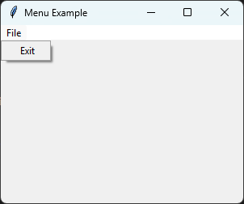

====================================================
tk Menu
====================================================

| See: `<https://docs.python.org/3/library/tkinter.html#tkinter.Menu>`_
| See: `<https://www.geeksforgeeks.org/python-menu-widget-in-tkinter/>`_

----

====================================================
tk Menu
====================================================

| See: `<https://docs.python.org/3/library/tkinter.html#tkinter.Menu>`_
| See: `<https://www.geeksforgeeks.org/python-menu-widget-in-tkinter/>`_

----

Overview
------------

| The ``tk.Menu`` widget creates menus in a Tkinter application.
| It can be used to create:

    | * a menu bar attached to the main application window,
    | * pull-down submenus,
    | * shortcut (context) menus that appear when the user right-clicks.

| To create a menu widget, the general syntax is
| (assuming import via "import tkinter as tk"):

.. py:function:: menu_widget = tk.Menu(parent, option=value)

    | * ``parent`` is the parent window or another ``Menu`` widget.
    | * ``option=value`` specifies one or more configuration options.

| Menus are normally attached to a ``tk.Tk`` window using  ``root.config(menu=menubar)`

| Submenus are attached to another ``Menu`` using ``add_cascade()``.

---

Sample Menu
----------------------

| The code below creates a simple file menu with an "Exit" command.

.. code-block:: python

    import tkinter as tk

    root = tk.Tk()
    root.title("Menu Example")
    root.geometry("300x200")

    # 1. Create the main Menu bar
    menubar = tk.Menu(root)
    root.config(menu=menubar)

    # 2. Create a "File" submenu
    file_menu = tk.Menu(menubar, tearoff=0)
    menubar.add_cascade(label="File", menu=file_menu)

    # 3. Add commands to the "File" submenu
    file_menu.add_command(label="Exit", command=root.destroy)

    root.mainloop()

----

.. admonition:: Tasks

    #. Modify the code to create the menu shown below.

        * Add a **File** menu to the menu bar.
        * Add the menu commands **New**, **Open**, and **Exit**.
        * Insert a separator between **Open** and **Exit**.
        * Disable the tear-off feature.

        .. image:: images/tk_menu_question.png
            :scale: 70

    .. dropdown::
        :icon: codescan
        :color: primary
        :class-container: sd-dropdown-container

        .. tab-set::

            .. tab-item:: Q1

                Modify the code so it creates the menu shown above.

                .. code-block:: python

                    import tkinter as tk

                    root = tk.Tk()
                    root.title("Menu Question")
                    root.geometry("300x200")

                    # Create the menu bar
                    menubar = tk.Menu(root)
                    root.config(menu=menubar)

                    # Create the File menu
                    file_menu = tk.Menu(menubar, tearoff=0)

                    # Add the File menu to the menu bar
                    menubar.add_cascade(label="File", menu=file_menu)

                    # Add menu commands
                    file_menu.add_command(label="New")
                    file_menu.add_command(label="Open")
                    file_menu.add_separator()
                    file_menu.add_command(label="Exit", command=root.destroy)

                    root.mainloop()

----

Common Menu Methods
---------------------------

.. py:function:: menu_widget.add_command(label=text, command=function)

    | Adds a command item to the menu.

.. py:function:: menu_widget.add_checkbutton(label=text, variable=tk_var)

    | Adds a checkbutton menu item.

.. py:function:: menu_widget.add_radiobutton(label=text, variable=tk_var, value=value)

    | Adds a radio button menu item.

.. py:function:: menu_widget.add_separator()

    | Adds a horizontal separator.

.. py:function:: menu_widget.add_cascade(label=text, menu=submenu)

    | Attaches a submenu to the menu.

.. py:function:: menu_widget.post(x, y)

    | Displays the menu as a popup at the specified screen coordinates.

.. py:function:: menu_widget.entryconfig(index, option=value)

    | Changes the configuration of an existing menu item.

.. py:function:: menu_widget.delete(index1, index2=None)

    | Removes one or more menu items.

---

Parameter syntax
----------------------------

.. py:function:: menu_widget = tk.Menu(parent, option=value)

    **Parameters:**

    .. py:attribute:: activebackground

        | Syntax: ``menu_widget.config(activebackground="color")``
        | Description: Background color of the item when active or hovered.
        | Default: SystemHighlight

    .. py:attribute:: activeforeground

        | Syntax: ``menu_widget.config(activeforeground="color")``
        | Description: Text color of the item when active or hovered.
        | Default: SystemHighlightText

    .. py:attribute:: background or bg

        | Syntax: ``menu_widget.config(bg="color")``
        | Description: Background color of the menu.

    .. py:attribute:: font

        | Syntax: ``menu_widget.config(font=("FontName", size, style))``
        | Description: Font of the menu items.

    .. py:attribute:: fg or foreground

        | Syntax: ``menu_widget.config(fg="color")``
        | Description: Text color of the menu items.

    .. py:attribute:: tearoff

        | Syntax: ``menu_widget.config(tearoff=boolean)``
        | Description: Whether the menu can be "torn off" into a separate window.
        | Default: 1

.. note::

    ``tearoff=0`` disables the dashed line that allows a menu to be
    detached into its own window. Most modern applications set this
    option to ``0``.

----

Default options
------------------------

| Code to get the defaults for each menu option is below.

.. code-block:: python

    import tkinter as tk

    root = tk.Tk()
    menu = tk.Menu(root)

    for option in menu.keys():
        print(f"{option}: {menu.cget(option)}")

    root.mainloop()

