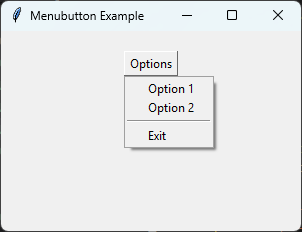

==============================
tk Menubutton
==============================

| See: `<https://docs.python.org/3/library/tkinter.html#tkinter.Menubutton>`_
| See: `<https://www.geeksforgeeks.org/python-tkinter-menubutton-widget/>`_

----

Overview
------------

| The ``tk.Menubutton`` widget creates a button that displays a menu when clicked.
| It is useful for creating drop-down buttons, toolbar menus, and option selectors.
| Unlike ``tk.Menu``, a ``Menubutton`` is a visible widget placed inside a window.

| To create a Menubutton widget, the general syntax is
| (assuming import via "import tkinter as tk"):

.. py:function:: menubutton_widget = tk.Menubutton(parent, option=value)

    | * ``parent`` is the window or frame object.
    | * ``option=value`` specifies one or more configuration options.

| A menu is attached to a Menubutton using ``menu=menu_widget``.

.. py:function:: menu_widget = tk.Menu(parent, option=value)

    | * ``parent`` is the menubutton widget.
    | * ``option=value`` specifies one or more configuration options.

----

Sample Menubutton
----------------------

| The code below creates a Menubutton with a drop-down menu.

.. code-block:: python

    import tkinter as tk

    root = tk.Tk()
    root.title("Menubutton Example")
    root.geometry("300x200")

    menubutton = tk.Menubutton(
        root,
        text="Options",
        relief="raised"
    )

    # Create the menu owned by the Menubutton
    menu = tk.Menu(menubutton, tearoff=0)

    menu.add_command(label="Option 1")
    menu.add_command(label="Option 2")
    menu.add_separator()
    menu.add_command(label="Exit", command=root.destroy)

    # Attach the menu
    menubutton.config(menu=menu)

    menubutton.pack(padx=20, pady=20)

    root.mainloop()

----

.. admonition:: Tasks

    #. Modify the code to create the Menubutton shown below.

        * Create a Menubutton labelled **Colours**.
        * Add menu options **Red**, **Green**, and **Blue**.
        * Add a separator before the final option.
        * Add an **Exit** command that closes the window.
        * Colour the **Red**, **Green**, and **Blue** options red, green, and blue respectively using the `entryconfig` method.

        .. image:: images/menubutton_question.png
            :scale: 100

    .. dropdown::
        :icon: codescan
        :color: primary
        :class-container: sd-dropdown-container

        .. tab-set::

            .. tab-item:: Q1

                Modify the code so it creates the Menubutton shown above.

                .. code-block:: python

                    import tkinter as tk

                    root = tk.Tk()
                    root.title("Coloured Menubutton Example")
                    root.geometry("300x200")

                    # Create the Menubutton
                    menubutton = tk.Menubutton(
                        root,
                        text="Colours",
                        relief="raised"
                    )

                    # Create the menu
                    colour_menu = tk.Menu(menubutton, tearoff=0)

                    colour_menu.add_command(label="Red")
                    colour_menu.add_command(label="Green")
                    colour_menu.add_command(label="Blue")
                    colour_menu.add_separator()
                    colour_menu.add_command(label="Exit", command=root.destroy)

                    # Colour individual menu entries
                    colour_menu.entryconfig("Red", foreground="red")
                    colour_menu.entryconfig("Green", foreground="green")
                    colour_menu.entryconfig("Blue", foreground="blue")

                    menubutton.config(menu=colour_menu)

                    menubutton.pack(padx=20, pady=20)

                    root.mainloop()

----

Common Menubutton Methods
---------------------------

Menubutton methods
----------------------------------------------------

| ``Menubutton`` inherits many methods from the standard Tk widget class.
| The drop-down menu behaviour is controlled by the attached ``Menu`` widget.
| Menu entry methods are called on the associated ``Menu`` object, not the ``Menubutton`` itself.

.. py:function:: menubutton_widget.config(option=value)

    | Changes one or more ``Menubutton`` configuration options.
    | Common options include ``text``, ``font``, ``bg``, ``fg``, ``relief``, ``direction`` and ``menu``.
    | Example: ``menubutton_widget.config(text="Options")``

.. py:function:: menubutton_widget.configure(option=value)

    | Updates one or more ``Menubutton`` configuration options.
    | This is an alternative name for ``config()``.
    | Example: ``menubutton_widget.configure(bg="lightblue")``

.. py:function:: value = menubutton_widget.cget(option)

    | Returns the current value of a ``Menubutton`` configuration option.
    | Example: ``colour = menubutton_widget.cget("text")``

.. py:function:: menubutton_widget.flash()

    | Flashes the ``Menubutton`` several times.
    | Useful for drawing attention to the widget.
    | The visual effect depends on the current widget style and theme.

.. py:function:: result = menubutton_widget.invoke()

    | Activates the ``Menubutton`` as if it had been clicked.
    | Opens the associated menu.
    | Returns the result of the associated command, if one exists.

.. py:function:: menu_widget.entryconfig(index, option=value)

    | Changes the configuration of an existing menu entry.
    | This method is called on the attached ``Menu`` object.
    | ``index`` can be a menu position number or the entry label.
    |
    | Example:
    |
    | ``colour_menu.entryconfig("Red", foreground="red")``
    |
    | Common options include:
    |
    | - ``foreground`` or ``fg``: changes the text colour.
    | - ``background`` or ``bg``: changes the menu item background colour.
    | - ``font``: changes the menu item font.
    | - ``state``: enables or disables the menu item.
    | - ``label``: changes the displayed text.

.. py:function:: menu_widget.entryconfigure(index, option=value)

    | Alternative name for ``entryconfig()``.
    | Updates the configuration of an existing menu entry.
    |
    | Example:
    |
    | ``colour_menu.entryconfigure("Blue", state="disabled")``

.. py:function:: menu_widget.add_command(label=text, command=function)

    | Adds a normal command item to the menu.
    |
    | Example:
    |
    | ``colour_menu.add_command(label="Red")``

.. py:function:: menu_widget.add_separator()

    | Adds a horizontal separator line between menu entries.
    |
    | Example:
    |
    | ``colour_menu.add_separator()``

.. py:function:: menu_widget.add_checkbutton(label=text, variable=tk_var)

    | Adds a checkbutton item to the menu.
    | The item stores an on/off state using a Tkinter control variable.
    |
    | Example:
    |
    | ``colour_menu.add_checkbutton(label="Show Grid", variable=show_grid)``

.. py:function:: menu_widget.add_radiobutton(label=text, variable=tk_var, value=value)

    | Adds a radio button item to the menu.
    | Radio menu items normally share the same control variable.
    |
    | Example:
    |
    | ``colour_menu.add_radiobutton(label="Red", variable=colour, value="red")``

.. py:function:: menu_widget.add_cascade(label=text, menu=submenu)

    | Adds a submenu to the menu.
    | Used to create nested menus.
    |
    | Example:
    |
    | ``main_menu.add_cascade(label="File", menu=file_menu)``

.. py:function:: menu_widget.delete(index1, index2=None)

    | Removes one or more menu entries.
    |
    | Example:
    |
    | ``colour_menu.delete(0)``

.. py:function:: menu_widget.entrycget(index, option)

    | Returns the current value of an option for a specific menu entry.
    |
    | Example:
    |
    | ``colour = colour_menu.entrycget("Red", "foreground")``

.. py:function:: menu_widget.index(index)

    | Returns the numerical position of a menu entry.
    |
    | Example:
    |
    | ``position = colour_menu.index("Blue")``

.. py:function:: menu_widget.post(x, y)

    | Displays the menu at a specific screen position.
    | Commonly used to create custom popup menus.
    |
    | Example:
    |
    | ``colour_menu.post(100, 100)``

.. py:function:: menu_widget.unpost()

    | Removes a posted menu from the screen.
    | Used after menus displayed manually with ``post()``.

----

Parameter syntax
----------------------------

.. py:function:: menubutton_widget = tk.Menubutton(parent, option=value)

    **Parameters:**

    .. py:attribute:: activebackground

        | Syntax: ``menubutton_widget.config(activebackground="color")``
        | Description: Background colour when the mouse is over the button.
        | Default: SystemButtonFace

    .. py:attribute:: activeforeground

        | Syntax: ``menubutton_widget.config(activeforeground="color")``
        | Description: Text colour when the mouse is over the button.
        | Default: SystemButtonText

    .. py:attribute:: anchor

        | Syntax: ``menubutton_widget.config(anchor="position")``
        | Description: Controls where the text is positioned inside the widget.
        | Default: center

    .. py:attribute:: background
    .. py:attribute:: bg

        | Syntax: ``menubutton_widget.config(bg="color")``
        | Description: Sets the background colour.
        | Default: SystemButtonFace

    .. py:attribute:: bd
    .. py:attribute:: borderwidth

        | Syntax: ``menubutton_widget.config(borderwidth=value)``
        | Description: Sets the border width.
        | Default: 2

    .. py:attribute:: compound

        | Syntax: ``menubutton_widget.config(compound="position")``
        | Description: Controls the position of text relative to an image.
        | Default: none

    .. py:attribute:: cursor

        | Syntax: ``menubutton_widget.config(cursor="cursor_type")``
        | Description: Sets the mouse cursor.
        | Example: ``cursor="hand2"``

    .. py:attribute:: direction

        | Syntax: ``menubutton_widget.config(direction="direction")``
        | Description: Controls where the menu appears relative to the button.
        | Possible values: ``above``, ``below``, ``left``, ``right``

    .. py:attribute:: font

        | Syntax: ``menubutton_widget.config(font=("Font", size))``
        | Description: Sets the font used for the button text.

    .. py:attribute:: foreground
    .. py:attribute:: fg

        | Syntax: ``menubutton_widget.config(fg="color")``
        | Description: Sets the text colour.

    .. py:attribute:: height

        | Syntax: ``menubutton_widget.config(height=value)``
        | Description: Sets the height of the widget.

    .. py:attribute:: image

        | Syntax: ``menubutton_widget.config(image=image_object)``
        | Description: Displays an image on the button.

    .. py:attribute:: indicatoron

        | Syntax: ``menubutton_widget.config(indicatoron=boolean)``
        | Description: Displays a small indicator arrow when enabled.
        | Default: 1

    .. py:attribute:: justify

        | Syntax: ``menubutton_widget.config(justify="alignment")``
        | Description: Controls multi-line text alignment.

    .. py:attribute:: menu

        | Syntax: ``menubutton_widget.config(menu=menu_widget)``
        | Description: Attaches a Menu widget to the Menubutton.

    .. py:attribute:: padx

        | Syntax: ``menubutton_widget.config(padx=value)``
        | Description: Sets horizontal internal padding.

    .. py:attribute:: pady

        | Syntax: ``menubutton_widget.config(pady=value)``
        | Description: Sets vertical internal padding.

    .. py:attribute:: relief

        | Syntax: ``menubutton_widget.config(relief="style")``
        | Description: Sets the border style.
        | Default: raised

    .. py:attribute:: state

        | Syntax: ``menubutton_widget.config(state="state")``
        | Description: Sets the widget state.
        | Values: ``normal`` or ``disabled``

    .. py:attribute:: text

        | Syntax: ``menubutton_widget.config(text="label")``
        | Description: Sets the displayed text.

    .. py:attribute:: textvariable

        | Syntax: ``menubutton_widget.config(textvariable=variable)``
        | Description: Associates a Tkinter variable with the button text.

    .. py:attribute:: underline

        | Syntax: ``menubutton_widget.config(underline=index)``
        | Description: Underlines the specified character in the text.

    .. py:attribute:: width

        | Syntax: ``menubutton_widget.config(width=value)``
        | Description: Sets the width of the widget.

----

Default options
------------------------

| Code to display the default values for each ``Menubutton`` option is shown below.

.. code-block:: python

    import tkinter as tk

    root = tk.Tk()

    widget = tk.Menubutton(root)

    for option in widget.keys():
        print(f"{option}: {widget.cget(option)}")
