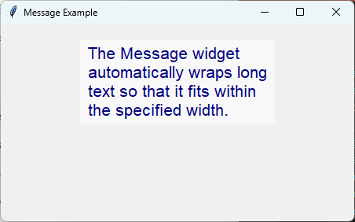

====================================================
tk Message
====================================================

| See: `<https://docs.python.org/3/library/tkinter.html#tkinter.Message>`_
| See: `<https://www.geeksforgeeks.org/python-message-widget-in-tkinter/>`_

----

Usage
---------------

| The ``tkinter.Message`` widget displays multiple lines of read-only text.
| Unlike a ``Label``, a ``Message`` widget automatically wraps its text to fit within a specified width.
| It is suitable for displaying paragraphs or longer instructions.
| To create a Message widget, the general syntax is (assuming import via ``import tkinter as tk``):

.. py:function:: message_widget = tk.Message(parent, option=value)

    | ``parent`` is the window or frame object.
    | Options can be passed as parameters separated by commas.
    | The text is automatically wrapped according to the ``width`` option.

----

Message example
----------------------------------------------------

| The example below displays a paragraph of wrapped text.

.. code-block:: python

    import tkinter as tk

    # Create the main window
    root = tk.Tk()
    root.title("Message Example")
    root.geometry("450x250")

    # Create the Message widget
    message = tk.Message(
        root,
        text="The Message widget automatically wraps long text so that it fits within the specified width.",
        width=250,
        font=("Arial", 16),
        bg="#f8f8f8",
        fg="navy"
    )

    message.pack(padx=20, pady=20)

    # Run the main event loop
    root.mainloop()

----

.. admonition:: Tasks

    #. Create a Tkinter application with a window size of **450x250** containing a ``Message`` widget. Use the **Comic Sans MS** font at size **18**, a background colour of **#fff8dc**, a foreground colour of **darkgreen**, a width of **220** pixels, and display the widget using 20 pixels of padding on each side.

        .. image:: images/message_question.png
            :scale: 67

    .. dropdown::
        :icon: codescan
        :color: primary
        :class-container: sd-dropdown-container

        .. tab-set::

            .. tab-item:: Q1

                Create the Message widget shown above.

                .. code-block:: python

                    import tkinter as tk

                    # Create the main window
                    root = tk.Tk()
                    root.title("Message Question")
                    root.geometry("450x250")

                    message = tk.Message(
                        root,
                        text="The Message widget automatically wraps long text so that it fits inside the widget.",
                        font=("Comic Sans MS", 18),
                        bg="#fff8dc",
                        fg="darkgreen",
                        width=220
                    )

                    message.pack(padx=20, pady=20)

                    root.mainloop()

----

Message methods
----------------------------------------------------

| ``Message`` inherits most of its methods from the base ``Widget`` class.
| It does not provide additional widget-specific methods.
| Common methods include:

.. py:function:: message_widget.config(option=value)

    | Changes one or more configuration options.

.. py:function:: message_widget.cget(option)

    | Returns the current value of the specified option.

.. py:function:: message_widget.destroy()

    | Removes the widget from the window.

----

Option details
--------------------

.. py:function:: message_widget = tk.Message(parent, option=value)

    | ``parent`` is the window or frame object.
    | Options can be passed as parameters separated by commas.

    **Parameters:**

    .. py:attribute:: anchor

        | Syntax: ``message_widget = tk.Message(parent, anchor="position")``
        | Description: Specifies where the text is positioned within the widget.
        | Default: ``center``

    .. py:attribute:: aspect

        | Syntax: ``message_widget = tk.Message(parent, aspect=value)``
        | Description: Specifies the desired aspect ratio (width to height) of the text layout.
        | Default: ``150``

    .. py:attribute:: background
    .. py:attribute:: bg

        | Syntax: ``message_widget = tk.Message(parent, bg="color")``
        | Description: Sets the background colour.
        | Default: SystemButtonFace

    .. py:attribute:: bd
    .. py:attribute:: borderwidth

        | Syntax: ``message_widget = tk.Message(parent, borderwidth=value)``
        | Description: Sets the width of the border.
        | Default: ``2``

    .. py:attribute:: cursor

        | Syntax: ``message_widget = tk.Message(parent, cursor="cursor_type")``
        | Description: Sets the mouse cursor when it is over the widget.

    .. py:attribute:: font

        | Syntax: ``message_widget = tk.Message(parent, font=("font_name", size, style))``
        | Description: Sets the font used to display the text.

    .. py:attribute:: foreground
    .. py:attribute:: fg

        | Syntax: ``message_widget = tk.Message(parent, fg="color")``
        | Description: Sets the text colour.

    .. py:attribute:: justify

        | Syntax: ``message_widget = tk.Message(parent, justify="alignment")``
        | Description: Specifies the alignment of multiple lines of text.
        | Possible values include ``left``, ``center`` and ``right``.

    .. py:attribute:: padx

        | Syntax: ``message_widget = tk.Message(parent, padx=value)``
        | Description: Sets the internal horizontal padding.

    .. py:attribute:: pady

        | Syntax: ``message_widget = tk.Message(parent, pady=value)``
        | Description: Sets the internal vertical padding.

    .. py:attribute:: relief

        | Syntax: ``message_widget = tk.Message(parent, relief="style")``
        | Description: Sets the border style.
        | Default: ``flat``

    .. py:attribute:: takefocus

        | Syntax: ``message_widget = tk.Message(parent, takefocus=boolean)``
        | Description: Determines whether the widget can receive keyboard focus.

    .. py:attribute:: text

        | Syntax: ``message_widget = tk.Message(parent, text="message")``
        | Description: Specifies the text displayed by the widget.

    .. py:attribute:: textvariable

        | Syntax: ``message_widget = tk.Message(parent, textvariable=variable)``
        | Description: Associates the displayed text with a Tkinter control variable.

    .. py:attribute:: width

        | Syntax: ``message_widget = tk.Message(parent, width=pixels)``
        | Description: Specifies the width of the widget in pixels.
        | The text is automatically wrapped to fit within this width.

----

Default options
------------------------

| Code to display the default value for each ``Message`` option is shown below.

.. code-block:: python

    import tkinter as tk

    root = tk.Tk()

    widget = tk.Message(root)
    widget_options = widget.keys()

    for option in widget_options:
        print(f"{option}: {widget.cget(option)}")  # cget retrieves the current value of the option

