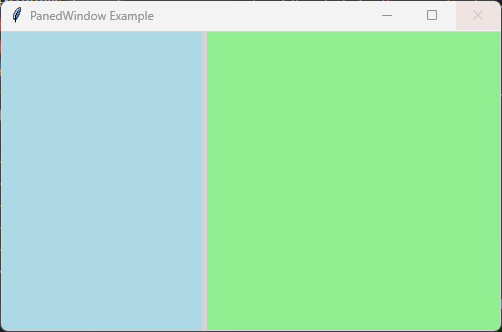

====================================================
tk PanedWindow
====================================================

| See: `<https://docs.python.org/3/library/tkinter.html#tkinter.PanedWindow>`_

----

Usage
---------------

| The `tkinter.PanedWindow` widget is a container that allows the user to resize child widgets by dragging a separator (sash).
| It is useful for creating layouts where the user controls the relative size of sections of the window.
| Paned windows can be arranged horizontally or vertically.
| To create a paned window the general syntax is
| (assuming import via "import tkinter as tk"):

.. py:function:: panedwindow_widget = tk.PanedWindow(parent, option=value)

    | parent is the window or frame object.
    | Options can be passed as parameters separated by commas.

| Child widgets are added to a ``PanedWindow`` using the ``add()`` method.

----

Sample PanedWindow
----------------------------

| The code below creates a horizontal ``PanedWindow`` containing two frames.
| The user can drag the divider between the frames to resize them.

.. code-block:: python

    import tkinter as tk

    root = tk.Tk()
    root.title("PanedWindow Example")
    root.geometry("500x300")

    # Create the PanedWindow
    paned = tk.PanedWindow(
        root,
        orient="horizontal",
        sashwidth=5,
        bg="lightgray"
    )

    paned.pack(fill="both", expand=True)

    # Create child frames
    left_frame = tk.Frame(
        paned,
        bg="lightblue",
        width=200,
        height=200
    )

    right_frame = tk.Frame(
        paned,
        bg="lightgreen",
        width=200,
        height=200
    )

    # Add frames to the PanedWindow
    paned.add(left_frame)
    paned.add(right_frame)

    root.mainloop()

----

.. admonition:: Tasks

    #. Modify the code so that it creates a vertical ``PanedWindow`` containing three frames.

        * Arrange the frames from top to bottom.
        * Set the top frame background to light blue.
        * Set the middle frame background to light yellow.
        * Set the bottom frame background to light green.
        * Add all three frames to the ``PanedWindow``.
        * Set the minimum size of each pane to 50 pixels.

        .. image:: images/panedwindow_question.png
            :scale: 100

    .. dropdown::
        :icon: codescan
        :color: primary
        :class-container: sd-dropdown-container

        .. tab-set::

            .. tab-item:: Q1

                Modify the code so that it creates a vertical ``PanedWindow`` containing three resizable frames.

                .. code-block:: python

                    import tkinter as tk

                    # Create the main window
                    root = tk.Tk()
                    root.title("PanedWindow Question")
                    root.geometry("300x310")

                    # Create the PanedWindow
                    paned = tk.PanedWindow(
                        root,
                        orient="vertical",
                        sashwidth=5
                    )

                    paned.pack(fill="both", expand=True)

                    # Create three frames
                    top_frame = tk.Frame(
                        paned,
                        bg="light blue",
                        width=300,
                        height=100
                    )

                    middle_frame = tk.Frame(
                        paned,
                        bg="light yellow",
                        width=300,
                        height=100
                    )

                    bottom_frame = tk.Frame(
                        paned,
                        bg="light green",
                        width=300,
                        height=100
                    )

                    # Add frames to the PanedWindow
                    paned.add(top_frame, minsize=50)
                    paned.add(middle_frame, minsize=50)
                    paned.add(bottom_frame, minsize=50)

                    # Run the main event loop
                    root.mainloop()

----

Methods
----------------------

.. py:function:: panedwindow_widget.add(child_widget, option=value)

    | Adds a child widget to the PanedWindow.
    | The child widget becomes one of the resizable sections.
    |
    | Example:
    |
    | ``paned.add(frame1)``

.. py:function:: panedwindow_widget.remove(child_widget)

    | Removes a child widget from the PanedWindow.
    |
    | Example:
    |
    | ``paned.remove(frame1)``

.. py:function:: panedwindow_widget.forget(child_widget)

    | Removes a child widget from the PanedWindow.
    | The widget is removed but not destroyed.
    |
    | Example:
    |
    | ``paned.forget(frame1)``

.. py:function:: panedwindow_widget.paneconfig(child_widget, option=value)

    | Changes the configuration options for a child widget inside the PanedWindow.
    |
    | Example:
    |
    | ``paned.paneconfig(frame1, minsize=100)``

.. py:function:: panedwindow_widget.paneconfigure(child_widget, option=value)

    | Alternative name for ``paneconfig()``.
    | Updates options for a specific child pane.

.. py:function:: panedwindow_widget.panes()

    | Returns a tuple containing the widgets managed by the PanedWindow.
    |
    | Example:
    |
    | ``print(paned.panes())``

.. py:function:: panedwindow_widget.sash_coord(index)

    | Returns the current x and y coordinates of a sash.
    |
    | Example:
    |
    | ``x, y = paned.sash_coord(0)``

.. py:function:: panedwindow_widget.sash_place(index, x, y)

    | Moves a sash to a specified position.
    |
    | Example:
    |
    | ``paned.sash_place(0, 150, 0)``

----

Parameter syntax
----------------------

| The main options are below.

.. py:function:: panedwindow_widget = tk.PanedWindow(parent, option=value)

    **Parameters:**

    .. py:attribute:: background
    .. py:attribute:: bg

        | Syntax: ``panedwindow_widget = tk.PanedWindow(parent, bg="color")``
        | Description: Sets the background colour of the PanedWindow.
        | Default: SystemButtonFace

    .. py:attribute:: borderwidth
    .. py:attribute:: bd

        | Syntax: ``panedwindow_widget = tk.PanedWindow(parent, bd=width)``
        | Description: Sets the width of the border around the PanedWindow.
        | Default: ``2``

    .. py:attribute:: cursor

        | Syntax: ``panedwindow_widget = tk.PanedWindow(parent, cursor="cursor_type")``
        | Description: Sets the mouse cursor when hovering over the PanedWindow.

    .. py:attribute:: handlepad

        | Syntax: ``panedwindow_widget = tk.PanedWindow(parent, handlepad=value)``
        | Description: Sets the distance between the sash and the resize handle.
        | Default: ``8``

    .. py:attribute:: handlesize

        | Syntax: ``panedwindow_widget = tk.PanedWindow(parent, handlesize=value)``
        | Description: Sets the size of the sash resize handle.
        | Default: ``8``

    .. py:attribute:: orient

        | Syntax: ``panedwindow_widget = tk.PanedWindow(parent, orient="orientation")``
        | Description: Sets the direction of the panes.
        | Values:
        |
        | - ``"horizontal"``: panes arranged left to right.
        | - ``"vertical"``: panes arranged top to bottom.
        |
        | Default: ``horizontal``

    .. py:attribute:: relief

        | Syntax: ``panedwindow_widget = tk.PanedWindow(parent, relief="style")``
        | Description: Sets the border style.
        | Values include ``flat``, ``raised``, ``sunken``, ``ridge``, ``solid`` and ``groove``.
        | Default: ``raised``

    .. py:attribute:: sashcursor

        | Syntax: ``panedwindow_widget = tk.PanedWindow(parent, sashcursor="cursor_type")``
        | Description: Sets the cursor displayed over the sash.
        | Example:
        |
        | ``sashcursor="sb_h_double_arrow"``

    .. py:attribute:: sashpad

        | Syntax: ``panedwindow_widget = tk.PanedWindow(parent, sashpad=value)``
        | Description: Sets padding around the sash.
        | Default: ``0``

    .. py:attribute:: sashrelief

        | Syntax: ``panedwindow_widget = tk.PanedWindow(parent, sashrelief="style")``
        | Description: Sets the relief style of the sash.
        | Default: ``flat``

    .. py:attribute:: sashwidth

        | Syntax: ``panedwindow_widget = tk.PanedWindow(parent, sashwidth=value)``
        | Description: Sets the width of the sash divider.
        | Default: ``2``

    .. py:attribute:: showhandle

        | Syntax: ``panedwindow_widget = tk.PanedWindow(parent, showhandle=True)``
        | Description: Displays the resize handle on the sash.
        | Default: ``False``

    .. py:attribute:: width

        | Syntax: ``panedwindow_widget = tk.PanedWindow(parent, width=value)``
        | Description: Sets the requested width of the PanedWindow.

    .. py:attribute:: height

        | Syntax: ``panedwindow_widget = tk.PanedWindow(parent, height=value)``
        | Description: Sets the requested height of the PanedWindow.

----

Default options
------------------------

| Code to display the default value for each ``PanedWindow`` option is shown below.

.. code-block:: python

    import tkinter as tk

    root = tk.Tk()

    widget = tk.PanedWindow(root)

    widget_options = widget.keys()

    for option in widget_options:
        print(f"{option}: {widget.cget(option)}")

