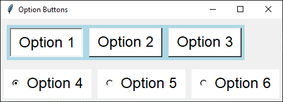

====================================================
tk Radiobutton
====================================================

| See: https://www.geeksforgeeks.org/radiobutton-in-tkinter-python/

----

Usage
---------------

| The `tkinter.Radiobutton` widget provides a Radio button.
| To create a Radio button widget the general syntax is (assuming import via "import tkinter as tk"):

.. py:function:: button_widget = tk.Radiobutton(parent, option=value)

    | parent is the window or frame object.
    | Options can be passed as parameters separated by commas.

----

Using radio buttons
---------------------------

| This code create one group of radio buttons in a frame and a second group in root window below the frame.
| To group radio buttons together set the variable option to be the same for each widget. e.g. ``variable=option_grp1_var``.
| All radio buttons in the same group should share this variable to ensure only one can be selected at a time.
| To preselect the first radio button in each group use: ``option_grp1_var.set("Option 1")`` and ``option_grp2_var.set("Option 4")``.

| The `indicatoron` option is set to `0` to make the radio buttons look like regular buttons.
| The `indicatoron` option is set to `1` to make the radio buttons look like radio buttons.

| A for loop is used to create each group of radio buttons since they have the dame formatting options apart from the text and value options which are taken care of by the loop variable, `option`.

.. code-block:: python

    import tkinter as tk
    from tkinter import font

    # Create the main window
    root = tk.Tk()
    root.title("Option Buttons")

    # Create a frame with a background color
    frame = tk.Frame(root, bg="light blue")
    frame.pack(anchor="nw", padx=10, pady=10)

    # Define a font style
    fontStyle = font.Font(family="Lucida Grande", size=18)

    # Create a StringVar to hold the selected option
    option_grp1_var = tk.StringVar(value=None)  # No default value

    # Define the options
    options_grp1 = ["Option 1", "Option 2", "Option 3"]

    # Create and pack the radio buttons
    for option in options_grp1:
        button = tk.Radiobutton(frame, text=option, value=option, variable=option_grp1_var,
                                bg="white", fg="black", font=fontStyle, indicatoron=0, padx=10, pady=5)
        button.pack(anchor="nw", side="left", padx=5, pady=5)
    option_grp1_var.set("Option 1")

    # Create a StringVar to hold the selected option
    option_grp2_var = tk.StringVar(value=None)  # No default value

    # Define the options
    options_grp2 = ["Option 4", "Option 5", "Option 6"]

    # Create and pack the radio buttons
    for option in options_grp2:
        button = tk.Radiobutton(root, text=option, value=option, variable=option_grp2_var,
                                bg="white", fg="black", font=fontStyle, indicatoron=1, padx=10, pady=5)
        button.pack(anchor="nw", side="left", padx=5, pady=5)
    option_grp2_var.set("Option 4")

    # Run the main event loop
    root.mainloop()

----

.. admonition:: Tasks

     #. Modify the code to have 4 radio buttons one under another.

        .. image:: images/radio_buttons_question.png
            :scale: 67%

    .. dropdown::
        :icon: codescan
        :color: primary
        :class-container: sd-dropdown-container

        .. tab-set::

            .. tab-item:: Q1

                Modify the code to have 4 radio buttons one under another.

                .. code-block:: python

                    import tkinter as tk
                    from tkinter import font

                    # Create the main window
                    root = tk.Tk()
                    root.title("Radio Buttons Question")
                    root.geometry("300x300")

                    # Create a frame with a background color
                    frame = tk.Frame(root, bg="light blue")
                    frame.pack(anchor="nw", padx=10, pady=10)

                    # Define a font style
                    fontStyle = font.Font(family="Lucida Grande", size=18)

                    # Create a StringVar to hold the selected option
                    option_var = tk.StringVar(value=None)  # No default value

                    # Define the options
                    options = ["Option 1", "Option 2", "Option 3", "Option 4"]

                    # Create and pack the radio buttons
                    for option in options:
                        button = tk.Radiobutton(frame, text=option, value=option, variable=option_var,
                                                bg="white", fg="black", font=fontStyle, indicatoron=1, padx=10, pady=5)
                        button.pack(anchor="nw", side="top", padx=5, pady=5)
                    option_var.set("Option 1")

                    # Run the main event loop
                    root.mainloop()

----

Parameter syntax
----------------------

.. py:function:: radiobutton_widget = tk.Radiobutton(parent, option=value)

    | parent is the window or frame object.
    | Options can be passed as parameters separated by commas.

    **Parameters:**

    .. py:attribute:: activebackground

        | Syntax: ``radiobutton_widget = tk.Radiobutton(parent, activebackground="color")``
        | Description: Sets the background color of the radiobutton when it is active.
        | Default: SystemButtonFace
        | Example: ``radiobutton_widget = tk.Radiobutton(root, activebackground="lightblue")``

    .. py:attribute:: activeforeground

        | Syntax: ``radiobutton_widget = tk.Radiobutton(parent, activeforeground="color")``
        | Description: Sets the foreground color of the radiobutton when it is active.
        | Default: SystemWindowText
        | Example: ``radiobutton_widget = tk.Radiobutton(root, activeforeground="blue")``

    .. py:attribute:: anchor

        | Syntax: ``radiobutton_widget = tk.Radiobutton(parent, anchor="position")``
        | Description: Sets the anchor position for the text and indicator.
        | Default: center
        | Example: ``radiobutton_widget = tk.Radiobutton(root, anchor="w")``

    .. py:attribute:: background

        | Syntax: ``radiobutton_widget = tk.Radiobutton(parent, background="color")``
        | Description: Sets the background color of the radiobutton.
        | Default: SystemButtonFace
        | Example: ``radiobutton_widget = tk.Radiobutton(root, background="lightyellow")``

    .. py:attribute:: bd

        | Syntax: ``radiobutton_widget = tk.Radiobutton(parent, bd=border_width)``
        | Description: Sets the border width of the radiobutton.
        | Default: 2
        | Example: ``radiobutton_widget = tk.Radiobutton(root, bd=5)``

    .. py:attribute:: bg

        | Syntax: ``radiobutton_widget = tk.Radiobutton(parent, bg="color")``
        | Description: Sets the background color of the radiobutton.
        | Default: SystemButtonFace
        | Example: ``radiobutton_widget = tk.Radiobutton(root, bg="lightyellow")``

    .. py:attribute:: bitmap

        | Syntax: ``radiobutton_widget = tk.Radiobutton(parent, bitmap="bitmap_name")``
        | Description: Sets a bitmap image to be displayed on the radiobutton.
        | Default: None
        | Example: ``radiobutton_widget = tk.Radiobutton(root, bitmap="error")``

    .. py:attribute:: borderwidth

        | Syntax: ``radiobutton_widget = tk.Radiobutton(parent, borderwidth=width)``
        | Description: Sets the width of the border around the radiobutton.
        | Default: 2
        | Example: ``radiobutton_widget = tk.Radiobutton(root, borderwidth=3)``

    .. py:attribute:: command

        | Syntax: ``radiobutton_widget = tk.Radiobutton(parent, command=function)``
        | Description: Specifies a function to be called when the radiobutton is selected.
        | Default: None
        | Example: ``radiobutton_widget = tk.Radiobutton(root, command=my_function)``

    .. py:attribute:: compound

        | Syntax: ``radiobutton_widget = tk.Radiobutton(parent, compound="position")``
        | Description: Specifies how to display the image and text (if both are set).
        | Default: none
        | Example: ``radiobutton_widget = tk.Radiobutton(root, compound="left")``

    .. py:attribute:: cursor

        | Syntax: ``radiobutton_widget = tk.Radiobutton(parent, cursor="cursor_type")``
        | Description: Sets the mouse cursor when hovering over the radiobutton.
        | Default: arrow
        | Example: ``radiobutton_widget = tk.Radiobutton(root, cursor="hand2")``

    .. py:attribute:: disabledforeground

        | Syntax: ``radiobutton_widget = tk.Radiobutton(parent, disabledforeground="color")``
        | Description: Sets the foreground color when the radiobutton is disabled.
        | Default: SystemDisabledText
        | Example: ``radiobutton_widget = tk.Radiobutton(root, disabledforeground="gray")``

    .. py:attribute:: fg

        | Syntax: ``radiobutton_widget = tk.Radiobutton(parent, fg="color")``
        | Description: Sets the foreground color of the radiobutton (text color).
        | Default: SystemWindowText
        | Example: ``radiobutton_widget = tk.Radiobutton(root, fg="black")``

    .. py:attribute:: font

        | Syntax: ``radiobutton_widget = tk.Radiobutton(parent, font=("font_name", size, "style"))``
        | Description: Specifies the font type, size, and style for the text of the radiobutton.
        | Default: TkDefaultFont
        | Example: ``radiobutton_widget = tk.Radiobutton(root, font=("Arial", 12, "bold"))``

    .. py:attribute:: foreground

        | Syntax: ``radiobutton_widget = tk.Radiobutton(parent, foreground="color")``
        | Description: Sets the foreground color of the radiobutton (text color).
        | Default: SystemWindowText
        | Example: ``radiobutton_widget = tk.Radiobutton(root, foreground="black")``

    .. py:attribute:: height

        | Syntax: ``radiobutton_widget = tk.Radiobutton(parent, height=value)``
        | Description: Sets the height of the radiobutton.
        | Default: 0 (automatically determined)
        | Example: ``radiobutton_widget = tk.Radiobutton(root, height=2)``

    .. py:attribute:: highlightbackground

        | Syntax: ``radiobutton_widget = tk.Radiobutton(parent, highlightbackground="color")``
        | Description: Sets the background color of the radiobutton when it does not have focus.
        | Default: SystemButtonFace
        | Example: ``radiobutton_widget = tk.Radiobutton(root, highlightbackground="gray")``

    .. py:attribute:: highlightcolor

        | Syntax: ``radiobutton_widget = tk.Radiobutton(parent, highlightcolor="color")``
        | Description: Sets the color of the highlight when the radiobutton has focus.
        | Default: SystemWindowFrame
        | Example: ``radiobutton_widget = tk.Radiobutton(root, highlightcolor="blue")``

    .. py:attribute:: highlightthickness

        | Syntax: ``radiobutton_widget = tk.Radiobutton(parent, highlightthickness=thickness)``
        | Description: Sets the thickness of the highlight border.
        | Default: 1
        | Example: ``radiobutton_widget = tk.Radiobutton(root, highlightthickness=2)``

    .. py:attribute:: image

        | Syntax: ``radiobutton_widget = tk.Radiobutton(parent, image="image_name")``
        | Description: Sets an image to be displayed on the radiobutton.
        | Default: None
        | Example: ``radiobutton_widget = tk.Radiobutton(root, image=my_image)``

    .. py:attribute:: indicatoron

        | Syntax: ``radiobutton_widget = tk.Radiobutton(parent, indicatoron=1)``
        | Description: Specifies whether to show the indicator (true or false).
        | Default: 1
        | Example: ``radiobutton_widget = tk.Radiobutton(root, indicatoron=0)``

    .. py:attribute:: justify

        | Syntax: ``radiobutton_widget = tk.Radiobutton(parent, justify="position")``
        | Description: Sets the justification of the text (left, center, right).
        | Default: center
        | Example: ``radiobutton_widget = tk.Radiobutton(root, justify="right")``

    .. py:attribute:: offrelief

        | Syntax: ``radiobutton_widget = tk.Radiobutton(parent, offrelief="style")``
        | Description: Sets the relief style for the indicator when off.
        | Default: raised
        | Example: ``radiobutton_widget = tk.Radiobutton(root, offrelief="flat")``

    .. py:attribute:: overrelief

        | Syntax: ``radiobutton_widget = tk.Radiobutton(parent, overrelief="style")``
        | Description: Sets the relief style for the indicator when hovered over.
        | Default: None
        | Example: ``radiobutton_widget = tk.Radiobutton(root, overrelief="sunken")``

    .. py:attribute:: padx

        | Syntax: ``radiobutton_widget = tk.Radiobutton(parent, padx=padding_value)``
        | Description: Sets the horizontal padding within the radiobutton.
        | Default: 1
        | Example: ``radiobutton_widget = tk.Radiobutton(root, padx=10)``

    .. py:attribute:: pady

        | Syntax: ``radiobutton_widget = tk.Radiobutton(parent, pady=padding_value)``
        | Description: Sets the vertical padding within the radiobutton.
        | Default: 1
        | Example: ``radiobutton_widget = tk.Radiobutton(root, pady=10)``

    .. py:attribute:: relief

        | Syntax: ``radiobutton_widget = tk.Radiobutton(parent, relief="style")``
        | Description: Sets the border style of the radiobutton. Options include `flat`, `raised`, `sunken`, `groove`, `ridge`.
        | Default: flat
        | Example: ``radiobutton_widget = tk.Radiobutton(root, relief="raised")``

    .. py:attribute:: selectcolor

        | Syntax: ``radiobutton_widget = tk.Radiobutton(parent, selectcolor="color")``
        | Description: Sets the color of the indicator when the radiobutton is selected.
        | Default: SystemWindow
        | Example: ``radiobutton_widget = tk.Radiobutton(root, selectcolor="lightgreen")``

    .. py:attribute:: selectimage

        | Syntax: ``radiobutton_widget = tk.Radiobutton(parent, selectimage="image_name")``
        | Description: Sets an image to be displayed when the radiobutton is selected.
        | Default: None
        | Example: ``radiobutton_widget = tk.Radiobutton(root, selectimage=my_selected_image)``

    .. py:attribute:: state

        | Syntax: ``radiobutton_widget = tk.Radiobutton(parent, state="state_type")``
        | Description: Sets the state of the radiobutton. Options include `normal`, `disabled`, or `active`.
        | Default: normal
        | Example: ``radiobutton_widget = tk.Radiobutton(root, state="disabled")``

    .. py:attribute:: takefocus

        | Syntax: ``radiobutton_widget = tk.Radiobutton(parent, takefocus=1)``
        | Description: Allows the radiobutton to take focus on click.
        | Default: None
        | Example: ``radiobutton_widget = tk.Radiobutton(root, takefocus=1)``

    .. py:attribute:: text

        | Syntax: ``radiobutton_widget = tk.Radiobutton(parent, text="label")``
        | Description: Sets the text label for the radiobutton.
        | Default: None
        | Example: ``radiobutton_widget = tk.Radiobutton(root, text="Option 1")``

    .. py:attribute:: textvariable

        | Syntax: ``radiobutton_widget = tk.Radiobutton(parent, textvariable=variable)``
        | Description: Associates a variable with the text of the radiobutton.
        | Default: None
        | Example: ``radiobutton_widget = tk.Radiobutton(root, textvariable=my_text_var)``

    .. py:attribute:: tristateimage

        | Syntax: ``radiobutton_widget = tk.Radiobutton(parent, tristateimage="image_name")``
        | Description: Sets an image to be displayed for a tristate radiobutton.
        | Default: None
        | Example: ``radiobutton_widget = tk.Radiobutton(root, tristateimage=my_tristate_image)``

    .. py:attribute:: tristatevalue

        | Syntax: ``radiobutton_widget = tk.Radiobutton(parent, tristatevalue=value)``
        | Description: Sets the value for the tristate option of the radiobutton.
        | Default: None
        | Example: ``radiobutton_widget = tk.Radiobutton(root, tristatevalue=2)``

    .. py:attribute:: underline

        | Syntax: ``radiobutton_widget = tk.Radiobutton(parent, underline=index)``
        | Description: Specifies the index of the character to underline in the text.
        | Default: -1 (no underline)
        | Example: ``radiobutton_widget = tk.Radiobutton(root, underline=0)``

    .. py:attribute:: value

        | Syntax: ``radiobutton_widget = tk.Radiobutton(parent, value=radio_value)``
        | Description: Sets the value associated with this radiobutton when selected.
        | Default: None
        | Example: ``radiobutton_widget = tk.Radiobutton(root, value=1)``

    .. py:attribute:: variable

        | Syntax: ``radiobutton_widget = tk.Radiobutton(parent, variable=control_variable)``
        | Description: Associates the radiobutton with a control variable (e.g., `IntVar`, `StringVar`).
        | Default: None
        | Example: ``radiobutton_widget = tk.Radiobutton(root, variable=my_var)``

    .. py:attribute:: width

        | Syntax: ``radiobutton_widget = tk.Radiobutton(parent, width=width_value)``
        | Description: Sets the width of the radiobutton.
        | Default: 0 (automatically determined)
        | Example: ``radiobutton_widget = tk.Radiobutton(root, width=30)``

    .. py:attribute:: wraplength

        | Syntax: ``radiobutton_widget = tk.Radiobutton(parent, wraplength=pixel_value)``
        | Description: Sets the maximum line length for text in pixels.
        | Default: 0 (no wrapping)
        | Example: ``radiobutton_widget = tk.Radiobutton(root, wraplength=100)``
