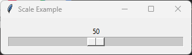

====================================================
tk Scale
====================================================

| See: `<https://docs.python.org/3/library/tkinter.html#tkinter.Scale>`_
| See: `<https://www.geeksforgeeks.org/python-scale-widget-in-tkinter/>`_

----

Usage
---------------

| The ``tkinter.Scale`` widget provides a slider that allows the user to select a numeric value by dragging a slider along a horizontal or vertical bar.
| It is commonly used for selecting values such as volume, brightness, or percentages.
| To create a scale widget, the general syntax is
| (assuming import via ``import tkinter as tk``):

.. py:function:: scale_widget = tk.Scale(parent, option=value)

    | ``parent`` is the window or frame object.
    | Options can be passed as parameters separated by commas.
    | A scale can be associated with a control variable such as ``IntVar`` or ``DoubleVar`` to store its current value.

----

Using a scale
---------------------------

.. code-block:: python

    import tkinter as tk

    root = tk.Tk()
    root.title("Scale Example")

    value = tk.IntVar(value=50)

    scale = tk.Scale(
        root,
        from_=0,
        to=100,
        orient="horizontal",
        variable=value,
        length=300
    )

    scale.pack(padx=10, pady=10)

    root.mainloop()

----

.. admonition:: Tasks

    #. Modify the code so that the scale:

        * is vertical,
        * ranges from **0** to **20**,
        * has a length of **100** pixels,
        * starts at **10**.

        .. image:: images/scale_question.png
            :scale: 100

    .. dropdown::
        :icon: codescan
        :color: primary
        :class-container: sd-dropdown-container

        .. tab-set::

            .. tab-item:: Q1

                Modify the code to produce the scale shown above.

                .. code-block:: python

                    import tkinter as tk

                    root = tk.Tk()
                    root.title("Scale Question")

                    value = tk.IntVar(value=10)

                    scale = tk.Scale(
                        root,
                        from_=0,
                        to=20,
                        orient="vertical",
                        variable=value,
                        length=100
                    )

                    scale.pack(padx=10, pady=10)

                    root.mainloop()

----

Methods
----------------------

.. py:function:: scale_widget.get()

    | Returns the current value of the scale.

.. py:function:: scale_widget.set(value)

    | Sets the current value of the scale.

.. py:function:: scale_widget.coords(value=None)

    | Returns the screen coordinates of the current slider position.
    | If ``value`` is supplied, returns the coordinates for that value.

.. py:function:: scale_widget.identify(x, y)

    | Returns the name of the scale element at the specified coordinates.

.. py:function:: scale_widget.flash()

    | Briefly flashes the widget several times.
    | Useful for drawing the user's attention to the widget.

.. py:function:: scale_widget.invoke()

    | Invokes the scale's command callback, if one exists.

----

Control variable methods
----------------------------

.. py:function:: variable.get()

    | Returns the current value stored in the control variable.

.. py:function:: variable.set(value)

    | Sets the current value stored in the control variable.
    | The slider immediately moves to the specified position.

----

Parameter syntax
----------------------

.. py:function:: scale_widget = tk.Scale(parent, option=value)

    | ``parent`` is the window or frame object.
    | Options can be passed as parameters separated by commas.

    **Parameters:**

    .. py:attribute:: activebackground

        | Syntax: ``scale_widget = tk.Scale(parent, activebackground="color")``
        | Description: Sets the slider colour while it is being dragged.
        | Default: SystemButtonFace
        | Example: ``scale_widget = tk.Scale(root, activebackground="lightblue")``

    .. py:attribute:: background
    .. py:attribute:: bg

        | Syntax: ``scale_widget = tk.Scale(parent, bg="color")``
        | Description: Sets the background colour of the widget.
        | Default: SystemButtonFace
        | Example: ``scale_widget = tk.Scale(root, bg="white")``

    .. py:attribute:: bd

        | Syntax: ``scale_widget = tk.Scale(parent, bd=width)``
        | Description: Sets the width of the widget border.
        | Default: 2
        | Example: ``scale_widget = tk.Scale(root, bd=4)``

    .. py:attribute:: borderwidth

        | Syntax: ``scale_widget = tk.Scale(parent, borderwidth=width)``
        | Description: Sets the width of the widget border.
        | Default: 2
        | Example: ``scale_widget = tk.Scale(root, borderwidth=4)``

    .. py:attribute:: command

        | Syntax: ``scale_widget = tk.Scale(parent, command=function)``
        | Description: Calls a function whenever the slider is moved.
        | Example: ``scale_widget = tk.Scale(root, command=my_function)``

    .. py:attribute:: cursor

        | Syntax: ``scale_widget = tk.Scale(parent, cursor="cursor_type")``
        | Description: Sets the mouse cursor when hovering over the widget.
        | Default: arrow
        | Example: ``scale_widget = tk.Scale(root, cursor="hand2")``

    .. py:attribute:: digits

        | Syntax: ``scale_widget = tk.Scale(parent, digits=value)``
        | Description: Specifies the number of significant digits displayed for a ``StringVar``.
        | Default: 0

    .. py:attribute:: font

        | Syntax: ``scale_widget = tk.Scale(parent, font=("font", size, style))``
        | Description: Sets the font used for labels and values.
        | Default: TkDefaultFont

    .. py:attribute:: foreground
    .. py:attribute:: fg

        | Syntax: ``scale_widget = tk.Scale(parent, fg="color")``
        | Description: Sets the text colour.
        | Default: SystemWindowText

    .. py:attribute:: from_

        | Syntax: ``scale_widget = tk.Scale(parent, from_=value)``
        | Description: Sets the minimum value of the scale.
        | Default: 0

    .. py:attribute:: to

        | Syntax: ``scale_widget = tk.Scale(parent, to=value)``
        | Description: Sets the maximum value of the scale.
        | Default: 100

rst id="w2kp8m"
    .. py:attribute:: label

        | Syntax: ``scale_widget = tk.Scale(parent, label="text")``
        | Description: Displays a text label above a horizontal scale or beside a vertical scale.
        | Default: None
        | Example: ``scale_widget = tk.Scale(root, label="Volume")``

    .. py:attribute:: length

        | Syntax: ``scale_widget = tk.Scale(parent, length=value)``
        | Description: Sets the length of the scale in pixels.
        | Default: 100
        | Example: ``scale_widget = tk.Scale(root, length=250)``

    .. py:attribute:: orient

        | Syntax: ``scale_widget = tk.Scale(parent, orient="horizontal")``
        | Description: Specifies whether the scale is horizontal or vertical.
        | Valid values: ``"horizontal"``, ``"vertical"``
        | Default: ``"vertical"``
        | Example: ``scale_widget = tk.Scale(root, orient="horizontal")``

    .. py:attribute:: relief

        | Syntax: ``scale_widget = tk.Scale(parent, relief="style")``
        | Description: Sets the border style of the widget.
        | Default: ``flat``
        | Example: ``scale_widget = tk.Scale(root, relief="groove")``

    .. py:attribute:: repeatdelay

        | Syntax: ``scale_widget = tk.Scale(parent, repeatdelay=milliseconds)``
        | Description: Specifies how long to wait before auto-repeating when the trough is held down.
        | Default: 300
        | Example: ``scale_widget = tk.Scale(root, repeatdelay=500)``

    .. py:attribute:: repeatinterval

        | Syntax: ``scale_widget = tk.Scale(parent, repeatinterval=milliseconds)``
        | Description: Specifies the time between repeated movements while the trough is held down.
        | Default: 100
        | Example: ``scale_widget = tk.Scale(root, repeatinterval=50)``

    .. py:attribute:: resolution

        | Syntax: ``scale_widget = tk.Scale(parent, resolution=value)``
        | Description: Sets the smallest increment between selectable values.
        | Default: 1
        | Example: ``scale_widget = tk.Scale(root, resolution=0.5)``

    .. py:attribute:: showvalue

        | Syntax: ``scale_widget = tk.Scale(parent, showvalue=boolean)``
        | Description: Determines whether the current value is displayed.
        | Default: 1
        | Example: ``scale_widget = tk.Scale(root, showvalue=0)``

    .. py:attribute:: sliderlength

        | Syntax: ``scale_widget = tk.Scale(parent, sliderlength=value)``
        | Description: Sets the length of the slider in pixels.
        | Default: 30
        | Example: ``scale_widget = tk.Scale(root, sliderlength=40)``

    .. py:attribute:: sliderrelief

        | Syntax: ``scale_widget = tk.Scale(parent, sliderrelief="style")``
        | Description: Sets the border style of the slider.
        | Default: ``raised``
        | Example: ``scale_widget = tk.Scale(root, sliderrelief="sunken")``

    .. py:attribute:: state

        | Syntax: ``scale_widget = tk.Scale(parent, state="state")``
        | Description: Specifies whether the widget is enabled.
        | Valid values: ``"normal"``, ``"disabled"``
        | Default: ``"normal"``
        | Example: ``scale_widget = tk.Scale(root, state="disabled")``

    .. py:attribute:: takefocus

        | Syntax: ``scale_widget = tk.Scale(parent, takefocus=1)``
        | Description: Determines whether the widget can receive keyboard focus.
        | Default: 1
        | Example: ``scale_widget = tk.Scale(root, takefocus=0)``

    .. py:attribute:: tickinterval

        | Syntax: ``scale_widget = tk.Scale(parent, tickinterval=value)``
        | Description: Displays tick marks at the specified interval.
        | Default: 0 (no tick marks)
        | Example: ``scale_widget = tk.Scale(root, tickinterval=10)``

    .. py:attribute:: troughcolor

        | Syntax: ``scale_widget = tk.Scale(parent, troughcolor="color")``
        | Description: Sets the colour of the trough behind the slider.
        | Default: SystemButtonFace
        | Example: ``scale_widget = tk.Scale(root, troughcolor="lightgray")``

    .. py:attribute:: variable

        | Syntax: ``scale_widget = tk.Scale(parent, variable=control_variable)``
        | Description: Associates the scale with a control variable such as ``IntVar`` or ``DoubleVar``.
        | Default: An internal Tcl variable.
        | Example: ``scale_widget = tk.Scale(root, variable=my_var)``

    .. py:attribute:: width

        | Syntax: ``scale_widget = tk.Scale(parent, width=value)``
        | Description: Sets the width of the trough in pixels.
        | Default: 15
        | Example: ``scale_widget = tk.Scale(root, width=25)``

----

Default options
------------------------

| Code to display the default value for each ``Scale`` option is shown below.

.. code-block:: python

    import tkinter as tk

    root = tk.Tk()

    widget = tk.Scale(root)
    widget_options = widget.keys()

    for option in widget_options:
        print(f"{option}: {widget.cget(option)}")  # cget retrieves the current value of the option

