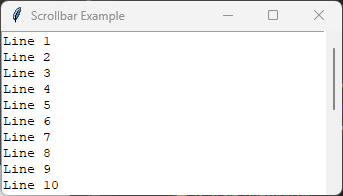

====================================================
tk Scrollbar
====================================================

| See: `<https://docs.python.org/3/library/tkinter.html#tkinter.Scrollbar>`_
| See: `<https://www.geeksforgeeks.org/python-tkinter-scrollbar/>`_

----

Usage
---------------

| The ``tkinter.Scrollbar`` widget provides a horizontal or vertical scrollbar that allows the user to scroll the contents of another widget.
| A scrollbar is commonly used with widgets such as ``Text``, ``Canvas``, ``Listbox`` and ``Treeview``.
| To create a scrollbar widget, the general syntax is
| (assuming import via ``import tkinter as tk``):

.. py:function:: scrollbar_widget = tk.Scrollbar(parent, option=value)

    | ``parent`` is the window or frame object.
    | Options can be passed as parameters separated by commas.
    | A scrollbar must be linked to another widget using the widget's ``xview`` or ``yview`` method.

----

Using a Scrollbar
---------------------------

.. code-block:: python

    import tkinter as tk

    root = tk.Tk()
    root.title("Scrollbar Example")

    scrollbar = tk.Scrollbar(root)
    scrollbar.pack(side="right", fill="y")

    text = tk.Text(root, width=40, height=10,
                   yscrollcommand=scrollbar.set)
    text.pack(side="left", fill="both", expand=True)

    scrollbar.config(command=text.yview)

    for i in range(1, 21):
        text.insert("end", f"Line {i}\n")

    root.mainloop()

----

.. admonition:: Tasks

    #. Modify the program so that:

        * the ``Text`` widget displays **15** lines,
        * the scrollbar appears on the **left** of the window,
        * the ``Text`` widget is **30** characters wide.

        .. image:: images/scrollbar_question.png
            :scale: 100

    .. dropdown::
        :icon: codescan
        :color: primary
        :class-container: sd-dropdown-container

        .. tab-set::

            .. tab-item:: Q1

                Modify the code to produce the layout shown above.

                .. code-block:: python

                    import tkinter as tk

                    root = tk.Tk()
                    root.title("Scrollbar Question")

                    scrollbar = tk.Scrollbar(root)
                    scrollbar.pack(side="right", fill="y")

                    text = tk.Text(
                        root,
                        width=40,
                        height=10,
                        yscrollcommand=scrollbar.set
                    )
                    text.pack(side="left")

                    scrollbar.config(command=text.yview)

                    for i in range(1, 101):
                        text.insert("end", f"Line {i}\n")

                    root.mainloop()

----

Methods
----------------------

.. py:function:: scrollbar_widget.activate(element=None)

    | Activates the specified scrollbar element.
    | If no element is supplied, returns the currently active element.

.. py:function:: scrollbar_widget.delta(deltax, deltay)

    | Returns the amount the scrollbar should move for the specified mouse movement.

.. py:function:: scrollbar_widget.fraction(x, y)

    | Returns the fractional position corresponding to the specified coordinates.

.. py:function:: scrollbar_widget.get()

    | Returns the current position of the scrollbar as two fractions.

.. py:function:: scrollbar_widget.identify(x, y)

    | Returns the name of the scrollbar element at the specified coordinates.

.. py:function:: scrollbar_widget.set(first, last)

    | Updates the slider position.
    | This method is normally called automatically by the associated widget.

----

Parameter syntax
----------------------

.. py:function:: scrollbar_widget = tk.Scrollbar(parent, option=value)

    | ``parent`` is the window or frame object.
    | Options can be passed as parameters separated by commas.

    **Parameters:**

    .. py:attribute:: activebackground

        | Syntax: ``scrollbar_widget = tk.Scrollbar(parent, activebackground="color")``
        | Description: Sets the colour of the slider while it is active.
        | Default: SystemButtonFace

    .. py:attribute:: background
    .. py:attribute:: bg

        | Syntax: ``scrollbar_widget = tk.Scrollbar(parent, bg="color")``
        | Description: Sets the background colour of the scrollbar.
        | Default: SystemButtonFace

    .. py:attribute:: borderwidth
    .. py:attribute:: bd

        | Syntax: ``scrollbar_widget = tk.Scrollbar(parent, borderwidth=value)``
        | Description: Sets the border width.
        | Default: 2

    .. py:attribute:: command

        | Syntax: ``scrollbar_widget = tk.Scrollbar(parent, command=function)``
        | Description: Specifies the function used to scroll the associated widget.
        | Example: ``command=text.yview``

    .. py:attribute:: cursor

        | Syntax: ``scrollbar_widget = tk.Scrollbar(parent, cursor="cursor_type")``
        | Description: Sets the mouse cursor.

    .. py:attribute:: elementborderwidth

        | Syntax: ``scrollbar_widget = tk.Scrollbar(parent, elementborderwidth=value)``
        | Description: Sets the border width of the slider and arrow buttons.

    .. py:attribute:: jump

        | Syntax: ``scrollbar_widget = tk.Scrollbar(parent, jump=True)``
        | Description: Updates the associated widget only after the slider is released.
        | Default: False

    .. py:attribute:: orient

        | Syntax: ``scrollbar_widget = tk.Scrollbar(parent, orient="vertical")``
        | Description: Specifies the scrollbar orientation.
        | Valid values: ``"vertical"``, ``"horizontal"``
        | Default: ``"vertical"``

    .. py:attribute:: relief

        | Syntax: ``scrollbar_widget = tk.Scrollbar(parent, relief="style")``
        | Description: Sets the border style.
        | Default: ``sunken``

    .. py:attribute:: repeatdelay

        | Syntax: ``scrollbar_widget = tk.Scrollbar(parent, repeatdelay=milliseconds)``
        | Description: Specifies how long to wait before auto-repeating begins.
        | Default: 300

    .. py:attribute:: repeatinterval

        | Syntax: ``scrollbar_widget = tk.Scrollbar(parent, repeatinterval=milliseconds)``
        | Description: Specifies the interval between repeated scrolling actions.
        | Default: 100

    .. py:attribute:: takefocus

        | Syntax: ``scrollbar_widget = tk.Scrollbar(parent, takefocus=1)``
        | Description: Determines whether the scrollbar can receive keyboard focus.

    .. py:attribute:: troughcolor

        | Syntax: ``scrollbar_widget = tk.Scrollbar(parent, troughcolor="color")``
        | Description: Sets the colour of the scrollbar trough.

    .. py:attribute:: width

        | Syntax: ``scrollbar_widget = tk.Scrollbar(parent, width=value)``
        | Description: Sets the width of a vertical scrollbar or the height of a horizontal scrollbar.
        | Default: Platform dependent

----

Default options
------------------------

| Code to display the default value for each ``Scrollbar`` option is shown below.

.. code-block:: python

    import tkinter as tk

    root = tk.Tk()

    widget = tk.Scrollbar(root)
    widget_options = widget.keys()

    for option in widget_options:
        print(f"{option}: {widget.cget(option)}")  # cget retrieves the current value of the option

