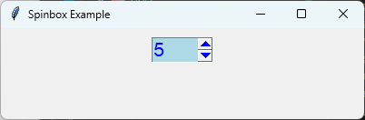

====================================================
tk Spinbox
====================================================

| See: `<https://docs.python.org/3/library/tkinter.html#tkinter.Spinbox>`_
| See: `<https://www.geeksforgeeks.org/python-tkinter-spinbox/>`_

----

Usage
---------------

| The ``tkinter.Spinbox`` widget allows the user to select a value by either typing it directly or using the up and down arrow buttons.
| A spinbox can display a range of numbers or a sequence of strings.
| To create a spinbox widget, the general syntax is
| (assuming import via ``import tkinter as tk``):

.. py:function:: spinbox_widget = tk.Spinbox(parent, option=value)

    | ``parent`` is the window or frame object.
    | Options can be passed as parameters separated by commas.
    | A spinbox can be associated with a ``StringVar``, ``IntVar`` or ``DoubleVar`` control variable.

----

Using a Spinbox
---------------------------

.. code-block:: python

    import tkinter as tk

    root = tk.Tk()
    root.title("Spinbox Example")
    root.geometry("400x100")

    value = tk.IntVar(value=5)

    spinbox = tk.Spinbox(
        root,
        from_=0,
        to=10,
        increment=1,
        textvariable=value,
        width=4,
        font=("Arial", 16),
        bg="lightblue",
        fg="blue",
        activebackground="blue",
        borderwidth=1,
        relief="sunken",
        )

    spinbox.pack(padx=10, pady=10)

    root.mainloop()

----

.. admonition:: Tasks

    #. Modify the code so that the spinbox:

        * displays values of **UG, E, D, C, B, A**,
        * has a width of **5**.
        * has a bg colour of **lightgreen**.
        * has a fg colour of **green**.
        * has an activebackground colour of **green**.
        * has a width of **5**.
        * has a borderwidth of **2**.
        * has a relief of **groove**.
        * sets the inital display value to **C**.

        .. image:: images/spinbox_question.png
            :scale: 100

    .. dropdown::
        :icon: codescan
        :color: primary
        :class-container: sd-dropdown-container

        .. tab-set::

            .. tab-item:: Q1

                Modify the code to produce the spinbox shown above.

                .. code-block:: python

                    import tkinter as tk

                    root = tk.Tk()
                    root.title("Spinbox Question")
                    root.geometry("400x100")

                    value = tk.StringVar()

                    spinbox = tk.Spinbox(
                        root,
                        values=("UG", "E", "D", "C", "B", "A"),
                        textvariable=value,
                        width=5,
                        font=("Arial", 16),
                        bg="lightgreen",
                        fg="green",
                        activebackground="green",
                        borderwidth=2,
                        relief="groove",
                    )

                    spinbox.pack(padx=10, pady=10)
                    value.set("C")
                    root.mainloop()

----

Methods
----------------------

.. py:function:: spinbox_widget.delete(first, last=None)

    | Deletes one or more characters from the entry field.

.. py:function:: spinbox_widget.get()

    | Returns the current value as a string.

.. py:function:: spinbox_widget.insert(index, text)

    | Inserts text into the entry field.

.. py:function:: spinbox_widget.icursor(index)

    | Moves the insertion cursor to the specified position.

.. py:function:: spinbox_widget.invoke(element)

    | Simulates clicking one of the arrow buttons.
    | ``element`` may be ``"buttonup"`` or ``"buttondown"``.

.. py:function:: spinbox_widget.selection('range', start, end)

    | Selects a range of text.

----

Control variable methods
----------------------------

.. py:function:: variable.get()

    | Returns the current value stored in the control variable.

.. py:function:: variable.set(value)

    | Sets the current value of the control variable.
    | The displayed value updates automatically.

----

Parameter syntax
----------------------

.. py:function:: spinbox_widget = tk.Spinbox(parent, option=value)

    | ``parent`` is the window or frame object.
    | Options can be passed as parameters separated by commas.

    **Parameters:**

    .. py:attribute:: activebackground

        | Syntax: ``spinbox_widget = tk.Spinbox(parent, activebackground="color")``
        | Description: Sets the background colour of the arrow buttons while active.
        | Default: SystemButtonFace

    .. py:attribute:: background
    .. py:attribute:: bg

        | Syntax: ``spinbox_widget = tk.Spinbox(parent, bg="color")``
        | Description: Sets the background colour.
        | Default: SystemWindow

    .. py:attribute:: borderwidth
    .. py:attribute:: bd

        | Syntax: ``spinbox_widget = tk.Spinbox(parent, borderwidth=value)``

        | Description: Sets the border width.
        | Default: 2

    .. py:attribute:: buttonbackground

        | Syntax: ``spinbox_widget = tk.Spinbox(parent, buttonbackground="color")``
        | Description: Sets the background colour of the up and down arrow buttons.
        | Default: SystemButtonFace

    .. py:attribute:: command

        | Syntax: ``spinbox_widget = tk.Spinbox(parent, command=function)``
        | Description: Calls a function whenever the arrow buttons change the value.

    .. py:attribute:: cursor

        | Syntax: ``spinbox_widget = tk.Spinbox(parent, cursor="cursor")``
        | Description: Sets the mouse cursor.

    .. py:attribute:: disabledbackground

        | Syntax: ``spinbox_widget = tk.Spinbox(parent, disabledbackground="color")``
        | Description: Sets the background colour when the widget is disabled.
        | Default: SystemButtonFace

    .. py:attribute:: disabledforeground

        | Syntax: ``spinbox_widget = tk.Spinbox(parent, disabledforeground="color")``
        | Description: Sets the text colour when the widget is disabled.
        | Default: SystemDisabledText

    .. py:attribute:: exportselection

        | Syntax: ``spinbox_widget = tk.Spinbox(parent, exportselection=boolean)``
        | Description: Determines whether selected text is automatically copied to the clipboard.
        | Default: 1

    .. py:attribute:: font

        | Syntax: ``spinbox_widget = tk.Spinbox(parent, font=("font", size, style))``
        | Description: Sets the font used to display the value.

    .. py:attribute:: foreground
    .. py:attribute:: fg

        | Syntax: ``spinbox_widget = tk.Spinbox(parent, fg="color")``
        | Description: Sets the text colour.

    .. py:attribute:: format

        | Syntax: ``spinbox_widget = tk.Spinbox(parent, format="%format")``
        | Description: Specifies how numeric values are displayed.

    .. py:attribute:: from_

        | Syntax: ``spinbox_widget = tk.Spinbox(parent, from_=value)``
        | Description: Sets the minimum numeric value.
        | Default: 0

    .. py:attribute:: increment

        | Syntax: ``spinbox_widget = tk.Spinbox(parent, increment=value)``
        | Description: Sets the amount added or subtracted each time an arrow button is pressed.
        | Default: 1

    .. py:attribute:: justify

        | Syntax: ``spinbox_widget = tk.Spinbox(parent, justify="position")``
        | Description: Aligns the displayed text.
        | Valid values: ``left``, ``center`` and ``right``.

    .. py:attribute:: readonlybackground

        | Syntax: ``spinbox_widget = tk.Spinbox(parent, readonlybackground="color")``
        | Description: Sets the background colour when ``state="readonly"``.
        | Default: SystemButtonFace

    .. py:attribute:: relief

        | Syntax: ``spinbox_widget = tk.Spinbox(parent, relief="style")``
        | Description: Sets the border style of the widget.
        | Default: ``sunken``

    .. py:attribute:: repeatdelay

        | Syntax: ``spinbox_widget = tk.Spinbox(parent, repeatdelay=milliseconds)``
        | Description: Specifies how long to wait before the value begins auto-repeating while an arrow button is held down.
        | Default: 400

    .. py:attribute:: repeatinterval

        | Syntax: ``spinbox_widget = tk.Spinbox(parent, repeatinterval=milliseconds)``
        | Description: Specifies the time between repeated value changes while an arrow button is held down.
        | Default: 100

    .. py:attribute:: state

        | Syntax: ``spinbox_widget = tk.Spinbox(parent, state="state")``
        | Description: Sets the widget state.
        | Valid values: ``normal``, ``readonly`` and ``disabled``.

    .. py:attribute:: textvariable

        | Syntax: ``spinbox_widget = tk.Spinbox(parent, textvariable=variable)``
        | Description: Associates a control variable with the widget.

    .. py:attribute:: to

        | Syntax: ``spinbox_widget = tk.Spinbox(parent, to=value)``
        | Description: Sets the maximum numeric value.
        | Default: 0

    .. py:attribute:: values

        | Syntax: ``spinbox_widget = tk.Spinbox(parent, values=("A", "B", "C"))``
        | Description: Displays a fixed sequence of values instead of a numeric range.

    .. py:attribute:: width

        | Syntax: ``spinbox_widget = tk.Spinbox(parent, width=value)``
        | Description: Sets the width of the entry field.

    .. py:attribute:: wrap

        | Syntax: ``spinbox_widget = tk.Spinbox(parent, wrap=True)``
        | Description: Wraps from the maximum value back to the minimum value.
        | Default: False

----

Default options
------------------------

| Code to display the default value for each ``Spinbox`` option is shown below.

.. code-block:: python

    import tkinter as tk

    root = tk.Tk()

    widget = tk.Spinbox(root)
    widget_options = widget.keys()

    for option in widget_options:
        print(f"{option}: {widget.cget(option)}")  # cget retrieves the current value of the option

