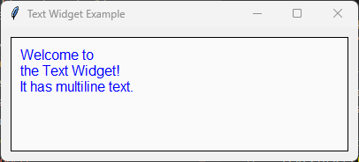

====================================================
tk Text
====================================================

| See: `<https://docs.python.org/3/library/tkinter.html#tkinter.Text>`_
| See: `<https://www.geeksforgeeks.org/python-tkinter-text-widget/>`_

----

Usage
---------------

| The `tkinter.Text` widget provides a versatile multi-line text area that you can use for various purposes such as comments or descriptions
| To create a multi-line text widget the general syntax is (assuming import via "import tkinter as tk"):

.. py:function:: text_widget  = tk.Text(parent, option=value)

    | `parent` is the window or frame object.
    | Options can be passed as parameters separated by commas.

| Options can also be changed or added anew after widget creation.

.. py:function:: text_widget.config(option=value)

    | text_widget is the Text widget object.
    | Options can be passed as parameters separated by commas.

----

Text widget example
---------------------------------------------

| The code below sets some widget options at creation.
| It also uses **.config()** to add other custom options.

.. code-block:: python

    import tkinter as tk

    root = tk.Tk()
    root.title("Text Widget Example")
    root.geometry("300x200")

    # Create a Text widget
    text = tk.Text(root, height=6, width=40, wrap="word", font=("Arial", 12))
    text.pack(padx=10, pady=10)

    # Insert initial content
    text.insert(
        "1.0", "Welcome to \nthe Text Widget!\nIt has multiline text.")

    # Customize options
    text.config(
        bg="#fafafa",  # Background color
        fg="blue",  # Text color
        borderwidth=1,  # Border width
        relief="solid",  # Border style
        insertbackground="red",  # Insertion cursor color
        selectbackground="red",   # Selection background color
        state="normal",  # Enable editing (use "disabled" to disable)
        padx=10,
        pady=10
    )

    root.mainloop()

----

.. admonition:: Tasks

     #. Modify the given Tkinter code to change the following options to use a background color of light yellow, a text color of dark green, a background selection color of purple, a border width of 2, a border style of "groove" and disabled state so it can't be edited.

        .. image:: images/text_question.png
            :scale: 67

    .. dropdown::
        :icon: codescan
        :color: primary
        :class-container: sd-dropdown-container

        .. tab-set::

            .. tab-item:: Q1

                Modify the given Tkinter code to change the following options to use a background color of light yellow, a text color of dark green, a background selection color of purple, a border width of 2, a border style of "groove" and disabled state so it can't be edited.

                .. code-block:: python

                    import tkinter as tk

                    root = tk.Tk()
                    root.title("Text Widget Questions")

                    # Create a Text widget
                    text = tk.Text(root, height=6, width=40, wrap="word", font=("Arial", 12))
                    text.pack(padx=10, pady=10)

                    # Insert initial content
                    text.insert(
                        "1.0", "Welcome to \nthe Text Widget!\nIt has multiline text.")

                    # Customize options
                    text.config(
                        bg="light yellow",  # Background color
                        fg="dark green",  # Text color
                        borderwidth=2,  # Border width
                        relief="groove",  # Border style
                        insertbackground="red",  # Insertion cursor color
                        selectbackground="purple",   # Selection background color
                        state="disabled",  # Disable editing
                        padx=10,
                        pady=10
                    )

                    root.mainloop()

----

Methods
----------------------

| Insert text using ``text_widget.insert("1.0", "text")``.
| Retrieve all text using ``text = text_widget.get("1.0", tk.END)``.
| Delete all text using ``text_widget.delete("1.0", tk.END)``.
| Scroll to the end using ``text_widget.see(tk.END)``.
| Configure a tag for text using ``text_widget.tag_configure("red", foreground="red")``.

| Text widget positions use the format "line.character".
| For example, "1.0" is the first character on the first line.
| The integer before the decimal represents the line number (1-indexed), and the integer after represents the character column (0-indexed).

.. py:function:: text_widget.tag_configure(tag_name, option=value)

    | Configures the appearance of the specified text tag.
    | Use ``text_widget.tag_configure("red", foreground="red")`` to create a tag to be used to display tagged text in red.
    | Multiple options can be specified, for example ``text_widget.tag_configure("heading", font=("Arial", 16, "bold"), foreground="red")``.

.. py:function:: text_widget.insert(index, text, *tags)

    | Inserts ``text`` at the specified ``index``.
    | Use ``text_widget.insert("1.0", "Hello")`` to insert text at the beginning of the Text widget.
    | Use ``text_widget.insert(tk.END, "Hello")`` to append text to the end of the existing text.
    | ``*tags`` are zero or more tag names to apply to the inserted text. For multiple tages, quote them as a tuple.
    | Use ``text_widget.insert(tk.END, "Error", "red")`` to insert text using the ``red`` tag.
    | If ``index`` is outside the valid range, Tk adjusts it to the nearest valid position.

.. py:function:: text_widget.get(start, end)

    | Retrieves the text between ``start`` and ``end``.
    | Use ``text_widget.get("1.0", tk.END)`` to retrieve all text.

.. py:function:: text_widget.delete(start, end)

    | Deletes the text between ``start`` and ``end``.
    | Use ``text_widget.delete("1.0", tk.END)`` to clear the widget.

.. py:function:: text_widget.see(index)

    | Scrolls the Text widget so that the specified ``index`` is visible.
    | Use ``text_widget.see(tk.END)`` to scroll to the end of the text.
    | Commonly used after inserting text so the most recently added text is visible.

----

Parameter syntax
----------------------

 .. py:function:: text_widget = tk.Text(parent, option=value)

    | parent is the window or frame object.
    | Options can be passed as parameters separated by commas.

    **Parameters:**

    .. py:attribute:: autoseparators

        | Syntax: ``text_widget = tk.Text(parent, autoseparators=1)``
        | Description: Enables automatic separator insertion when typing.
        | Default: 1
        | Example: ``text_widget = tk.Text(root, autoseparators=1)``

    .. py:attribute:: background
    .. py:attribute:: bg

        | Syntax: ``text_widget = tk.Text(parent, background="color")``
        | Description: Sets the background color of the text widget.
        | Default: SystemWindow
        | Example: ``text_widget = tk.Text(root, background="lightyellow")``

    .. py:attribute:: borderwidth
    .. py:attribute:: bd

        | Syntax: ``text_widget = tk.Text(parent, borderwidth=border_width)``
        | Description: Sets the border width of the text widget.
        | Default: 1
        | Example: ``text_widget = tk.Text(root, borderwidth=2)``

    .. py:attribute:: blockcursor

        | Syntax: ``text_widget = tk.Text(parent, blockcursor=0)``
        | Description: Sets the cursor style; a block or normal cursor.
        | Default: 0
        | Example: ``text_widget = tk.Text(root, blockcursor=1)``

    .. py:attribute:: cursor

        | Syntax: ``text_widget = tk.Text(parent, cursor="cursor_type")``
        | Description: Sets the mouse cursor when hovering over the text widget.
        | Default: xterm
        | Example: ``text_widget = tk.Text(root, cursor="hand2")``

    .. py:attribute:: exportselection

        | Syntax: ``text_widget = tk.Text(parent, exportselection=1)``
        | Description: Allows the text selection to be copied to the clipboard.
        | Default: 1
        | Example: ``text_widget = tk.Text(root, exportselection=1)``

    .. py:attribute:: font

        | Syntax: ``text_widget = tk.Text(parent, font=("font_name", size, "style"))``
        | Description: Specifies the font type, size, and style for the text.
        | Default: TkFixedFont
        | Example: ``text_widget = tk.Text(root, font=("Arial", 12, "italic"))``

    .. py:attribute:: foreground
    .. py:attribute:: fg

        | Syntax: ``text_widget = tk.Text(parent, foreground="color")``
        | Description: Sets the foreground color (text color) of the text widget.
        | Default: SystemWindowText
        | Example: ``text_widget = tk.Text(root, foreground="black")``

    .. py:attribute:: height

        | Syntax: ``text_widget = tk.Text(parent, height=height_value)``
        | Description: Sets the height of the text widget in lines.
        | Default: 24
        | Example: ``text_widget = tk.Text(root, height=10)``

    .. py:attribute:: highlightbackground

        | Syntax: ``text_widget = tk.Text(parent, highlightbackground="color")``
        | Description: Sets the background color when the text widget does not have focus.
        | Default: SystemButtonFace
        | Example: ``text_widget = tk.Text(root, highlightbackground="gray")``

    .. py:attribute:: highlightcolor

        | Syntax: ``text_widget = tk.Text(parent, highlightcolor="color")``
        | Description: Sets the color of the highlight when the text widget has focus.
        | Default: SystemWindowFrame
        | Example: ``text_widget = tk.Text(root, highlightcolor="blue")``

    .. py:attribute:: highlightthickness

        | Syntax: ``text_widget = tk.Text(parent, highlightthickness=thickness)``
        | Description: Sets the thickness of the highlight border.
        | Default: 0
        | Example: ``text_widget = tk.Text(root, highlightthickness=2)``

    .. py:attribute:: inactiveselectbackground

        | Syntax: ``text_widget = tk.Text(parent, inactiveselectbackground="color")``
        | Description: Sets the background color for selected text when the widget is inactive.
        | Default: None
        | Example: ``text_widget = tk.Text(root, inactiveselectbackground="lightgray")``

    .. py:attribute:: insertbackground

        | Syntax: ``text_widget = tk.Text(parent, insertbackground="color")``
        | Description: Sets the color of the insertion cursor (caret).
        | Default: SystemWindowText
        | Example: ``text_widget = tk.Text(root, insertbackground="red")``

    .. py:attribute:: insertborderwidth

        | Syntax: ``text_widget = tk.Text(parent, insertborderwidth=width)``
        | Description: Sets the width of the border around the insertion cursor.
        | Default: 0
        | Example: ``text_widget = tk.Text(root, insertborderwidth=2)``

    .. py:attribute:: insertofftime

        | Syntax: ``text_widget = tk.Text(parent, insertofftime=milliseconds)``
        | Description: Sets the time the cursor stays off (in milliseconds).
        | Default: 300
        | Example: ``text_widget = tk.Text(root, insertofftime=500)``

    .. py:attribute:: insertontime

        | Syntax: ``text_widget = tk.Text(parent, insertontime=milliseconds)``
        | Description: Sets the time the cursor stays on (in milliseconds).
        | Default: 600
        | Example: ``text_widget = tk.Text(root, insertontime=800)``

    .. py:attribute:: insertunfocussed

        | Syntax: ``text_widget = tk.Text(parent, insertunfocussed="style")``
        | Description: Sets the style of the cursor when the widget is unfocused.
        | Default: none
        | Example: ``text_widget = tk.Text(root, insertunfocussed="underline")``

    .. py:attribute:: insertwidth

        | Syntax: ``text_widget = tk.Text(parent, insertwidth=width)``
        | Description: Sets the width of the insertion cursor.
        | Default: 2
        | Example: ``text_widget = tk.Text(root, insertwidth=5)``

    .. py:attribute:: maxundo

        | Syntax: ``text_widget = tk.Text(parent, maxundo=number)``
        | Description: Sets the maximum number of undo operations.
        | Default: 0 (unlimited)
        | Example: ``text_widget = tk.Text(root, maxundo=100)``

    .. py:attribute:: padx

        | Syntax: ``text_widget = tk.Text(parent, padx=padding_value)``
        | Description: Sets the horizontal padding within the text widget.
        | Default: 1
        | Example: ``text_widget = tk.Text(root, padx=10)``

    .. py:attribute:: pady

        | Syntax: ``text_widget = tk.Text(parent, pady=padding_value)``
        | Description: Sets the vertical padding within the text widget.
        | Default: 1
        | Example: ``text_widget = tk.Text(root, pady=10)``

    .. py:attribute:: relief

        | Syntax: ``text_widget = tk.Text(parent, relief="style")``
        | Description: Sets the border style of the text widget. Options include `flat`, `raised`, `sunken`, `groove`, `ridge`.
        | Default: sunken
        | Example: ``text_widget = tk.Text(root, relief="flat")``

    .. py:attribute:: selectbackground

        | Syntax: ``text_widget = tk.Text(parent, selectbackground="color")``
        | Description: Sets the background color of the selected text.
        | Default: SystemHighlight
        | Example: ``text_widget = tk.Text(root, selectbackground="lightblue")``

    .. py:attribute:: selectborderwidth

        | Syntax: ``text_widget = tk.Text(parent, selectborderwidth=width)``
        | Description: Sets the border width of the selection.
        | Default: 0
        | Example: ``text_widget = tk.Text(root, selectborderwidth=1)``

    .. py:attribute:: selectforeground

        | Syntax: ``text_widget = tk.Text(parent, selectforeground="color")``
        | Description: Sets the text color of the selected text.
        | Default: SystemHighlightText
        | Example: ``text_widget = tk.Text(root, selectforeground="white")``

    .. py:attribute:: setgrid

        | Syntax: ``text_widget = tk.Text(parent, setgrid=0)``
        | Description: tells the window manager to resize the window in character-sized increments.
        | Default: 0
        | ``setgrid=0`` tells the window manager to resize the window in pixel-sized increments.
        | Example: ``text_widget = tk.Text(root, setgrid=1)``
        | ``setgrid=1`` tells the window manager to resize the window in character-sized increments. This means that the window will snap to sizes that fit an integer number of characters, which is particularly useful for text editors where you want to ensure the window size accommodates full lines or rows of text.

    .. py:attribute:: spacing1

        | Syntax: ``text_widget = tk.Text(parent, spacing1=spacing_value)``
        | Description: Sets the spacing before paragraphs.
        | Default: 0
        | Example: ``text_widget = tk.Text(root, spacing1=5)``

    .. py:attribute:: spacing2

        | Syntax: ``text_widget = tk.Text(parent, spacing2=spacing_value)``
        | Description: Sets the spacing between lines.
        | Default: 0
        | Example: ``text_widget = tk.Text(root, spacing2=3)``

    .. py:attribute:: spacing3

        | Syntax: ``text_widget = tk.Text(parent, spacing3=spacing_value)``
        | Description: Sets the spacing after paragraphs.
        | Default: 0
        | Example: ``text_widget = tk.Text(root, spacing3=5)``

    .. py:attribute:: state

        | Syntax: ``text_widget = tk.Text(parent, state="state_type")``
        | Description: Sets the state of the text widget. Options include `normal` or `disabled`.
        | Default: normal
        | Example: ``text_widget = tk.Text(root, state="disabled")``

    .. py:attribute:: tabs

        | Syntax: ``text_widget = tk.Text(parent, tabs=tab_stops)``
        | Description: Sets tab stops for the text widget.
        | Default: None
        | Example: ``text_widget = tk.Text(root, tabs=4)``

    .. py:attribute:: tabstyle

        | Syntax: ``text_widget = tk.Text(parent, tabstyle="style")``
        | Description: Specifies the style for tab stops. Options include `tabular`.
        | Default: tabular
        | Example: ``text_widget = tk.Text(root, tabstyle="tabular")``

    .. py:attribute:: takefocus

        | Syntax: ``text_widget = tk.Text(parent, takefocus=1)``
        | Description: Allows the text widget to take focus on click.
        | Default: None
        | Example: ``text_widget = tk.Text(root, takefocus=1)``

    .. py:attribute:: undo

        | Syntax: ``text_widget = tk.Text(parent, undo=0)``
        | Description: Enables the undo feature for the text widget.
        | Default: 0
        | Example: ``text_widget = tk.Text(root, undo=1)``

    .. py:attribute:: width

        | Syntax: ``text_widget = tk.Text(parent, width=width_value)``
        | Description: Sets the width of the text widget in characters.
        | Default: 80
        | Example: ``text_widget = tk.Text(root, width=50)``

    .. py:attribute:: wrap

        | Syntax: ``text_widget = tk.Text(parent, wrap="mode")``
        | Description: Sets the text wrapping mode. Options are `none`, `char`, or `word`.
        | Default: char
        | Example: ``text_widget = tk.Text(root, wrap="word")``

    .. py:attribute:: xscrollcommand

        | Syntax: ``text_widget = tk.Text(parent, xscrollcommand=command)``
        | Description: Configures the command for horizontal scrolling.
        | Default: None
        | Example: ``text_widget = tk.Text(root, xscrollcommand=my_xscroll_command)``

    .. py:attribute:: yscrollcommand

        | Syntax: ``text_widget = tk.Text(parent, yscrollcommand=command)``
        | Description: Configures the command for vertical scrolling.
        | Default: None
        | Example: ``text_widget = tk.Text(root, yscrollcommand=my_yscroll_command)``

