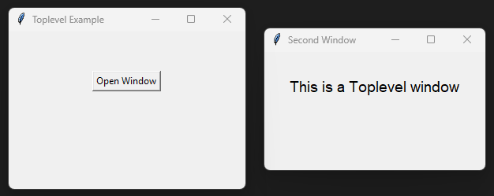

====================================================
tk Toplevel
====================================================

| See: `<https://docs.python.org/3/library/tkinter.html#tkinter.Toplevel>`_

----

Usage
---------------

| The `tkinter.Toplevel` widget creates an additional top-level window.
| A ``Toplevel`` window behaves like a separate window but remains connected to the main Tkinter application.
| It is commonly used for:

    | * dialog boxes,
    | * settings windows,
    | * child application windows,
    | * additional views.

| Unlike ``tk.Tk()``, which normally creates the main application window, ``tk.Toplevel()`` creates extra windows.
| To create a top-level window the general syntax is
| (assuming import via "import tkinter as tk"):

.. py:function:: toplevel_widget = tk.Toplevel(parent, option=value)

    | parent is the main window or another widget.
    | Options can be passed as parameters separated by commas.

----

Sample Toplevel
----------------------------

| The code below creates a second window containing a label.
| The second window is opened from a button in the main window.

.. code-block:: python

    import tkinter as tk

    def open_window():
        window = tk.Toplevel(root)
        window.title("Second Window")
        window.geometry("280x150")

        label = tk.Label(
            window,
            text="This is a Toplevel window",
            font=("Arial", 14)
        )

        label.pack(pady=30)

    root = tk.Tk()
    root.title("Toplevel Example")
    root.geometry("300x200")

    button = tk.Button(
        root,
        text="Open Window",
        command=open_window
    )

    button.pack(pady=50)

    root.mainloop()

----

.. admonition:: Tasks

    #. Modify the code so that pressing the button opens a new ``Toplevel`` window.

        * Set the new window title to **"Settings Window"**.
        * Set the window size to ``300x200``.
        * Add a label displaying **"Settings"**.
        * Use an Arial font size 18 for the label.

        .. image:: images/toplevel_question.png
            :scale: 67

    .. dropdown::
        :icon: codescan
        :color: primary
        :class-container: sd-dropdown-container

        .. tab-set::

            .. tab-item:: Q1

                Modify the code so that it creates the required ``Toplevel`` window.

                .. code-block:: python

                    import tkinter as tk

                    def open_settings():

                        settings = tk.Toplevel(root)
                        settings.title("Settings Window")
                        settings.geometry("300x200")

                        label = tk.Label(
                            settings,
                            text="Settings",
                            font=("Arial", 18)
                        )

                        label.pack(pady=50)

                    root = tk.Tk()
                    root.title("Toplevel Question")
                    root.geometry("300x200")

                    button = tk.Button(
                        root,
                        text="Open Settings",
                        command=open_settings
                    )

                    button.pack(pady=50)

                    root.mainloop()

----

Methods
----------------------

.. py:function:: toplevel_widget.destroy()

    | Closes and removes the Toplevel window.
    | The window and all widgets inside it are destroyed.

.. py:function:: toplevel_widget.title(text)

    | Sets the title displayed in the window title bar.
    |
    | Example:
    |
    | ``window.title("Settings")``

.. py:function:: toplevel_widget.geometry(size)

    | Sets the size and optional position of the window.
    |
    | Example:
    |
    | ``window.geometry("300x200")``

.. py:function:: toplevel_widget.resizable(width, height)

    | Controls whether the user can resize the window.
    |
    | Example:
    |
    | ``window.resizable(False, False)``

.. py:function:: toplevel_widget.protocol(name, function)

    | Defines a callback for window manager events.
    | Commonly used to handle the close button.
    |
    | Example:
    |
    | ``window.protocol("WM_DELETE_WINDOW", function)``

.. py:function:: toplevel_widget.withdraw()

    | Temporarily hides the Toplevel window.

.. py:function:: toplevel_widget.deiconify()

    | Restores a hidden Toplevel window.

.. py:function:: toplevel_widget.state()

    | Returns the current state of the window.
    | Possible values include ``normal``, ``withdrawn`` and ``iconic``.

----

Window methods
------------------------

| ``Toplevel`` also supports many methods inherited from the Tk window system.

.. py:function:: toplevel_widget.configure(option=value)

    | Updates configuration options for the window.

.. py:function:: value = toplevel_widget.cget(option)

    | Returns the current value of a configuration option.

.. py:function:: toplevel_widget.focus_set()

    | Gives keyboard focus to the Toplevel window.

.. py:function:: toplevel_widget.lift()

    | Raises the window above other windows.

.. py:function:: toplevel_widget.lower()

    | Moves the window behind other windows.

.. py:function:: toplevel_widget.attributes(option=value)

    | Changes window manager attributes.
    |
    | Example:
    |
    | ``window.attributes("-topmost", True)``

----

Parameter syntax
----------------------

| The main options are below.

.. py:function:: toplevel_widget = tk.Toplevel(parent, option=value)

    **Parameters:**

    .. py:attribute:: background
    .. py:attribute:: bg

        | Syntax: ``toplevel_widget = tk.Toplevel(parent, bg="color")``
        | Description: Sets the background colour of the window.
        | Default: SystemButtonFace

    .. py:attribute:: borderwidth
    .. py:attribute:: bd

        | Syntax: ``toplevel_widget = tk.Toplevel(parent, bd=width)``
        | Description: Sets the border width of the window.
        | Default: ``0``

    .. py:attribute:: cursor

        | Syntax: ``toplevel_widget = tk.Toplevel(parent, cursor="cursor_type")``
        | Description: Sets the mouse cursor when over the window.

    .. py:attribute:: height

        | Syntax: ``toplevel_widget = tk.Toplevel(parent, height=value)``
        | Description: Sets the requested height of the window.

    .. py:attribute:: highlightbackground

        | Syntax: ``toplevel_widget = tk.Toplevel(parent, highlightbackground="color")``
        | Description: Sets the focus highlight colour when the window does not have focus.

    .. py:attribute:: highlightcolor

        | Syntax: ``toplevel_widget = tk.Toplevel(parent, highlightcolor="color")``
        | Description: Sets the focus highlight colour when the window has focus.

    .. py:attribute:: highlightthickness

        | Syntax: ``toplevel_widget = tk.Toplevel(parent, highlightthickness=value)``
        | Description: Sets the thickness of the focus highlight border.
        | Default: ``0``

    .. py:attribute:: relief

        | Syntax: ``toplevel_widget = tk.Toplevel(parent, relief="style")``
        | Description: Sets the border style of the window.
        | Values include ``flat``, ``raised``, ``sunken``, ``ridge`` and ``groove``.

    .. py:attribute:: takefocus

        | Syntax: ``toplevel_widget = tk.Toplevel(parent, takefocus=True)``
        | Description: Determines whether the window can receive keyboard focus.

    .. py:attribute:: width

        | Syntax: ``toplevel_widget = tk.Toplevel(parent, width=value)``
        | Description: Sets the requested width of the window.

----

Default options
------------------------

| Code to display the default value for each ``Toplevel`` option is shown below.

.. code-block:: python

    import tkinter as tk

    root = tk.Tk()

    widget = tk.Toplevel(root)

    widget_options = widget.keys()

    for option in widget_options:
        print(f"{option}: {widget.cget(option)}")
