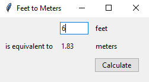

====================================================
Feet to meters
====================================================

| The code below converts feet to meters using a tkinter gui.

.. code-block:: python
            
    from tkinter import *
    from tkinter import ttk

    def calculate(feet):
        """
        Convert feet to meters.

        Parameters:
        feet (str): The number of feet to convert to meters.

        Returns:
        float: The equivalent number of meters rounded to 2 decimal places.
        """
        try:
            feet = float(feet)
            return round(0.3048 * feet, 2)
        except ValueError:
            pass

    def set_meters():
        """
        Set the meters StringVar with the calculated meters from the feet StringVar.
        Then set the focus back to the feet_entry field.
        """
        meters.set(calculate(feet.get()))
        feet_entry.focus()

    # Create the main window
    root = Tk()
    root.title("Feet to Meters")

    # Create the main frame
    mainframe = ttk.Frame(root, padding="3 3 12 12")
    mainframe.grid(column=0, row=0, sticky=(N, W, E, S))
    root.columnconfigure(0, weight=1)
    root.rowconfigure(0, weight=1)

    # Create the feet StringVar and entry field
    feet = StringVar()
    feet_entry = ttk.Entry(mainframe, width=7, textvariable=feet)
    feet_entry.grid(column=2, row=1, sticky=(W, E))

    # Create the meters StringVar and label
    meters = StringVar()
    ttk.Label(mainframe, textvariable=meters).grid(column=2, row=2, sticky=(W, E))

    # Create the calculate button
    ttk.Button(mainframe, text="Calculate", command=set_meters).grid(
        column=3, row=3, sticky=W
    )

    # Create the labels
    ttk.Label(mainframe, text="feet").grid(column=3, row=1, sticky=W)
    ttk.Label(mainframe, text="is equivalent to").grid(column=1, row=2, sticky=E)
    ttk.Label(mainframe, text="meters").grid(column=3, row=2, sticky=W)

    # Configure the padding for all child widgets of mainframe
    for child in mainframe.winfo_children():
        child.grid_configure(padx=5, pady=5)

    # Set the initial focus to the feet_entry field
    feet_entry.focus()

    # Bind the return key to the set_meters function
    root.bind("<Return>", lambda _: set_meters())

    # Start the main event loop
    root.mainloop()

----

Code walk through
-------------------

.. code-block:: python

    from tkinter import *
    from tkinter import ttk

These lines import all the necessary modules from `tkinter` and `ttk` (themed tkinter) for creating a GUI application.

----

.. code-block:: python

    def calculate(value):
        """
        Convert feet to meters.

        Parameters:
        value (str): The number of feet to convert to meters.

        Returns:
        float: The equivalent number of meters rounded to 2 decimal places.
        """
        try:
            value = float(value)
            return round(0.3048 * value, 2)
        except ValueError:
            pass

    def set_meters():
        """
        Set the meters StringVar with the calculated meters from the feet StringVar.
        Then set the focus back to the feet_entry field.
        """
        meters.set(calculate(feet.get()))
        feet_entry.focus()

This function is used to convert feet to meters. It tries to get the value from the `feet` variable, convert it to meters, and set the `meters` variable to the result. If the value cannot be converted to a float, it does nothing.

----

.. code-block:: python

    root = Tk()
    root.title("Feet to Meters")

This creates the main window (root) of the application and sets its title.

----

.. code-block:: python

    mainframe = ttk.Frame(root, padding="3 3 12 12")
    mainframe.grid(column=0, row=0, sticky=(N, W, E, S))
    root.columnconfigure(0, weight=1)
    root.rowconfigure(0, weight=1)

This creates a frame widget, which will hold all other widgets. It is placed in the root window and configured to expand as the window is resized. The sticky parameter specifies how the frame should expand to fill the space allocated to it. In this case, the frame will expand to fill the entire space in the North, West, East, and South directions. The next two lines configure the root window to expand in both the x and y directions by setting the weight of the column and row to 1. This ensures that the mainframe object will fill the entire window.

----

.. code-block:: python

    feet = StringVar()
    feet_entry = ttk.Entry(mainframe, width=7, textvariable=feet)
    feet_entry.grid(column=2, row=1, sticky=(W, E))

This creates a `StringVar` to hold the value of feet and an entry widget for the user to input the value. The entry widget is placed in the second column and first row of the grid.

`StringVar()` is a class in the `tkinter` module that holds a string data and provides helper functions for manipulating the values of widgets like `Label` and `Entry`. It works differently from normal Python variables and requires an interpreter that is created when an instance of `Tk` is made. `StringVar` can be created using a constructor that accepts a container widget, a value, and a name as optional arguments. `StringVar` is useful for creating and accessing variables in a graphical user interface ¹². 

----

.. code-block:: python

    meters = StringVar()
    ttk.Label(mainframe, textvariable=meters).grid(column=2, row=2, sticky=(W, E))

This creates another `StringVar` to hold the value of meters and a label widget to display it. The label widget is placed in the second column and second row of the grid.

----

.. code-block:: python

    ttk.Button(mainframe, text="Calculate", command=calculate).grid(column=3, row=3, sticky=W)

This creates a button widget that calls the `calculate` function when clicked.

----

.. code-block:: python

    ttk.Label(mainframe, text="feet").grid(column=3, row=1, sticky=W)
    ttk.Label(mainframe, text="is equivalent to").grid(column=1, row=2, sticky=E)
    ttk.Label(mainframe, text="meters").grid(column=3, row=2, sticky=W)

These lines create label widgets for the text "feet", "is equivalent to", and "meters", and place them in the grid.

----

.. code-block:: python

    for child in mainframe.winfo_children(): 
        child.grid_configure(padx=5, pady=5)

This loop adds padding to all widgets in the mainframe.

----

.. code-block:: python

    feet_entry.focus()
    root.bind("<Return>", calculate)

This sets the focus to the `feet_entry` widget (so the user can start typing immediately) and binds the Return key to the `calculate` function.

----

.. code-block:: python

    root.mainloop()

Finally, this starts the event loop for the application, which waits for user actions.
