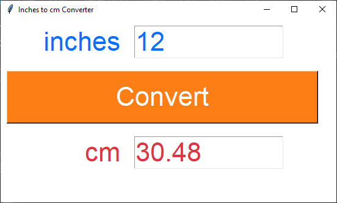

====================================================
tk inches to cm
====================================================

    
    
| This code converts inches to cm.   
| This code creates a simple GUI application using the Tkinter library. 
| It displays a window with Label, Entry, Text and Button widgets

----

convert_inches_to_cm
---------------

| ``convert_inches_to_cm()`` uses a try and except block to catch errors due to non numeric entries.

| The delete method of a Text widget requires the line.column as the first argument. e.g. ``1.0`` in ``c_text.delete(1.0, 'end')``
| ``tk.END`` or ``'end'`` can be used as the second argument to cause the deletion to go to the end of the widget.
| The insert method of a Text widget requires the line.column as the first argument. e.g. ``1.0`` in ``cm_text.insert(1.0, f'{cm:.2f}')``

| ``cm_text.insert(1.0, f'{cm:.2f}')`` uses ``:.2f`` to format the celsius float to 2 decimal place.

----

Full code
------------

.. code-block:: python

    import tkinter as tk

    def convert_inches_to_cm():
        try:
            inches = float(inches_entry.get())
            cm = inches * 2.54
            cm_text.delete(1.0, 'end')  # Clear any previous result
            cm_text.insert(1.0, f'{cm:.2f}')
        except ValueError:
            cm_text.delete(1.0, 'end')
            cm_text.insert(1.0, "Invalid input.")

    def setup_gui():
        """
        Sets up the Inches to cm converter GUI.
        Creates the main window, labels, entry fields, and buttons.
        """
        # Create the main window
        window = tk.Tk()
        window.title("Inches to cm Converter")
        window.geometry('300x200')
        window.configure(bg='#333333')

        # Create widgets
        inches_label = tk.Label(window, text="inches", bg='#333333', fg='#FFFFFF', font=("Arial", 16))
        inches_entry = tk.Entry(window, width = 10, font=("Arial", 16))
    
        cm_label = tk.Label(window, text="cm", bg='#333333', fg='#FFFFFF', font=("Arial", 16))
        # height of 1 is one text row
        cm_text = tk.Text(window, height=1, width = 10, font=("Arial", 16))

        convert_button = tk.Button(window, text="Convert", width=20, bg='#FF3399', fg='#FFFFFF', font=("Arial", 16), command=convert_inches_to_cm)

        # Place widgets in the window
        inches_label.grid(row=0, column=0, padx=10, pady=10)
        inches_entry.grid(row=0, column=1, padx=10, pady=10)
        cm_label.grid(row=2, column=0, padx=10, pady=10)
        cm_text.grid(row=2, column=1, padx=10, pady=10)
        convert_button.grid(row=1, column=0, columnspan=2, padx=10, pady=10)

        # Start the main event loop
        window.mainloop()

    # Call the setup function
    setup_gui()

