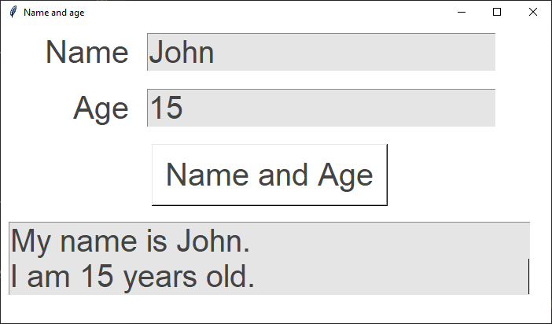

====================================================
Name and age task
====================================================

| Write code that outputs the user name and age in sentence form.

Hints:
--------------

| Use a height of 2 for text lines for the output.
| Use "\n" in an f-string to make an end of line character so the text flows to 2 lines.

