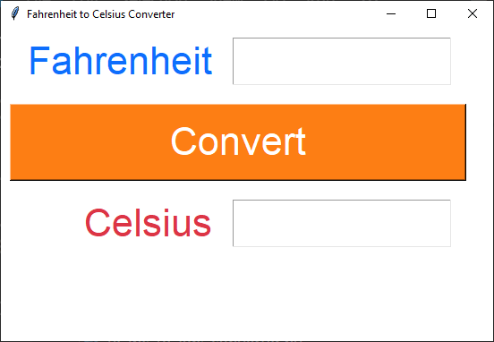

====================================================
tk temperature converter
====================================================

    
| This code converts Fahrenheit to Celsius temperatures.   
| This code creates a simple GUI application using the Tkinter library. 
| It displays a window with Label, Entry, Text and Button widgets

----

convert_f_to_c
---------------

| ``convert_f_to_c()`` uses a try and except block to catch errors due to non numeric entries.
| See: https://www.w3schools.com/python/python_try_except.asp
| The delete method of a Text widget requires the line.column as the first argument. e.g. ``1.0`` in ``c_text.delete(1.0, 'end')``
| ``tk.END`` or ``'end'`` can be used as the second argument to cause the deletion to go to the end of the widget.
| The insert method of a Text widget requires the line.column as the first argument. e.g. ``1.0`` in ``c_text.insert(1.0, f'{celsius:.1f}')``
| ``c_text.insert(1.0, f'{celsius:.1f}')`` uses ``:.1f`` to format the celsius float with 1 decimal place.
| For string formatting see: https://www.w3schools.com/python/ref_string_format.asp

----

Version 1 code
-----------------

.. code-block:: python

    import tkinter as tk

    def convert_f_to_c():
        try:
            fahrenheit = float(f_entry.get())
            celsius = (fahrenheit - 32) / 1.8
            c_text.delete(1.0, 'end')  # Clear any previous result
            c_text.insert(1.0, f'{celsius:.1f}')
        except ValueError:
            c_text.delete(1.0, 'end')
            c_text.insert(1.0, "Invalid input.")

    # Create the main window
    window = tk.Tk()
    window.title("Fahrenheit to Celsius Converter")
    window.geometry('300x200')
    window.configure(bg='#333333')

    # Create widgets
    f_label = tk.Label(window, text="Fahrenheit", bg='#333333', fg='#FFFFFF', font=("Arial", 16))
    f_entry = tk.Entry(window, width = 10, font=("Arial", 16))
    c_label = tk.Label(window, text="Celsius", bg='#333333', fg='#FFFFFF', font=("Arial", 16))
     # height of 1 is one text row
    c_text = tk.Text(window, height=1, width = 10, font=("Arial", 16))
    convert_button = tk.Button(window, text="Convert", width=20, bg='#FF3399', 
                            fg='#FFFFFF', font=("Arial", 16), command=convert_f_to_c)

    # Place widgets on window
    f_label.grid(row=0, column=0, padx=10, pady=10)
    f_entry.grid(row=0, column=1, padx=10, pady=10)
    c_label.grid(row=2, column=0, padx=10, pady=10)
    c_text.grid(row=2, column=1, padx=10, pady=10)
    convert_button.grid(row=1, column=0, columnspan=2, padx=10, pady=10)

    # Start the main event loop
    window.mainloop()

----

Version 2 code
----------------

| Add a doc string for the definition.
| Use constants for repeated values used in formatting widgets.
| Add alignment using **sticky**.

.. code-block:: python

    import tkinter as tk

    # Constants
    BG_COLOR = "#333333"
    FG_COLOR = "#FFFFFF"
    BUTTON_COLOR = "#FF3399"
    FONT_STYLE = ("Arial", 16)

    def convert_f_to_c():
        """
        Converts Fahrenheit to Celsius and displays the result in the GUI.

        Reads the Fahrenheit value from the input field, performs the conversion,
        and updates the result in the output text widget.

        Raises:
            ValueError: If the input is not a valid float.
        """
        try:
            fahrenheit = float(f_entry.get())
            celsius = (fahrenheit - 32) / 1.8
            c_text.delete(1.0, "end")  # Clear any previous result
            c_text.insert(1.0, f"{celsius:.1f}")
        except ValueError:
            c_text.delete(1.0, "end")
            c_text.insert(1.0, "Invalid input.")

    # Create the main window
    window = tk.Tk()
    window.title("Fahrenheit to Celsius Converter")
    window.geometry("300x200")
    window.configure(bg="#333333")

    # Create widgets
    f_label = tk.Label(window, text="Fahrenheit", bg=BG_COLOR, fg=FG_COLOR, font=FONT_STYLE)
    f_entry = tk.Entry(window, width=10, font=FONT_STYLE)
    c_label = tk.Label(window, text="Celsius", bg=BG_COLOR, fg=FG_COLOR, font=FONT_STYLE)
    c_text = tk.Text(window, height=1, width=10, font=FONT_STYLE)
    convert_button = tk.Button(window, text="Convert", width=20, bg=BUTTON_COLOR,
                            fg=FG_COLOR, font=FONT_STYLE, command=convert_f_to_c)

    # Place widgets on window
    f_label.grid(row=0, column=0, sticky="e", padx=10, pady=10)
    f_entry.grid(row=0, column=1, sticky="w", padx=10, pady=10)
    c_label.grid(row=2, column=0, sticky="e", padx=10, pady=10)
    c_text.grid(row=2, column=1, sticky="w", padx=10, pady=10)
    convert_button.grid(row=1, column=0, columnspan=2, padx=10, pady=10)

    # Start the main event loop
    window.mainloop()
