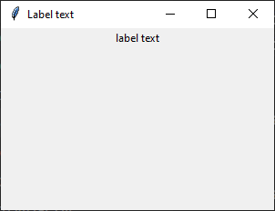
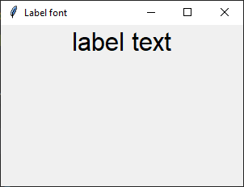
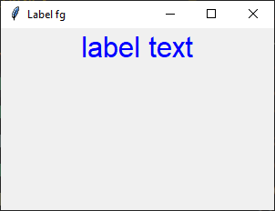
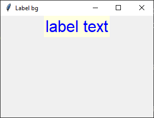
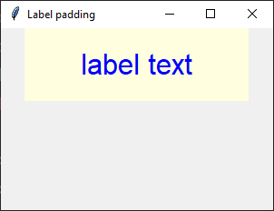
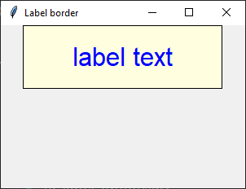

====================================================
tk label
====================================================

| See: https://www.geeksforgeeks.org/python-tkinter-label/?ref=lbp
| See: https://www.youtube.com/watch?v=8VoTtF-CxrM
| See: https://www.youtube.com/watch?v=Yn5sT2k4X3g

----

Usage
---------------

| The `tkinter.Label` widget provides a text label.
| To create a label widget the general syntax is:

.. py:function:: label_widget  = tk.Label(parent, option=value)

    | `parent` is the window or frame object. 
    | Options can be passed as parameters separated by commas.

----

Text
--------------

.. py:function:: label_widget  = tk.Label(parent, text=text_string)

    | `text_string` is text to display in the label widget. 
    | e.g. label = tk.Label(window, text="label text")

Text example
~~~~~~~~~~~~~~~~~~

.. code-block:: python

    import tkinter as tk

    # Create the main window
    window = tk.Tk()
    window.geometry("300x200")  # Set window size
    window.title("Label text")  # Set window title

    # Create the label widget
    label = tk.Label(window, text="label text")

    # Pack the label into the window
    label.pack()

    # Run the main event loop
    window.mainloop()

    
----

Font
----------

.. py:function:: label_widget  = tk.Label(parent, font=(font_type, font_size, font_style))
   
   - font_type is a font name. e.g "Arial"
   - font_size is the size of the font.  eg. 12
   - font_style can be bold, italic, underline or a space separated combination
   - Default Value: System-dependent (usually a default font)
   - Description: Specifies the font family, size, and style for the label text.
   - Example: To use a 12-point Arial font, use `font=("Arial", 12)`.
   - Example: To use a bold 12-point Arial font, use `font=("Arial", 12, "bold")`.
   - Example: To use a bold underlines 12-point Arial font, use `font=("Arial", 12, "bold underline")`.

font example
~~~~~~~~~~~~~~~~~~

.. code-block:: python

    import tkinter as tk

    # Create the main window
    window = tk.Tk()
    window.geometry("300x200")  # Set window size
    window.title("Label font")  # Set window title

    # Create the label widget with options
    label = tk.Label(window, text="label text", font=("Arial", 24))

    # Pack the label into the window
    label.pack()

    # Run the main event loop
    window.mainloop()

----

Text color
---------------

.. py:function:: label_widget  = tk.Label(parent, fg=color)
   
   - color can be a color name, e.g blue, or a hex colour, e.g. #0000FF.
   - Default Value: System-dependent (usually black)
   - Description: Sets the foreground (text) color of the label.
   - Example: To set the text color to blue, use `fg="blue"` or `fg="#0000FF"`.

fg example
~~~~~~~~~~~~~~~~~~

.. code-block:: python

    import tkinter as tk

    # Create the main window
    window = tk.Tk()
    window.geometry("300x200")  # Set window size
    window.title("Label fg")  # Set window title

    # Create the label widget with options
    label = tk.Label(window, text="label text", font=("Arial", 24), fg="blue")

    # Pack the label into the window
    label.pack()

    # Run the main event loop
    window.mainloop()

----

Background color
--------------------------

.. py:function:: label_widget  = tk.Label(parent, bg=color)
   
   - color can be a color name or a hex colour.
   - Default Value: System-dependent (usually white)
   - Description: Sets the background color of the label.
   - Example: To set the background color to light yellow, use `bg="lightyellow"`.

bg example
~~~~~~~~~~~~~~~~~~

.. code-block:: python

    import tkinter as tk

    # Create the main window
    window = tk.Tk()
    window.geometry("300x200")  # Set window size
    window.title("Label bg")  # Set window title

    # Create the label widget with options
    label = tk.Label(window, text="label text", font=("Arial", 24), fg="blue", bg="lightyellow")

    # Pack the label into the window
    label.pack()

    # Run the main event loop
    window.mainloop()

----

Padding
-------------------

.. py:function:: label_widget  = tk.Label(parent, padx=x_integer, pady=y_integer)
   
   - x_integer and y_integer are integers
   - Default Value: 0
   - Description: Adds extra space (in pixels) around the label text.
   - Example: To add 12 pixels of padding on the left and right sides, use `padx=12`.
   - Example: To add 5 pixels of padding on the top and bottom, use `pady=5`.

padding example
~~~~~~~~~~~~~~~~~~

.. code-block:: python

    import tkinter as tk

    # Create the main window
    window = tk.Tk()
    window.geometry("300x200")  # Set window size
    window.title("Label padding]")  # Set window title

    # Create the label widget with options
    label = tk.Label(text="label text", font=("Arial", 24), fg="blue", bg="lightyellow",
                    padx=60, pady=20)

    # Pack the label into the window
    label.pack()

    # Run the main event loop
    window.mainloop()

----

Border
---------------

.. py:function:: label_widget  = tk.Label(parent, borderwidth=width)
   
   - width is an integer
   - Default Value: 0
   - Description: Specifies the border width for the label.
   - Example: To create a width of 2 pixels, use `borderwidth=2`.

.. py:function:: label_widget  = tk.Label(parent, relief=border_style)
   
   - border_style is one of "flat", "raised", "sunken", "solid", "ridge", "groove"
   - Default Value: "flat" (no border)
   - Description: Specifies the border style and width for the label.
   - Example: To create a solid border with a width of 1 pixels, use `relief="solid"` and `borderwidth=1`.

border example
~~~~~~~~~~~~~~~~~~~~~

.. code-block:: python

    import tkinter as tk

    # Create the main window
    window = tk.Tk()
    window.geometry("300x200")  # Set window size
    window.title("Label border")  # Set window title

    # Create the label widget with options
    label = tk.Label(text="label text", font=("Arial", 24), fg="blue", bg="lightyellow",
                    padx=60, pady=20,
                    relief="solid", borderwidth=1)

    # Pack the label into the window
    label.pack()

    # Run the main event loop
    window.mainloop()

    
----

Options
--------------

| Options for the ``tkinter.Label`` widget:

1.  ``activebackground``: Sets the background color when the label is active (e.g., when the mouse hovers over it).
2.  ``activeforeground``: Sets the text color when the label is active.
3.  ``anchor``: Determines the alignment of text or image within the label. (e.g., 'center', 'nw', 'se', etc.) Options include `tk.W` (left), `tk.CENTER` (center), and `tk.E` (right).
4.  ``background`` (or ``bg``): Sets the background color of the label.
5.  ``bd`` (or ``borderwidth``): Specifies the border width (thickness) around the label.
6.  ``bitmap``: Displays a bitmap (small image) instead of text.
7.  ``compound``: Combines text and image display. Options include `tk.LEFT`, `tk.RIGHT`, `tk.TOP`, and `tk.BOTTOM`.
8.  ``cursor``: Determines the mouse cursor appearance when hovering over the label.
9.  ``disabledforeground``: Sets the text color when the label is disabled.
10. ``fg`` (or ``foreground``): Sets the text color.
11. ``font``: Specifies the font style for the label's text.
12. ``height``: Sets the height (number of lines) of the label.
13. ``highlightbackground``: Color of the focus highlight when the label is not focused.
14. ``highlightcolor``: Color of the focus highlight when the label is focused.
15. ``highlightthickness``: Thickness of the focus highlight.
16. ``image``: Displays an image instead of text.
17. ``justify``: Controls text alignment within the label when it contains multiple lines ('left', 'center', or 'right').
18. ``padx`` and ``pady``: Add padding (extra space) around the label's content.
19. ``relief``: Specifies the border style (e.g., flat, raised, sunken).
20. ``state``: Determines whether the label is active, disabled, or normal.
21. ``takefocus``: Specifies whether the label can receive focus during keyboard navigation.
22. ``text``: Sets the text content of the label.
23. ``textvariable``: Binds a `StringVar` to the label, allowing dynamic text updates.
24. ``underline``: Specifies which character in the label's text should be underlined.
25. ``width``: Sets the width (number of characters) of the label.
26. ``wraplength``: Limits the line length by wrapping text within the specified width.
