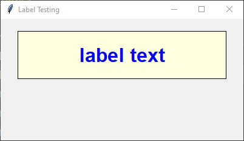

====================================================
tk label
====================================================

| See: https://www.geeksforgeeks.org/python-tkinter-label/?ref=lbp
| See: https://www.youtube.com/watch?v=8VoTtF-CxrM&list=PLs3IFJPw3G9KL3huzPS7g-0PCbS7Auc7I&index=3
| See: https://www.youtube.com/watch?v=Yn5sT2k4X3g

----

Usage
---------------

| The `tkinter.Label` widget provides a text label.
| To create a label widget the general syntax is:

.. py:function:: label_widget  = tk.Label(parent, option=value)

    | `parent` is the window or frame object. 
    | Options can be passed as parameters separated by commas.

.. py:function:: label_widget  = tk.Label(parent, text=text_string)

    | `text_string` is text to display in the label widget. 
    | e.g. label = tk.Label(window, text="label text")

----

Code example
---------------

.. code-block:: python

    import tkinter as tk

    # Create the main window
    window = tk.Tk()
    window.geometry("400x400")  # Set window size
    window.title("Label Testing")  # Set window title

    # Create the label widget
    label = tk.Label(window, text="label text")

    # Pack the label into the window
    label.pack()

    # Run the main event loop
    window.mainloop()

----

Text color
---------------

.. py:function:: label_widget  = tk.Label(parent, fg=color)
   
   - color can be a color name, e.g blue, or a hex colour, e.g. #0000FF.
   - Default Value: System-dependent (usually black)
   - Description: Sets the foreground (text) color of the label.
   - Example: To set the text color to blue, use `fg="blue"` or `fg="#0000FF"`.

Background color
--------------------------

.. py:function:: label_widget  = tk.Label(parent, bg=color)
   
   - color can be a color name or a hex colour.
   - Default Value: System-dependent (usually white)
   - Description: Sets the background color of the label.
   - Example: To set the background color to light yellow, use `bg="lightyellow"`.

Font
----------

.. py:function:: label_widget  = tk.Label(parent, font=(font_type, font_size, font_style))
   
   - font_type is a font name. e.g "Arial"
   - font_size is the size of the font.  eg. 12
   - font_style can be bold, italic, underline or a space separated combination
   - Default Value: System-dependent (usually a default font)
   - Description: Specifies the font family, size, and style for the label text.
   - Example: To use a 12-point Arial font, use `font=("Arial", 12)`.
   - Example: To use a bold 12-point Arial font, use `font=("Arial", 12, "bold")`.
   - Example: To use a bold underlines 12-point Arial font, use `font=("Arial", 12, "bold underline")`.

Text alignment
----------------------

.. py:function:: label_widget  = tk.Label(parent, justify=alignment)
   
   - alignment is "left", "center", "right" 
   - Default Value: "center"
   - Description: Determines how the label text is aligned within the widget.
   - Example: To left-align the text, use `justify="left"`.

Padding
-------------------

.. py:function:: label_widget  = tk.Label(parent, padx=x_integer, pady=y_integer)
   
   - x_integer and y_integer are integers
   - Default Value: 0
   - Description: Adds extra space (in pixels) around the label text.
   - Example: To add 5 pixels of padding on the left and right sides, use `padx=5`.

Border
---------------

.. py:function:: label_widget  = tk.Label(parent, borderwidth=width)
   
   - width is an integer
   - Default Value: 0
   - Description: Specifies the border width for the label.
   - Example: To create a width of 2 pixels, use `borderwidth=2`.

.. py:function:: label_widget  = tk.Label(parent, relief=border_style)
   
   - border_style is one of "flat", "raised", "sunken", "solid", "ridge", "groove"
   - Default Value: "flat" (no border)
   - Description: Specifies the border style and width for the label.
   - Example: To create a sunken border with a width of 2 pixels, use `relief="sunken"` and `borderwidth=2`.

Code example
---------------

.. code-block:: python

    import tkinter as tk

    # Create the main window
    window = tk.Tk()
    window.geometry("400x400")  # Set window size
    window.title("Label Testing")  # Set window title

    # Create the label widget with options
    label = tk.Label(window,
                    text="label text",
                    fg="blue",
                    bg="lightyellow",
                    font=("Arial", 24, "bold"),
                    justify="center",
                    padx=100,
                    pady=20,
                    relief="solid",
                    borderwidth=1)

    # Pack the label into the window
    label.pack(padx=20, pady=20)  # Add some padding to the top and side

    # Run the main event loop
    window.mainloop()

    
----

Options
--------------

STANDARD OPTIONS
~~~~~~~~~~~~~~~~~~~~~~~~

    activebackground, activeforeground, anchor,
    background, bitmap, borderwidth, cursor,
    disabledforeground, font, foreground,
    highlightbackground, highlightcolor,
    highlightthickness, image, justify,
    padx, pady, relief, takefocus, text,
    textvariable, underline, wraplength

WIDGET-SPECIFIC OPTIONS
~~~~~~~~~~~~~~~~~~~~~~~~

    height, state, width

| Options for the `tkinter.Label` widget:

1. **`activebackground`**: Specifies the background color when the label is active (e.g., when the mouse hovers over it).
2. **`activeforeground`**: Sets the text color when the label is active.
3. **`anchor`**: Determines the position of the label's text or image within the available space (e.g., 'center', 'nw', 'se', etc.).
4. **`background`**: Sets the background color of the label.
5. **`bitmap`**: Displays a bitmap (monochrome image) on the label.
6. **`borderwidth`**: Defines the width of the label's border.
7. **`cursor`**: Specifies the mouse cursor shape when hovering over the label.
8. **`disabledforeground`**: Sets the text color when the label is disabled.
9. **`font`**: Determines the font style for the label's text.
10. **`foreground`**: Sets the color of the label's text.
11. **`highlightbackground`**: Specifies the color of the focus highlight when the label is not focused.
12. **`highlightcolor`**: Sets the color of the focus highlight when the label is focused.
13. **`highlightthickness`**: Determines the thickness of the focus highlight.
14. **`image`**: Displays an image (e.g., a PhotoImage) on the label instead of text.
15. **`justify`**: Controls the horizontal alignment of the label's text ('left', 'center', or 'right').
16. **`padx`** and **`pady`**: Add padding (extra space) around the label's content.
17. **`relief`**: Specifies the border style (e.g., 'flat', 'raised', 'sunken', etc.).
18. **`takefocus`**: Determines whether the label can receive focus.
19. **`text`**: Sets the text content of the label.
20. **`textvariable`**: Associates a `StringVar` with the label (useful for dynamic text updates).
21. **`underline`**: Indicates which character in the label's text should be underlined.
22. **`wraplength`**: Breaks the text into multiple lines if it exceeds the specified width.
