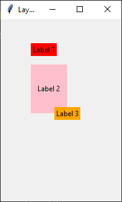

====================================================
tk geometry place
====================================================

| The place geometry manager allows you to arrange widgets within a window using absolute positions.
| place: see https://www.youtube.com/watch?v=bx0YmWFfsEI
| Layouts: https://www.youtube.com/watch?v=i577cFu8eBI&list=PLpMixYKO4EXflJFPhTvZOVAbs7lBdEBSa

----

place
--------------------

| place is not responsive to window size changes.
| Place can use absolute positioning or relative positioning. Only absolute is considered below.
| Absolute positioning uses coordinates of (0, 0) in the top left and increases to the right and down.

x and y coordinates of top left of widget
~~~~~~~~~~~~~~~~~~~~~~~~~~~~~~~~~~~~~~~~~~

.. py:function:: widget.place(x=x_coord, y=y_coord)

    | Use **place()** method to place a widget with its top left at the x and y coordinates.
    | e.g. widget.place(x=50, y=75)
    | The width and height of the widget are automatically determined by the content.

width and height of widget
~~~~~~~~~~~~~~~~~~~~~~~~~~~~~~~~~~~~~~~~~~

.. py:function:: widget.place(x=x_coord, y=y_coord, width=widget_width, height=widget_height)

    | Use **place()** method to place a widget with its top left at the x and y coordinates.
    | Set the height and width of the widget: **width=widget_width**, **height=widget_height**.
    | e.g.  label2.place(x=50, y=75, width=60, height=80)

widget anchor
~~~~~~~~~~~~~~~~~~~~~~~~~~~~~~~~~~~~~~~~~~

.. py:function:: widget.place(x=x_coord, y=y_coord, anchor="nw")

    | The anchor parameter determines which part of the widget is positioned at the given coordinates.
    | The default value of the anchor is 'nw' for the top left of the widget at the specified coordinates.
    | parameter accepts values such as: 'n', 'ne', 'e', 'se', 'sw', 'w', 'nw'
    | These constants represent north, northeast, east, southeast, south, southwest, west, northwest.
    | 'center': This value instructs the place() method to position the center of the widget at the coordinates (x, y).                                 

Sample code
--------------

.. code-block:: python

    import tkinter as tk

    # window
    window = tk.Tk()
    window.title('Layout intro')
    window.geometry('600x400')

    # widgets
    label1 = tk.Label(window, text = 'Label 1', background = 'red')
    label2 = tk.Label(window, text = 'Label 2', background = 'pink')
    label3 = tk.Label(window, text = 'Label 3', background = 'orange')

    # place
    label1.place(x=150, y=50)
    label2.place(x=150, y=100, width=100, height=60)
    label3.place(x=150, y=200, anchor="center")

    # run
    window.mainloop()

options
--------------

See: https://www.pythontutorial.net/tkinter/tkinter-place/
