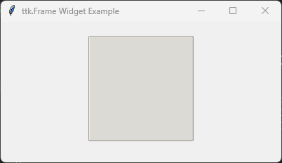

====================================================
ttk Frame
====================================================

| See: `<https://docs.python.org/3/library/tkinter.ttk.html#frame>`_

----

Usage
---------------

| The `tkinter.ttk.Frame` widget acts as a themed container for other widgets.
| To create a frame widget the general syntax is
| (assuming import via "from tkinter import ttk"):

.. py:function:: frame_widget = ttk.Frame(parent, option=value)

    | parent is the window or frame object.
    | Options can be passed as parameters separated by commas.

----

Sample Frame
---------------

| The code below creates a themed frame with a specific border style and size using common widget options.

.. code-block:: python

    import tkinter as tk
    from tkinter import ttk

    root = tk.Tk()
    root.title("ttk.Frame Widget Example")
    root.geometry("200x200")

    # Note: To see customer styles clearly use 'clam' theme.
    style = ttk.Style()
    style.theme_use("clam")

    frame = ttk.Frame(
        root,
        borderwidth=5,
        relief="groove",
        width=150,
        height=150
    )

    # Prevent the frame from shrinking to fit nothing; force its explicit size
    frame.pack_propagate(False)
    frame.pack(padx=20, pady=20)

    root.mainloop()

----

Parameter syntax
----------------------

.. py:function:: frame_widget = ttk.Frame(parent, option=value)

    **Parameters:**

    .. py:attribute:: borderwidth
    .. py:attribute:: bd

        | Syntax: ``frame_widget = ttk.Frame(parent, borderwidth=width)``
        | Description: Sets the width of the frame's outer border in pixels.
        | Default: ``0``

    .. py:attribute:: cursor

        | Syntax: ``frame_widget = ttk.Frame(parent, cursor="cursor_type")``
        | Description: Changes the mouse cursor when it hovers over the area of the frame.
        | Default: ``""``

    .. py:attribute:: height

        | Syntax: ``frame_widget = ttk.Frame(parent, height=height_in_pixels)``
        | Description: Sets the vertical height of the frame container in pixels.
        | Default: ``0``

    .. py:attribute:: padding

        | Syntax: ``frame_widget = ttk.Frame(parent, padding=amount)``
        | Description: Internal buffer padding surrounding nested content. Can accept a single integer, a 2-tuple ``(width, height)``, or a 4-tuple ``(left, top, right, bottom)``.
        | Default: ``""``

    .. py:attribute:: relief

        | Syntax: ``frame_widget = ttk.Frame(parent, relief="relief_type")``
        | Description: Sets the border style behavior of the frame layout. Valid values include ``"flat"``, ``"raised"``, ``"sunken"``, ``"ridge"``, ``"solid"``, ``"groove"``.
        | Default: ``"flat"``

    .. py:attribute:: style

        | Syntax: ``frame_widget = ttk.Frame(parent, style="style_name")``
        | Description: Points to a custom layout configuration defined inside a ``ttk.Style()`` object tree (e.g., ``"TFrame"`` derivatives).
        | Default: ``""``

    .. py:attribute:: width

        | Syntax: ``frame_widget = ttk.Frame(parent, width=width_in_pixels)``
        | Description: Sets the horizontal width of the frame container in pixels.
        | Default: ``0``

----

Theme Customization Options (via ttk.Style)
---------------------------------------------

| Global visual modifications like backgrounds are handled cleanly using custom style configurations.

**Example Configuration:**

.. code-block:: python

    style = ttk.Style()
    style.configure(
        "Custom.TFrame",
        background="lightgray"
    )

----

Default options
-----------------------

| Code to inspect and get the current defaults for each themed frame layout option is below.
.. code-block:: python

    import tkinter as tk
    from tkinter import ttk

    root = tk.Tk()

    frame = ttk.Frame(root)
    frame_options = frame.keys()

    for option in frame_options:
        print(f"{option}: {frame.cget(option)}")

